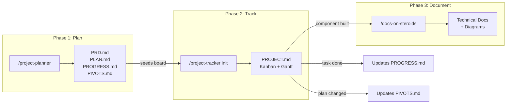

# Itay Claude Skills

Three powerful Claude Code skills for documentation, project planning, and project tracking -- all with rich Mermaid diagram support.

## Quick Start

```bash
npx itay-claude-skills
```

The interactive installer lets you pick which skills to install and whether to install them globally (`~/.claude/skills/`, available everywhere) or locally (`./.claude/skills/`, current project only).

## Skills

| Skill | Slash Command | What It Does |
|-------|---------------|--------------|
| **docs-on-steroids** | `/docs-on-steroids [topic]` | Generate comprehensive documentation with 19 Mermaid diagram types, auto-detect undocumented code, flag stale docs |
| **project-planner** | `/project-planner [name]` | Auto-generate PRD.md, PLAN.md, PROGRESS.md, PIVOTS.md with context-appropriate diagrams |
| **project-tracker** | `/project-tracker [action]` | Manage projects via a single PROJECT.md with kanban board, Gantt timeline, dependency graph, sprint velocity |

---

## docs-on-steroids

Generate comprehensive technical documentation with embedded visual diagrams. Covers 19 Mermaid diagram types -- flowcharts, sequence diagrams, ER diagrams, C4 architecture, state machines, Gantt charts, mindmaps, git graphs, and more.

**Key features:**

- **Template selection** -- Context-specific templates for APIs, libraries, CLIs, microservices, and databases
- **Auto-detect mode** -- Scans the codebase for undocumented code, missing READMEs, and complex files lacking architecture docs. Produces a prioritized gap report (Critical / High / Medium / Low)
- **Drift detection** -- Compares source file modification dates against documentation, checks for references to renamed or deleted symbols, and flags stale docs with severity levels
- **Multi-format** -- Primary Mermaid output with PlantUML and DOT/Graphviz guidance for scenarios where they excel
- **Quality checklist** -- Content, diagram, structural, and freshness checks before finalizing

**Usage:**

```
/docs-on-steroids src/auth
/docs-on-steroids database schema
/docs-on-steroids              (runs auto-detect across the codebase)
```

**Sample output:**


**Included reference files:** Mermaid syntax reference (all 19 types), 16 real-world diagram examples, 5 documentation templates, drift detection methodology.

---

## project-planner

Automatically generates structured planning documentation when brainstorming or starting something new. Detects natural language triggers like "let's build", "new project", "add a feature", or "what if we" -- or invoke directly with `/project-planner`.

**Generates four files in `docs/plans/<name>/`:**

| File | Purpose |
|------|---------|
| `PRD.md` | Problem statement, goals with measurable criteria, user stories, scope (in/out), architecture and data model diagrams |
| `PLAN.md` | Phased task breakdown with `~Nd` estimates, architecture decisions, dependency graph, Gantt timeline, risk assessment |
| `PROGRESS.md` | Auto-updated completion tracking, actual-vs-planned Gantt, metrics |
| `PIVOTS.md` | Change log capturing every plan modification with reasoning and impact |

**Diagram auto-selection:**

| Context | Diagrams Generated |
|---------|--------------------|
| New project | C4 context, ER, component, Gantt, user journey |
| New feature | Sequence, state, flowchart, dependency graph |
| New component | Class, flowchart, component |
| Refactor | Before/after architecture, dependency graph |
| API design | Sequence, ER, flowchart |
| Database change | ER, state, migration timeline |

**Usage:**

```
/project-planner todo-app
/project-planner OAuth integration
"Let's build a real-time chat feature"    (auto-triggers)
```

**Included reference files:** PRD template, plan template, progress template, pivots template, diagram selection matrix, 3 complete worked examples (new project, new feature, new component).

---

## project-tracker

Manage an entire project through a single `PROJECT.md` file. Features a kanban board as the source of truth, with a Mermaid Gantt timeline, dependency graph, velocity tracking, and sprint management -- all regenerated automatically on every change.

**Commands:**

| Command | What It Does |
|---------|--------------|
| `/project-tracker init` | Create PROJECT.md (auto-seeds from PLAN.md if available) |
| `/project-tracker status` | Sprint summary, task counts by column, blockers, velocity trend |
| `/project-tracker add <task>` | Add task to Backlog with parsed metadata |
| `/project-tracker next` | Recommend next unblocked, highest-priority task |
| `/project-tracker board` | Display the current kanban board |

**Task metadata parsing:**

```
/project-tracker add ! Implement auth flow ~3d #backend #security @alice depends:Setup database
```

Parses: priority (high), title, duration (3 days), tags (backend, security), assignee (alice), dependency.

**Sprint management:** Start/end sprints, carry over incomplete tasks, track velocity with trend analysis (stable, improving, declining, volatile).

**Usage:**

```
/project-tracker init
/project-tracker add Build login page ~2d #frontend @bob
/project-tracker next
/project-tracker status
```

**Included reference files:** PROJECT.md template, detailed update guide (moving tasks, regenerating diagrams, managing sprints, calculating velocity).

---

## Cross-Skill Workflow

The three skills are designed to work together seamlessly:



**Typical workflow:**

1. **Brainstorm** -- Chat about what you want to build. `/project-planner` auto-detects and generates PRD + PLAN
2. **Initialize board** -- Run `/project-tracker init` to seed your kanban from the plan
3. **Build** -- Use `/project-tracker next` to pick tasks, track progress as you code
4. **Document** -- Use `/docs-on-steroids` on each component as you complete it
5. **Iterate** -- Changes are auto-logged in PIVOTS.md, progress auto-tracked in PROGRESS.md

---

## Manual Installation

If you prefer to install manually instead of using the CLI:

```bash
git clone https://github.com/itay/itay-claude-skills.git
cd itay-claude-skills
```

Copy the skills you want into your Claude skills directory:

```bash
# Global (available in all projects)
cp -r skills/docs-on-steroids ~/.claude/skills/
cp -r skills/project-planner ~/.claude/skills/
cp -r skills/project-tracker ~/.claude/skills/

# Local (current project only)
mkdir -p .claude/skills
cp -r skills/docs-on-steroids .claude/skills/
cp -r skills/project-planner .claude/skills/
cp -r skills/project-tracker .claude/skills/
```

## Requirements

- **Node.js >= 18** -- for the interactive CLI installer
- **Claude Code** with skills support

## Contributing

Contributions are welcome. Please follow these conventions:

- Skill names: lowercase with hyphens, max 64 characters
- SKILL.md files use YAML frontmatter per the Claude Code skill spec
- Keep SKILL.md under 500 lines; move details to reference files
- Reference files: one level deep from SKILL.md
- Use forward slashes in all file paths

## License

MIT -- see [LICENSE](LICENSE) for details.
