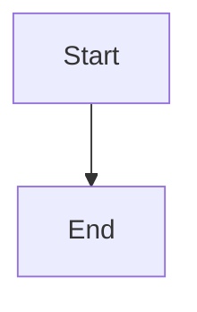

# amp:docs

Enhanced documentation generation with visual diagrams, auto-detection of undocumented code, and drift detection for stale docs.

## Documentation Workflow

Follow these steps when generating documentation:

1. **Determine scope** -- Identify what is being documented (single file, module, service, entire system).
2. **Select template** -- Choose the appropriate template from [doc-templates.md](doc-templates.md) based on the documentation target (API, library, CLI, microservice, database).
3. **Analyze code** -- Read source files, extract public interfaces, identify key data flows and dependencies.
4. **Select diagrams** -- Use the Diagram Type Decision Matrix below to pick the right diagram types.
5. **Generate documentation** -- Write prose sections first, then embed diagrams inline using Mermaid fenced code blocks.
6. **Run quality checklist** -- Verify all items in the Quality Checklist section before finalizing.
7. **Check for drift** -- If updating existing docs, run drift detection per [drift-detection.md](drift-detection.md).

## Template Selection

Choose the template that best matches what you are documenting:

| Target | Template | Key Sections |
|--------|----------|-------------|
| REST/GraphQL API | API Service | Endpoints, auth, rate limits, error codes, sequence diagrams |
| npm/pip/cargo package | Library/Package | Installation, API reference, class diagrams, examples |
| CLI application | CLI Tool | Commands table, flags, flowchart of command routing |
| Microservice | Microservice | C4 diagrams, communication patterns, deployment |
| Database | Database Schema | ER diagram, tables reference, indexes, migrations |

See [doc-templates.md](doc-templates.md) for full templates with placeholder guidance.

## Diagram Type Decision Matrix

Use this matrix to select the right diagram type for each documentation scenario:

| Scenario | Primary Diagram | Secondary Diagram | Why |
|----------|----------------|-------------------|-----|
| Request/response flow | Sequence | Flowchart | Shows temporal ordering of messages between actors |
| System architecture overview | C4 Context | Flowchart with subgraphs | Shows system boundaries and external dependencies |
| Internal service structure | C4 Component | Class diagram | Shows components within a container |
| Database schema | ER Diagram | Class diagram | Shows entities, attributes, and cardinality |
| Object-oriented design | Class Diagram | ER diagram | Shows inheritance, composition, interfaces |
| Workflow with conditions | Flowchart | State diagram | Shows branching logic and decision points |
| Lifecycle / state transitions | State Diagram | Flowchart | Shows states, events, guards, and transitions |
| Auth / multi-party flow | Sequence with alt/opt | Flowchart | Shows conditional branches in message exchange |
| User experience walkthrough | User Journey | Flowchart | Shows tasks, actors, and satisfaction scoring |
| Project timeline | Gantt Chart | Timeline | Shows tasks, durations, dependencies, milestones |
| Feature prioritization | Quadrant Chart | Pie chart | Shows two-axis positioning for comparison |
| Concept exploration | Mindmap | Flowchart | Shows hierarchical idea decomposition |
| Historical milestones | Timeline | Gantt chart | Shows events grouped by time period |
| Branch/merge strategy | Git Graph | Flowchart | Shows commits, branches, merges, cherry-picks |
| Proportion breakdown | Pie Chart | Quadrant chart | Shows percentage distribution |
| Infrastructure layout | Block Diagram | Architecture diagram | Shows layered system composition |
| Cloud deployment | Architecture Diagram | Block diagram | Shows services, groups, and connections with icons |
| Network protocol | Packet Diagram | Flowchart | Shows bit-level field layout |
| Kanban board state | Kanban Diagram | Flowchart | Shows columns, tasks, and metadata |

Full syntax for every diagram type: [mermaid-reference.md](mermaid-reference.md)
Real-world worked examples: [diagram-examples.md](diagram-examples.md)

## Auto-Detect Mode

When invoked without a specific topic, or when explicitly asked to audit documentation, scan the codebase for undocumented areas:

### Step 1: Identify Documentation Gaps

1. **Exported symbols without doc comments** -- Find public functions, classes, types, and constants that lack JSDoc/docstring/Godoc comments.
2. **Modules without README** -- Find directories containing source files but no README.md, README, or index documentation file.
3. **Complex files without architecture docs** -- Files exceeding 300 lines or containing more than 10 exported symbols likely need an architecture overview.
4. **Entry points without onboarding docs** -- Main entry files (index.ts, main.go, app.py, etc.) without a top-level project README.

### Step 2: Prioritize Gaps

Assign severity to each gap:

| Severity | Criteria | Action |
|----------|----------|--------|
| Critical | Public API with no docs at all | Document immediately |
| High | Module with 5+ exports and no README | Create module documentation |
| Medium | Functions with complex signatures lacking param docs | Add parameter documentation |
| Low | Internal utilities without docs | Document if time permits |

### Step 3: Generate Gap Report

Output a structured report:

```markdown
# Documentation Gap Report

**Scanned:** <number> files across <number> directories
**Date:** <ISO date>

## Critical Gaps
- [ ] `src/api/auth.ts` -- 12 exported functions, 0 documented
- [ ] `src/models/` -- No README, 8 model files

## High Priority
- [ ] `src/services/payment.ts` -- Complex module (450 lines), no architecture doc

## Medium Priority
- [ ] `src/utils/crypto.ts` -- `encrypt(data, key, opts)` missing param docs

## Low Priority
- [ ] `src/internal/cache.ts` -- Internal utility, no docs
```

### Step 4: Offer to Fill Gaps

After presenting the gap report, offer to generate documentation for each gap starting with Critical severity.

## Drift Detection Mode

Detect documentation that has fallen out of sync with the code it describes. Full methodology in [drift-detection.md](drift-detection.md).

### Quick Drift Check

1. Compare `git log -1 --format="%ai"` dates between source files and their corresponding doc files.
2. If any source file was modified after its doc file, flag the doc as potentially stale.
3. Check if function/class names referenced in docs still exist in source code.
4. Report findings with severity levels (Critical, Warning, Info).

### When to Run Drift Detection

- When the user asks to "check docs" or "audit documentation"
- When updating existing documentation (check first, then update)
- When a file being documented was recently refactored

## Multi-Format Output

### Primary: Mermaid (in Markdown)

Always use Mermaid as the primary diagram format. Embed diagrams in fenced code blocks:

````

````

### Secondary: PlantUML Guidance

PlantUML is stronger than Mermaid for:
- **Detailed class diagrams** with method signatures, visibility, stereotypes
- **Deployment diagrams** with nodes, artifacts, and device representations
- **Activity diagrams** with swim lanes and complex branching
- **Object diagrams** showing runtime instance relationships

When PlantUML would be better, note it in a callout:

```markdown
> **Note:** For a more detailed class diagram with full method signatures,
> consider using PlantUML with the `plantuml` fenced code block.
```

### Tertiary: DOT/Graphviz Guidance

DOT/Graphviz excels at:
- **Large dependency graphs** (100+ nodes) where automatic layout matters
- **Complex directed graphs** with many cross-edges
- **Cluster-based layouts** for hierarchical grouping
- **Record-based nodes** for struct/table visualization

### Export Instructions

For static image output:
- **Mermaid CLI:** `npx @mermaid-js/mermaid-cli -i input.md -o output.svg`
- **Mermaid Ink API:** `https://mermaid.ink/img/<base64-encoded-diagram>`
- **PlantUML Server:** `http://www.plantuml.com/plantuml/svg/~1<encoded>`
- **Graphviz:** `dot -Tsvg input.dot -o output.svg`

## Naming Conventions

Apply these naming conventions consistently in all diagrams and documentation:

| Element | Convention | Example |
|---------|-----------|---------|
| Services / Systems | PascalCase | `AuthService`, `PaymentGateway` |
| Actions / Methods | camelCase | `processPayment`, `validateToken` |
| Constants / Env vars | SCREAMING_SNAKE_CASE | `MAX_RETRIES`, `API_BASE_URL` |
| Database tables | snake_case | `user_sessions`, `order_items` |
| Database columns | snake_case | `created_at`, `user_id` |
| API endpoints | kebab-case paths | `/api/user-profiles` |
| File names | kebab-case | `auth-service.ts`, `user-model.py` |
| CSS classes | kebab-case | `nav-header`, `btn-primary` |
| Diagram node IDs | camelCase or short labels | `authSvc`, `db`, `apiGw` |

## Quality Checklist

Before finalizing any documentation, verify:

### Content Quality
- [ ] Overview section provides 2-3 sentence summary a newcomer can understand
- [ ] All public interfaces are documented with parameters and return types
- [ ] Code examples are syntactically correct and runnable
- [ ] No placeholder text remains (no "TODO", "TBD", "lorem ipsum")
- [ ] Technical terms are defined on first use or linked to a glossary

### Diagram Quality
- [ ] Every diagram has a descriptive title or caption
- [ ] Diagrams render correctly in standard Mermaid renderers (GitHub, VS Code, etc.)
- [ ] Node labels are concise but descriptive (max 4-5 words per node)
- [ ] Arrow labels describe the relationship or action
- [ ] Flow direction is logical (top-to-bottom for hierarchies, left-to-right for sequences)
- [ ] Colors are accessible (not relying on color alone to convey meaning)
- [ ] No more than 15-20 nodes per diagram (split large diagrams into sub-diagrams)

### Structural Quality
- [ ] Headings follow a logical hierarchy (h1 > h2 > h3, no skipped levels)
- [ ] Table of contents present for documents exceeding 100 lines
- [ ] Cross-references use relative links
- [ ] File follows the appropriate template from [doc-templates.md](doc-templates.md)

### Freshness
- [ ] All referenced function/class names exist in the current codebase
- [ ] File paths mentioned in docs are valid
- [ ] Version numbers and dependency references are current
- [ ] No references to removed or renamed APIs

## References

- [mermaid-reference.md](mermaid-reference.md) -- Complete syntax for all 19 Mermaid diagram types
- [diagram-examples.md](diagram-examples.md) -- 16 real-world worked examples with rationale
- [doc-templates.md](doc-templates.md) -- Context-specific templates for API, library, CLI, microservice, database
- [drift-detection.md](drift-detection.md) -- Stale documentation detection methodology and gap report format
