# Real-World Diagram Examples

16 real-world examples demonstrating when and how to use each Mermaid diagram type. Each example shows the Mermaid source code, the scenario it documents, and the rationale for choosing that diagram type.

## Table of Contents

1. [REST API Request/Response Flow](#1-rest-api-requestresponse-flow)
2. [Microservices Architecture](#2-microservices-architecture)
3. [Database Schema](#3-database-schema)
4. [Authentication Flow with Error Handling](#4-authentication-flow-with-error-handling)
5. [CI/CD Pipeline](#5-cicd-pipeline)
6. [Order Processing State Machine](#6-order-processing-state-machine)
7. [System Architecture Overview (C4 Context)](#7-system-architecture-overview-c4-context)
8. [Service Internals (C4 Component)](#8-service-internals-c4-component)
9. [User Signup Journey](#9-user-signup-journey)
10. [Sprint Timeline](#10-sprint-timeline)
11. [Feature Prioritization](#11-feature-prioritization)
12. [Technology Decision Tree](#12-technology-decision-tree)
13. [Project Milestones](#13-project-milestones)
14. [Git Branching Strategy](#14-git-branching-strategy)
15. [Error Distribution](#15-error-distribution)
16. [Deployment Architecture](#16-deployment-architecture)

---

## 1. REST API Request/Response Flow

**Scenario:** Documenting how a client creates a new order through the API, including payment processing and notification.

**Diagram type:** Sequence Diagram -- best for showing temporal message ordering between multiple services.

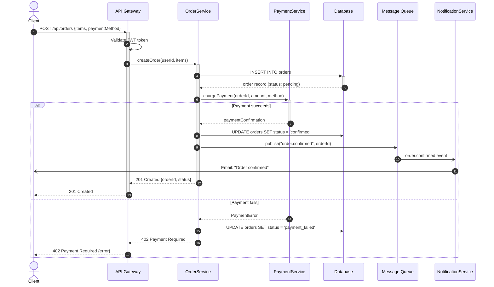

**Why Sequence Diagram:** The temporal ordering of messages across six services is critical to understanding this flow. The `alt` block clearly shows the diverging paths for success vs. failure.

---

## 2. Microservices Architecture

**Scenario:** Documenting the high-level architecture of an e-commerce platform with multiple backend services.

**Diagram type:** Flowchart with subgraphs -- best for showing service boundaries and communication paths.

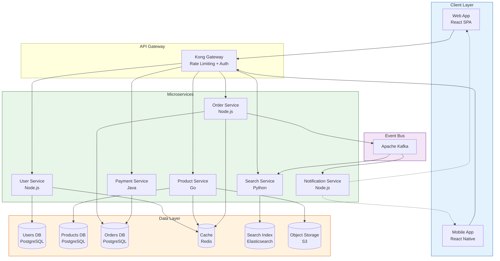

**Why Flowchart with Subgraphs:** Subgraphs naturally represent service boundaries (client, gateway, services, data, messaging). The color-coded groups make the layers instantly recognizable.

---

## 3. Database Schema

**Scenario:** Documenting the relational schema for a SaaS project management tool.

**Diagram type:** ER Diagram -- the standard for showing entities, attributes, and relationships with cardinality.

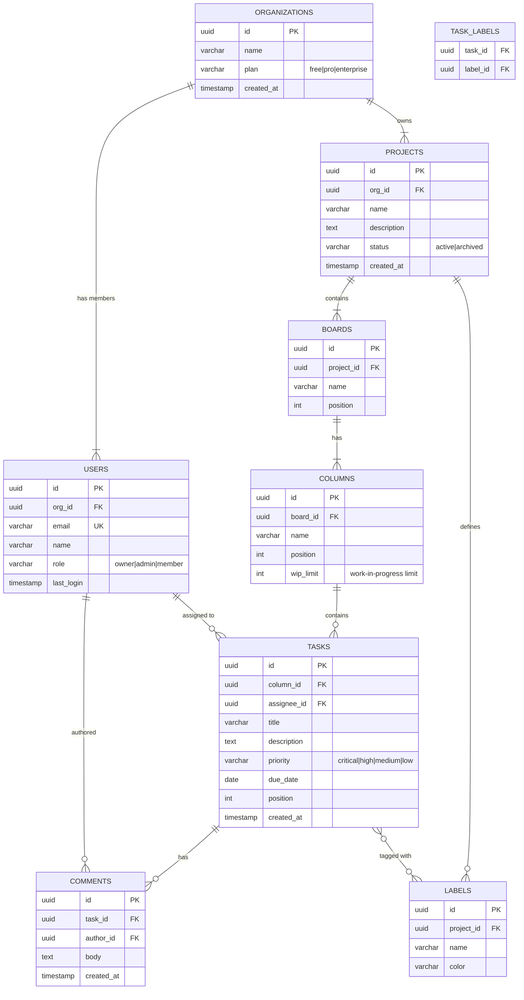

**Why ER Diagram:** Cardinality notation (one-to-many, many-to-many) is essential for database documentation. ER diagrams show the full data model at a glance with attribute types and keys.

---

## 4. Authentication Flow with Error Handling

**Scenario:** Documenting OAuth 2.0 authorization code flow with PKCE, including token refresh and error paths.

**Diagram type:** Sequence Diagram with alt/opt/loop blocks -- best for multi-party authentication flows with conditional branches.

```mermaid
sequenceDiagram
    autonumber
    actor User
    participant App as Client App
    participant Auth as Auth Server
    participant API as Resource API

    Note over App : Generate code_verifier + code_challenge

    User ->>+ App : Click "Login"
    App ->> Auth : GET /authorize?response_type=code<br/>&code_challenge=X&method=S256
    Auth ->>+ User : Show login form
    User ->> Auth : Enter credentials

    alt Valid credentials
        Auth ->> Auth : Generate authorization code
        Auth -->>- App : Redirect with ?code=AUTH_CODE
        App ->>+ Auth : POST /token {code, code_verifier}
        Auth ->> Auth : Verify code_verifier matches code_challenge
        Auth -->>- App : {access_token, refresh_token, expires_in}
        App ->> App : Store tokens securely

        loop API requests
            App ->>+ API : GET /resource (Bearer access_token)
            alt Token valid
                API -->>- App : 200 OK {data}
            else Token expired
                API -->> App : 401 Unauthorized
                App ->>+ Auth : POST /token {grant_type=refresh, refresh_token}
                alt Refresh token valid
                    Auth -->>- App : New {access_token, refresh_token}
                    App ->> API : Retry with new token
                else Refresh token expired
                    Auth -->> App : 401 Invalid refresh token
                    App -->> User : Redirect to login
                end
            end
        end
    else Invalid credentials
        Auth -->> User : Show error message
    end

    deactivate App
```

**Why Sequence Diagram with alt/opt:** Authentication flows involve multiple parties exchanging tokens. The `alt` blocks clearly document the success vs. failure paths, and the `loop` block shows the ongoing token refresh cycle.

---

## 5. CI/CD Pipeline

**Scenario:** Documenting a GitHub Actions CI/CD pipeline with parallel test jobs and conditional deployment.

**Diagram type:** Flowchart -- best for showing pipeline stages, parallelism, and conditional gates.

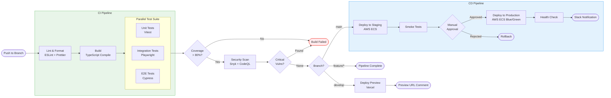

**Why Flowchart:** CI/CD pipelines are inherently sequential with branching conditions. Subgraphs separate CI from CD stages, and the parallel test suite is clearly visible.

---

## 6. Order Processing State Machine

**Scenario:** Documenting all possible states and transitions for an e-commerce order lifecycle.

**Diagram type:** State Diagram -- the standard for modeling lifecycle states, events, and transitions.

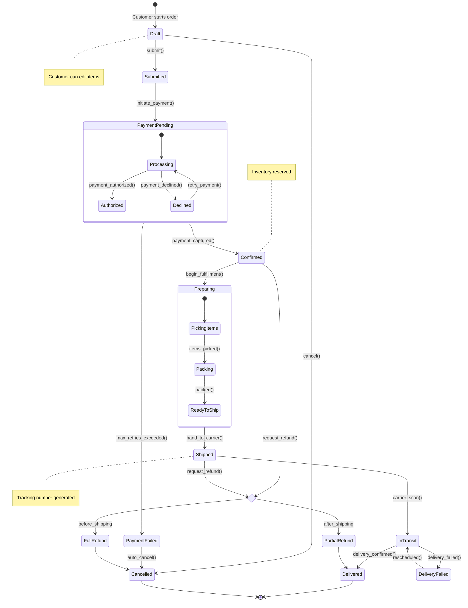

**Why State Diagram:** Order lifecycles have well-defined states and transitions with business rules governing each transition. Composite states (PaymentPending, Preparing) group related sub-states cleanly.

---

## 7. System Architecture Overview (C4 Context)

**Scenario:** Documenting the system context for a healthcare appointment booking platform, showing external users and systems.

**Diagram type:** C4 Context -- shows the system boundary, users, and external system dependencies at the highest level.

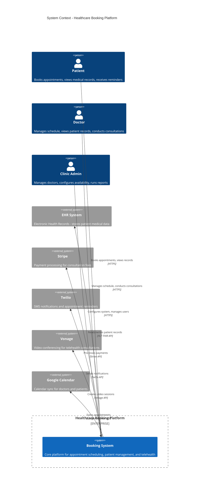

**Why C4 Context:** At the start of any architecture documentation, you need a "zoomed out" view showing who uses the system and what external systems it depends on. C4 Context diagrams are the standard for this.

---

## 8. Service Internals (C4 Component)

**Scenario:** Documenting the internal component structure of the Booking Service from the healthcare platform above.

**Diagram type:** C4 Component -- shows the internal components within a container, their responsibilities, and relationships.

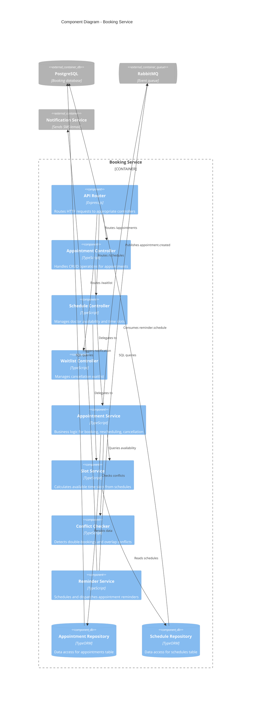

**Why C4 Component:** After the context view, engineers need to understand what is inside a service. The component diagram shows controllers, services, and repositories -- the building blocks of the implementation.

---

## 9. User Signup Journey

**Scenario:** Documenting the user experience of signing up for a SaaS product, with satisfaction scoring to identify pain points.

**Diagram type:** User Journey -- shows tasks, satisfaction scores, and actors across experience phases.

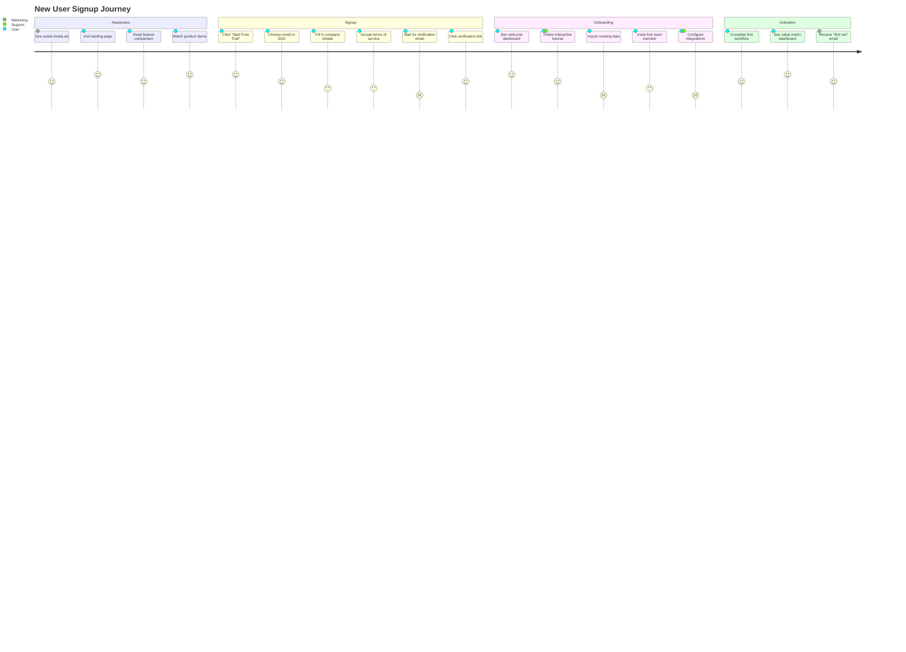

**Why User Journey:** The satisfaction scores (1-5) immediately highlight pain points in the signup flow. The "Import existing data" step scoring a 2 tells the product team exactly where users struggle. UX researchers and product managers find this format actionable.

---

## 10. Sprint Timeline

**Scenario:** Documenting the planned timeline for a two-week sprint with task dependencies and milestones.

**Diagram type:** Gantt Chart -- the standard for project scheduling with durations, dependencies, and progress tracking.

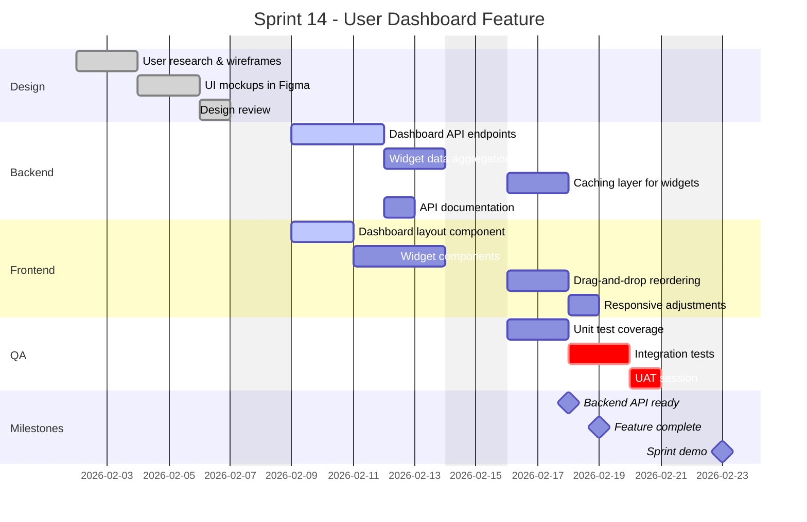

**Why Gantt Chart:** Sprint planning requires visualizing task durations, parallel workstreams, dependencies, and milestones. The Gantt format is universally understood by engineering teams and project managers.

---

## 11. Feature Prioritization

**Scenario:** Documenting a product team's prioritization of potential features using an effort vs. impact matrix.

**Diagram type:** Quadrant Chart -- ideal for two-axis comparisons and categorization.

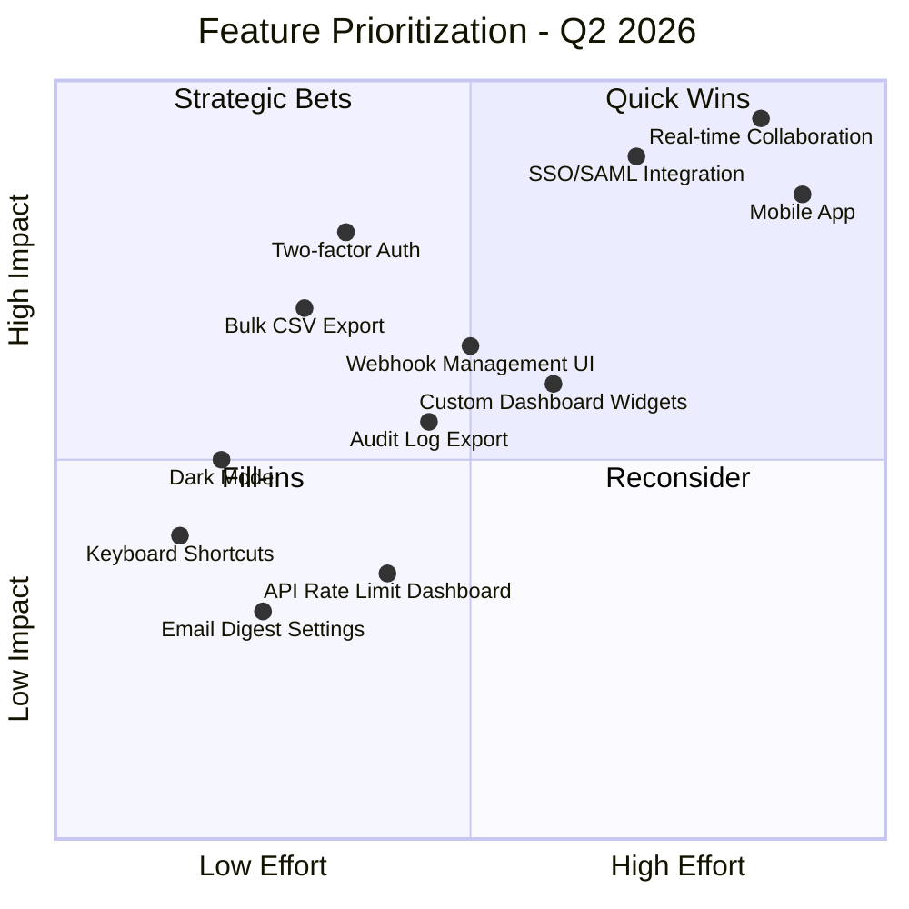

**Why Quadrant Chart:** Product prioritization is inherently a two-dimensional problem (effort vs. impact). The quadrant labels provide instant categorization, making it easy to communicate decisions in product review meetings.

---

## 12. Technology Decision Tree

**Scenario:** Documenting the decision framework for choosing a state management solution in a React application.

**Diagram type:** Mindmap -- best for hierarchical exploration of options and their trade-offs.

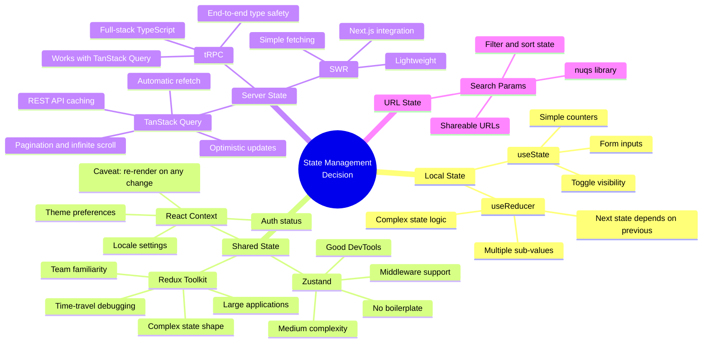

**Why Mindmap:** Decision trees with nested criteria naturally form a hierarchical structure. The mindmap format lets you explore options at each level without the rigidity of a flowchart, making it ideal for technology evaluation documents.

---

## 13. Project Milestones

**Scenario:** Documenting the key milestones and events across the first year of a startup product launch.

**Diagram type:** Timeline -- shows chronological events grouped by period.

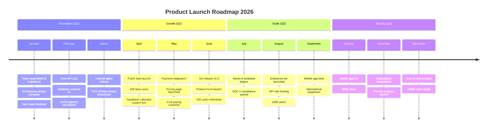

**Why Timeline:** Project milestones are chronological by nature. The section grouping (quarters) provides structure, and multiple events per period show the density of activities.

---

## 14. Git Branching Strategy

**Scenario:** Documenting a team's Git branching strategy based on a simplified Git Flow model.

**Diagram type:** Git Graph -- the only diagram type that directly models Git operations.

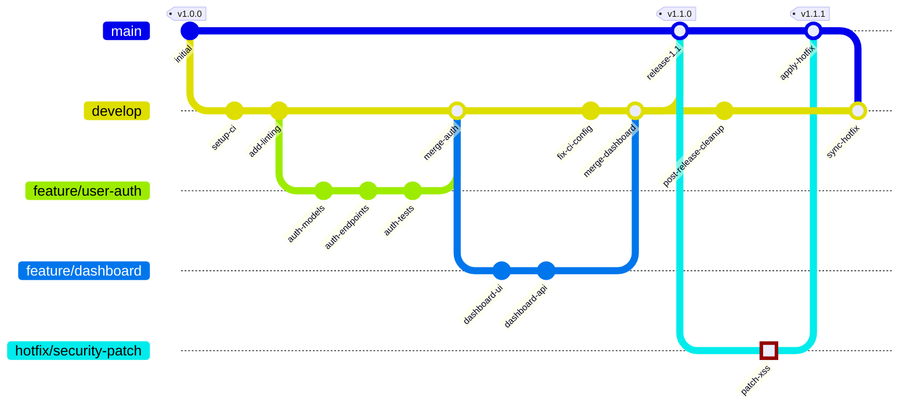

**Why Git Graph:** No other diagram type can accurately represent branches, merges, cherry-picks, and tags. This format is essential for documenting branching strategies in team onboarding guides.

---

## 15. Error Distribution

**Scenario:** Documenting the distribution of production errors by category from the last month's monitoring data.

**Diagram type:** Pie Chart -- best for showing proportional distribution of a single metric.

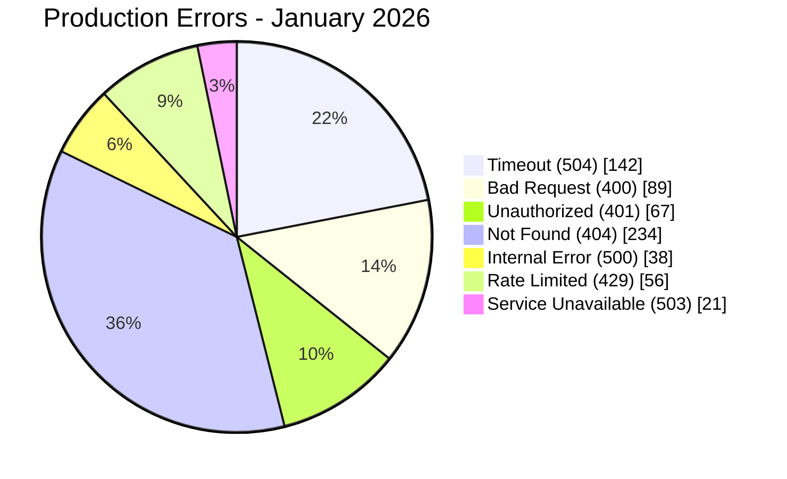

**Why Pie Chart:** When you need to communicate "what percentage of errors fall into each category," a pie chart provides instant visual proportions. The `showData` option adds raw counts for precision.

---

## 16. Deployment Architecture

**Scenario:** Documenting the cloud infrastructure layout for a production application.

**Diagram type:** Block Diagram -- best for showing layered system composition with visual hierarchy.

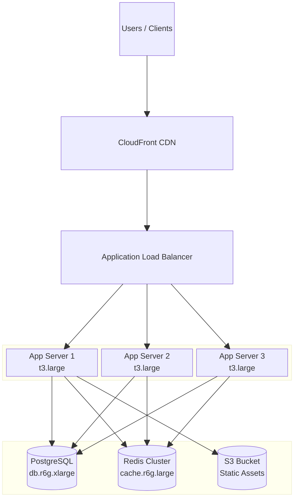

**Why Block Diagram:** Infrastructure layouts are inherently layered (client > CDN > load balancer > compute > data). The block diagram's column system and spanning create a natural top-to-bottom infrastructure view that resembles traditional cloud architecture diagrams.
