# Mermaid Diagram Syntax Reference

Complete syntax reference for all Mermaid diagram types. Use this as a lookup when generating diagrams.

## Table of Contents

1. [Flowchart](#1-flowchart)
2. [Sequence Diagram](#2-sequence-diagram)
3. [Class Diagram](#3-class-diagram)
4. [State Diagram](#4-state-diagram)
5. [Entity Relationship Diagram](#5-entity-relationship-diagram)
6. [C4 Context Diagram](#6-c4-context-diagram)
7. [C4 Container Diagram](#7-c4-container-diagram)
8. [C4 Component Diagram](#8-c4-component-diagram)
9. [C4 Dynamic Diagram](#9-c4-dynamic-diagram)
10. [C4 Deployment Diagram](#10-c4-deployment-diagram)
11. [User Journey](#11-user-journey)
12. [Gantt Chart](#12-gantt-chart)
13. [Quadrant Chart](#13-quadrant-chart)
14. [Mindmap](#14-mindmap)
15. [Timeline](#15-timeline)
16. [Git Graph](#16-git-graph)
17. [Pie Chart](#17-pie-chart)
18. [Block Diagram](#18-block-diagram)
19. [Architecture Diagram](#19-architecture-diagram)
20. [Kanban Diagram](#20-kanban-diagram)
21. [Packet Diagram](#21-packet-diagram)
22. [Styling and Theming](#styling-and-theming)
23. [Troubleshooting](#troubleshooting)

---

## 1. Flowchart

**Keyword:** `flowchart` or `graph`
**Direction:** `TD` (top-down), `TB` (top-bottom), `BT` (bottom-top), `LR` (left-right), `RL` (right-left)

### Node Shapes

```
id              %% Default rectangle
id[Text]        %% Rectangle
id(Text)        %% Rounded rectangle
id([Text])      %% Stadium / pill shape
id[[Text]]      %% Subroutine
id[(Text)]      %% Cylinder (database)
id((Text))      %% Circle
id{Text}        %% Diamond / rhombus
id{{Text}}      %% Hexagon
id[/Text/]      %% Parallelogram
id[\Text\]      %% Parallelogram (reversed)
id[/Text\]      %% Trapezoid
id[\Text/]      %% Trapezoid (reversed)
id>Text]        %% Flag / asymmetric
id(((Text)))    %% Double circle
```

### Link/Arrow Types

```
A --> B          %% Arrow
A --- B          %% Line (no arrow)
A -.-> B         %% Dotted arrow
A -.- B          %% Dotted line
A ==> B          %% Thick arrow
A === B          %% Thick line
A --text--> B    %% Arrow with label
A ---|text|B     %% Line with label
A -.text.-> B    %% Dotted arrow with label
A ==text==> B    %% Thick arrow with label
A <--> B         %% Bidirectional arrow
A o--o B         %% Circle endpoints
A x--x B         %% Cross endpoints
```

### Subgraphs

```
subgraph title [Display Title]
    direction LR
    A --> B
end
```

Subgraphs can be nested and linked:
```
subgraph outer
    subgraph inner
        A --> B
    end
    C --> inner
end
```

### Complete Example

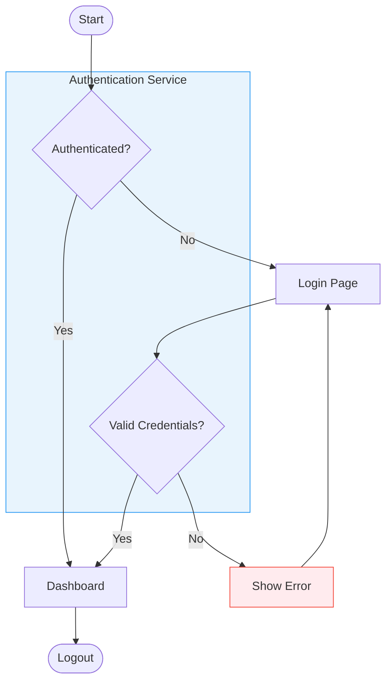
```mermaid
flowchart TD
    Start([Start]) --> CheckAuth{Authenticated?}
    CheckAuth -->|Yes| Dashboard[Dashboard]
    CheckAuth -->|No| Login[Login Page]
    Login --> Validate{Valid Credentials?}
    Validate -->|Yes| Dashboard
    Validate -->|No| Error[Show Error]
    Error --> Login
    Dashboard --> Logout([Logout])

    subgraph auth [Authentication Service]
        CheckAuth
        Validate
    end

    style auth fill:#e8f4fd,stroke:#2196f3
    style Error fill:#ffebee,stroke:#f44336
```

### Common Pitfalls
- Node IDs cannot contain spaces -- use `id[Label With Spaces]` syntax.
- The keyword `end` is reserved -- if you need it as a node label, wrap it: `e[end]`.
- Subgraph IDs must be unique across the entire diagram.
- Avoid circular references unless intentional -- they render but can be confusing.

---

## 2. Sequence Diagram

**Keyword:** `sequenceDiagram`

### Participants and Actors

```
participant A as Alice
actor B as Bob
```

`participant` renders as a box, `actor` renders as a stick figure.

### Message Types

```
A ->> B : Solid arrow (request)
A -->> B : Dashed arrow (response)
A -) B : Solid open arrow (async)
A --) B : Dashed open arrow (async response)
A -x B : Solid with cross (failure)
A --x B : Dashed with cross
```

### Activation/Deactivation

```
activate A
A ->> B : Request
deactivate A
```

Shorthand with `+` and `-`:
```
A ->>+ B : Request (activates B)
B -->>- A : Response (deactivates B)
```

### Grouping Blocks

```
alt Condition description
    A ->> B : Message when true
else Other condition
    A ->> C : Message when false
end

opt Optional block
    A ->> B : Optional message
end

loop Every 5 seconds
    A ->> B : Health check
end

par Parallel group
    A ->> B : Task 1
and
    A ->> C : Task 2
end

critical Critical region
    A ->> B : Must complete
option Timeout
    A ->> C : Fallback
end

break When error occurs
    A ->> B : Error handling
end
```

### Notes

```
Note left of A : Note text
Note right of B : Note text
Note over A,B : Spanning note
```

### Sequence Numbers

```
autonumber
```

Place at the top to auto-number all messages.

### Complete Example

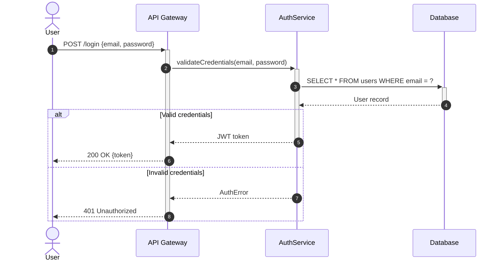
```mermaid
sequenceDiagram
    autonumber
    actor User
    participant API as API Gateway
    participant Auth as AuthService
    participant DB as Database

    User ->>+ API : POST /login {email, password}
    API ->>+ Auth : validateCredentials(email, password)
    Auth ->>+ DB : SELECT * FROM users WHERE email = ?
    DB -->>- Auth : User record
    alt Valid credentials
        Auth -->>- API : JWT token
        API -->> User : 200 OK {token}
    else Invalid credentials
        Auth -->> API : AuthError
        API -->>- User : 401 Unauthorized
    end
```

### Common Pitfalls
- Participant names with special characters must be aliased: `participant db as "PostgreSQL DB"`.
- The `end` keyword closes `alt`, `opt`, `loop`, `par`, `critical`, `break` blocks.
- Messages to self are valid: `A ->> A : Internal call`.
- Nested blocks are supported but can become hard to read beyond 2 levels.

---

## 3. Class Diagram

**Keyword:** `classDiagram`

### Class Definition

```
class ClassName {
    +String publicField
    -int privateField
    #List~String~ protectedField
    ~float packageField
    +publicMethod(param) ReturnType
    -privateMethod() void
    #protectedMethod(a, b) bool
    +abstractMethod()* ReturnType
    +staticMethod()$ ReturnType
}
```

Visibility: `+` public, `-` private, `#` protected, `~` package/internal.
Modifiers: `*` abstract, `$` static.

### Relationships

```
ClassA --|> ClassB : Inheritance
ClassA ..|> InterfaceA : Implementation
ClassA --* ClassB : Composition
ClassA --o ClassB : Aggregation
ClassA --> ClassB : Association
ClassA ..> ClassB : Dependency
ClassA -- ClassB : Link (solid)
ClassA .. ClassB : Link (dashed)
```

### Cardinality

```
ClassA "1" --> "*" ClassB : has
ClassA "1" --> "0..1" ClassB : may have
ClassA "0..*" --> "1..*" ClassB : relates
```

### Annotations

```
class Shape {
    <<abstract>>
}
class Serializable {
    <<interface>>
}
class Color {
    <<enumeration>>
    RED
    GREEN
    BLUE
}
class Singleton {
    <<service>>
}
```

### Namespace

```
namespace BaseShapes {
    class Triangle
    class Rectangle
}
```

### Complete Example

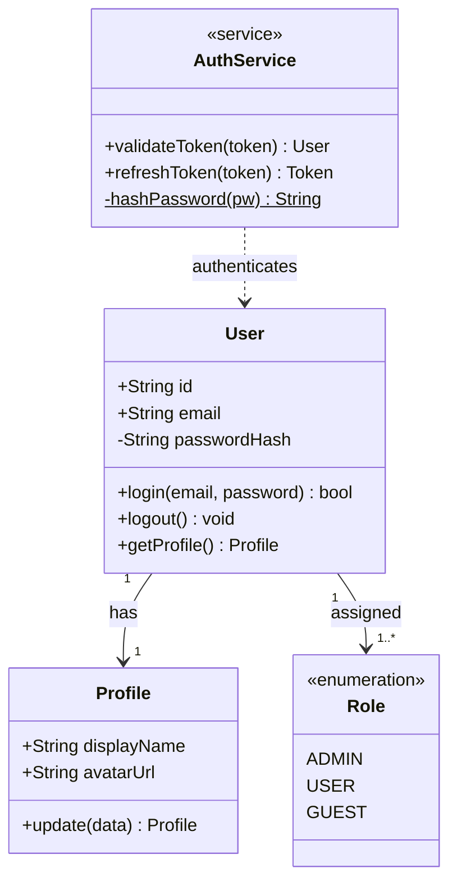
```mermaid
classDiagram
    class User {
        +String id
        +String email
        -String passwordHash
        +login(email, password) bool
        +logout() void
        +getProfile() Profile
    }
    class Profile {
        +String displayName
        +String avatarUrl
        +update(data) Profile
    }
    class Role {
        <<enumeration>>
        ADMIN
        USER
        GUEST
    }
    class AuthService {
        <<service>>
        +validateToken(token) User
        +refreshToken(token) Token
        -hashPassword(pw)$ String
    }

    User "1" --> "1" Profile : has
    User "1" --> "1..*" Role : assigned
    AuthService ..> User : authenticates
```

### Common Pitfalls
- Generics use tilde syntax: `List~String~` not `List<String>` (angle brackets break parsing).
- Method return types come after the parentheses: `+method() ReturnType`.
- Direction can be set: `direction LR` or `direction TB`.

---

## 4. State Diagram

**Keyword:** `stateDiagram-v2`

### States and Transitions

```
[*] --> Idle              %% Start state
Idle --> Processing : submit
Processing --> Done : complete
Processing --> Error : fail
Error --> Idle : retry
Done --> [*]              %% End state
```

### State Description

```
state "Long State Name" as longState
```

### Composite States

```
state Active {
    [*] --> Running
    Running --> Paused : pause
    Paused --> Running : resume
    Running --> [*] : stop
}
```

### Fork and Join

```
state fork_state <<fork>>
state join_state <<join>>

[*] --> fork_state
fork_state --> TaskA
fork_state --> TaskB
TaskA --> join_state
TaskB --> join_state
join_state --> Done
```

### Choice (Decision)

```
state check <<choice>>
[*] --> check
check --> Approved : if valid
check --> Rejected : if invalid
```

### Notes

```
note left of Active : This is a note
note right of Idle
    Multi-line
    note text
end note
```

### Concurrency

```
state Parallel {
    [*] --> A
    --
    [*] --> B
}
```

The `--` separator creates concurrent regions.

### Complete Example

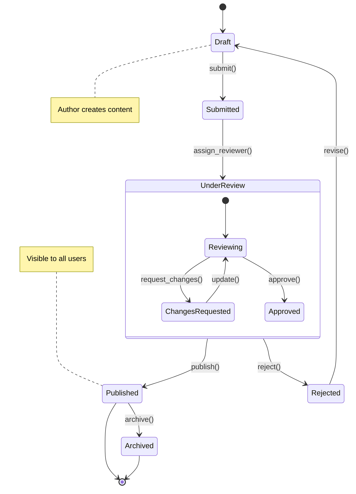
```mermaid
stateDiagram-v2
    [*] --> Draft

    Draft --> Submitted : submit()
    Submitted --> UnderReview : assign_reviewer()

    state UnderReview {
        [*] --> Reviewing
        Reviewing --> ChangesRequested : request_changes()
        ChangesRequested --> Reviewing : update()
        Reviewing --> Approved : approve()
    }

    UnderReview --> Published : publish()
    UnderReview --> Rejected : reject()
    Rejected --> Draft : revise()
    Published --> Archived : archive()
    Published --> [*]
    Archived --> [*]

    note right of Draft : Author creates content
    note left of Published : Visible to all users
```

### Common Pitfalls
- Use `stateDiagram-v2` not `stateDiagram` for the latest features.
- State IDs cannot contain spaces -- use the `state "Label" as id` syntax.
- `[*]` represents both start and end states depending on context.
- Composite states cannot be empty.

---

## 5. Entity Relationship Diagram

**Keyword:** `erDiagram`

### Relationships and Cardinality

```
ENTITY1 ||--o{ ENTITY2 : "relationship"
```

Left/right markers:
- `||` -- exactly one
- `o|` -- zero or one
- `}|` -- one or more
- `}o` -- zero or more

Line style:
- `--` -- identifying (solid)
- `..` -- non-identifying (dashed)

### Entity Attributes

```
ENTITY {
    type name PK "comment"
    type name FK
    type name UK
    type name
}
```

Attribute keys: `PK` (primary key), `FK` (foreign key), `UK` (unique key).

### Complete Example

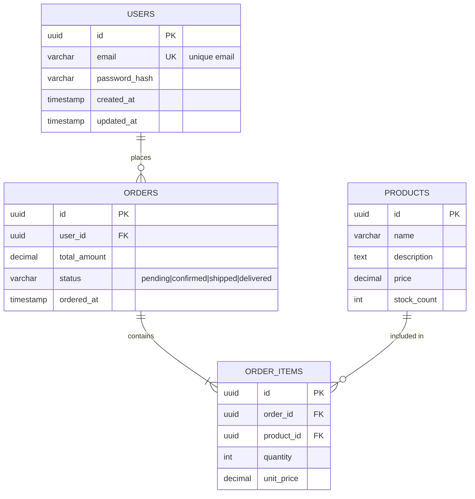
```mermaid
erDiagram
    USERS {
        uuid id PK
        varchar email UK "unique email"
        varchar password_hash
        timestamp created_at
        timestamp updated_at
    }
    ORDERS {
        uuid id PK
        uuid user_id FK
        decimal total_amount
        varchar status "pending|confirmed|shipped|delivered"
        timestamp ordered_at
    }
    ORDER_ITEMS {
        uuid id PK
        uuid order_id FK
        uuid product_id FK
        int quantity
        decimal unit_price
    }
    PRODUCTS {
        uuid id PK
        varchar name
        text description
        decimal price
        int stock_count
    }

    USERS ||--o{ ORDERS : places
    ORDERS ||--|{ ORDER_ITEMS : contains
    PRODUCTS ||--o{ ORDER_ITEMS : "included in"
```

### Common Pitfalls
- Relationship labels must be quoted if they contain spaces.
- Entity names are typically UPPER_CASE by convention.
- Attribute types are just labels -- Mermaid does not validate SQL types.
- Each relationship line must have a label string (even if empty `""`).

---

## 6. C4 Context Diagram

**Keyword:** `C4Context`

**Note:** C4 diagrams are experimental in Mermaid. Syntax may change in future releases.

### Elements

```
Person(alias, "Label", "Description")
Person_Ext(alias, "Label", "Description")
System(alias, "Label", "Description")
System_Ext(alias, "Label", "Description")
SystemDb(alias, "Label", "Description")
SystemDb_Ext(alias, "Label", "Description")
SystemQueue(alias, "Label", "Description")
SystemQueue_Ext(alias, "Label", "Description")
```

### Boundaries

```
Enterprise_Boundary(alias, "Label") {
    ...elements...
}
System_Boundary(alias, "Label") {
    ...elements...
}
Boundary(alias, "Label", "type") {
    ...elements...
}
```

### Relationships

```
Rel(from, to, "label", "technology")
Rel_D(from, to, "label")    %% Downward
Rel_U(from, to, "label")    %% Upward
Rel_L(from, to, "label")    %% Left
Rel_R(from, to, "label")    %% Right
BiRel(from, to, "label")    %% Bidirectional
```

### Layout and Styling

```
UpdateLayoutConfig($c4ShapeInRow="3", $c4BoundaryInRow="1")
UpdateRelStyle(from, to, $textColor="red", $lineColor="blue", $offsetX="-40", $offsetY="60")
UpdateElementStyle(alias, $bgColor="grey", $fontColor="white", $borderColor="black")
```

### Complete Example

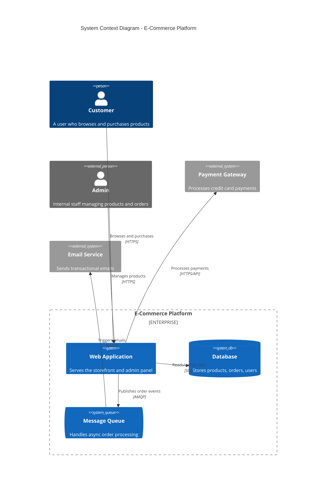
```mermaid
C4Context
    title System Context Diagram - E-Commerce Platform

    Person(customer, "Customer", "A user who browses and purchases products")
    Person_Ext(admin, "Admin", "Internal staff managing products and orders")

    Enterprise_Boundary(b0, "E-Commerce Platform") {
        System(webApp, "Web Application", "Serves the storefront and admin panel")
        SystemDb(db, "Database", "Stores products, orders, users")
        SystemQueue(queue, "Message Queue", "Handles async order processing")
    }

    System_Ext(payment, "Payment Gateway", "Processes credit card payments")
    System_Ext(email, "Email Service", "Sends transactional emails")

    Rel(customer, webApp, "Browses and purchases", "HTTPS")
    Rel(admin, webApp, "Manages products", "HTTPS")
    Rel(webApp, db, "Reads/writes data", "SQL")
    Rel(webApp, queue, "Publishes order events", "AMQP")
    Rel(webApp, payment, "Processes payments", "HTTPS/API")
    Rel(queue, email, "Triggers emails", "SMTP")

    UpdateLayoutConfig($c4ShapeInRow="3", $c4BoundaryInRow="1")
```

### Common Pitfalls
- All string parameters must be double-quoted.
- Layout is controlled by statement order, not automatic algorithms.
- Sprites, tags, and links are not yet supported in Mermaid's C4 implementation.
- Use `UpdateLayoutConfig` to control how many shapes per row to avoid cramped diagrams.

---

## 7. C4 Container Diagram

**Keyword:** `C4Container`

### Additional Elements (beyond C4Context)

```
Container(alias, "Label", "Technology", "Description")
Container_Ext(alias, "Label", "Technology", "Description")
ContainerDb(alias, "Label", "Technology", "Description")
ContainerDb_Ext(alias, "Label", "Technology", "Description")
ContainerQueue(alias, "Label", "Technology", "Description")
Container_Boundary(alias, "Label") {
    ...containers...
}
```

### Complete Example

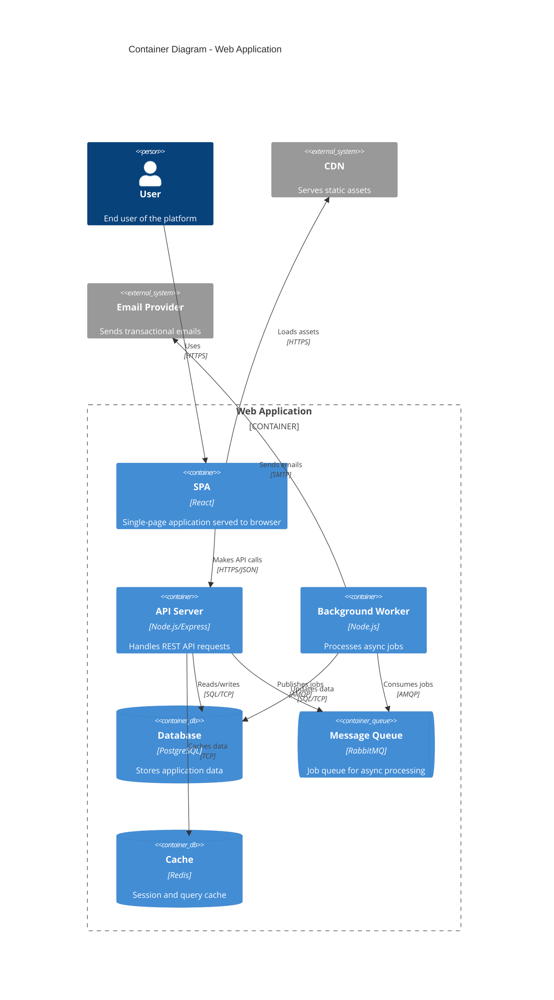
```mermaid
C4Container
    title Container Diagram - Web Application

    Person(user, "User", "End user of the platform")

    Container_Boundary(b1, "Web Application") {
        Container(spa, "SPA", "React", "Single-page application served to browser")
        Container(api, "API Server", "Node.js/Express", "Handles REST API requests")
        Container(worker, "Background Worker", "Node.js", "Processes async jobs")
        ContainerDb(db, "Database", "PostgreSQL", "Stores application data")
        ContainerQueue(queue, "Message Queue", "RabbitMQ", "Job queue for async processing")
        ContainerDb(cache, "Cache", "Redis", "Session and query cache")
    }

    System_Ext(cdn, "CDN", "Serves static assets")
    System_Ext(email, "Email Provider", "Sends transactional emails")

    Rel(user, spa, "Uses", "HTTPS")
    Rel(spa, cdn, "Loads assets", "HTTPS")
    Rel(spa, api, "Makes API calls", "HTTPS/JSON")
    Rel(api, db, "Reads/writes", "SQL/TCP")
    Rel(api, cache, "Caches data", "TCP")
    Rel(api, queue, "Publishes jobs", "AMQP")
    Rel(worker, queue, "Consumes jobs", "AMQP")
    Rel(worker, db, "Updates data", "SQL/TCP")
    Rel(worker, email, "Sends emails", "SMTP")
```

---

## 8. C4 Component Diagram

**Keyword:** `C4Component`

### Additional Elements

```
Component(alias, "Label", "Technology", "Description")
Component_Ext(alias, "Label", "Technology", "Description")
ComponentDb(alias, "Label", "Technology", "Description")
ComponentQueue(alias, "Label", "Technology", "Description")
```

### Complete Example

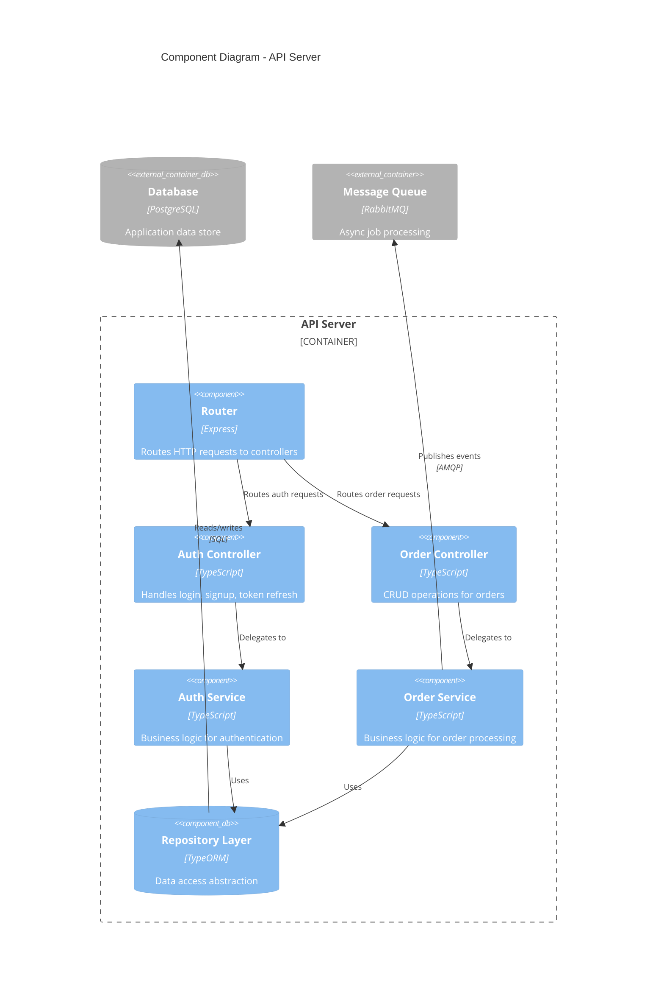
```mermaid
C4Component
    title Component Diagram - API Server

    Container_Boundary(api, "API Server") {
        Component(router, "Router", "Express", "Routes HTTP requests to controllers")
        Component(authCtrl, "Auth Controller", "TypeScript", "Handles login, signup, token refresh")
        Component(orderCtrl, "Order Controller", "TypeScript", "CRUD operations for orders")
        Component(authSvc, "Auth Service", "TypeScript", "Business logic for authentication")
        Component(orderSvc, "Order Service", "TypeScript", "Business logic for order processing")
        ComponentDb(repo, "Repository Layer", "TypeORM", "Data access abstraction")
    }

    ContainerDb_Ext(db, "Database", "PostgreSQL", "Application data store")
    Container_Ext(queue, "Message Queue", "RabbitMQ", "Async job processing")

    Rel(router, authCtrl, "Routes auth requests")
    Rel(router, orderCtrl, "Routes order requests")
    Rel(authCtrl, authSvc, "Delegates to")
    Rel(orderCtrl, orderSvc, "Delegates to")
    Rel(authSvc, repo, "Uses")
    Rel(orderSvc, repo, "Uses")
    Rel(orderSvc, queue, "Publishes events", "AMQP")
    Rel(repo, db, "Reads/writes", "SQL")
```

---

## 9. C4 Dynamic Diagram

**Keyword:** `C4Dynamic`

Shows numbered interaction flows between elements.

### Key Syntax

```
RelIndex(index, from, to, "label", "technology")
```

Note: The `index` parameter is for documentation only -- the rendering order follows statement order.

### Complete Example

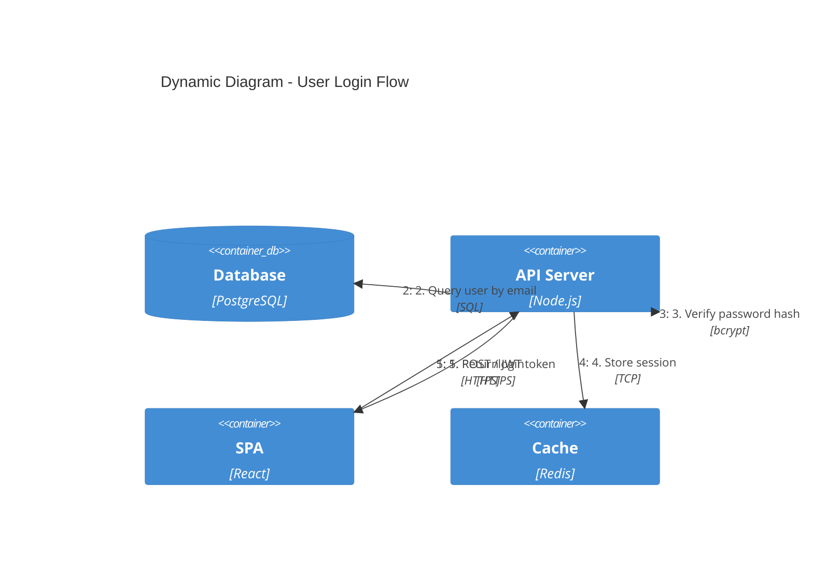
```mermaid
C4Dynamic
    title Dynamic Diagram - User Login Flow

    ContainerDb(db, "Database", "PostgreSQL")
    Container(api, "API Server", "Node.js")
    Container(spa, "SPA", "React")
    Container(cache, "Cache", "Redis")

    Rel(spa, api, "1. POST /login", "HTTPS")
    Rel(api, db, "2. Query user by email", "SQL")
    Rel(api, api, "3. Verify password hash", "bcrypt")
    Rel(api, cache, "4. Store session", "TCP")
    Rel(api, spa, "5. Return JWT token", "HTTPS")
```

---

## 10. C4 Deployment Diagram

**Keyword:** `C4Deployment`

### Elements

```
Deployment_Node(alias, "Label", "Type", "Description") {
    ...nested nodes or containers...
}
Node(alias, "Label", "Type", "Description")        %% Short form
Node_L(alias, "Label", "Type", "Description")       %% Left-aligned
Node_R(alias, "Label", "Type", "Description")       %% Right-aligned
```

### Complete Example

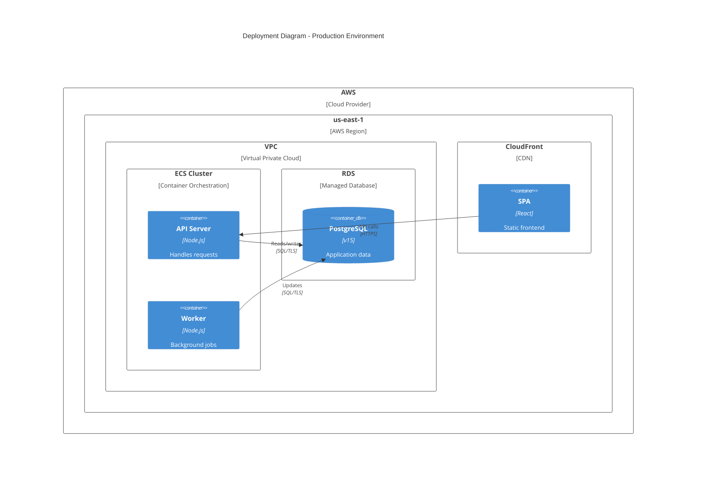
```mermaid
C4Deployment
    title Deployment Diagram - Production Environment

    Deployment_Node(cloud, "AWS", "Cloud Provider") {
        Deployment_Node(region, "us-east-1", "AWS Region") {
            Deployment_Node(vpc, "VPC", "Virtual Private Cloud") {
                Deployment_Node(ecs, "ECS Cluster", "Container Orchestration") {
                    Container(api, "API Server", "Node.js", "Handles requests")
                    Container(worker, "Worker", "Node.js", "Background jobs")
                }
                Deployment_Node(rds, "RDS", "Managed Database") {
                    ContainerDb(db, "PostgreSQL", "v15", "Application data")
                }
            }
            Deployment_Node(cdn_node, "CloudFront", "CDN") {
                Container(spa, "SPA", "React", "Static frontend")
            }
        }
    }

    Rel(spa, api, "API calls", "HTTPS")
    Rel(api, db, "Reads/writes", "SQL/TLS")
    Rel(worker, db, "Updates", "SQL/TLS")
```

---

## 11. User Journey

**Keyword:** `journey`

### Syntax

```
journey
    title My Journey Title
    section Section Name
        Task description: satisfaction_score: actor1, actor2
```

Satisfaction score: 1 (worst) to 5 (best).

### Complete Example

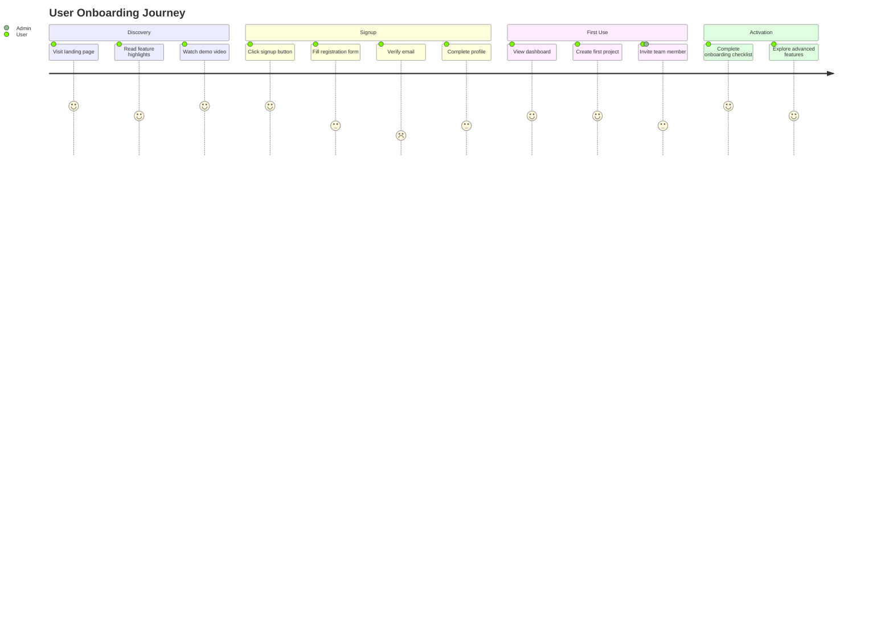
```mermaid
journey
    title User Onboarding Journey
    section Discovery
        Visit landing page: 5: User
        Read feature highlights: 4: User
        Watch demo video: 5: User
    section Signup
        Click signup button: 5: User
        Fill registration form: 3: User
        Verify email: 2: User
        Complete profile: 3: User
    section First Use
        View dashboard: 4: User
        Create first project: 4: User
        Invite team member: 3: User, Admin
    section Activation
        Complete onboarding checklist: 5: User
        Explore advanced features: 4: User
```

### Common Pitfalls
- Actor names are comma-separated after the score.
- Scores must be integers between 1 and 5.
- Section names group tasks visually -- use them to represent phases.

---

## 12. Gantt Chart

**Keyword:** `gantt`

### Structure

```
gantt
    title Project Timeline
    dateFormat YYYY-MM-DD
    excludes weekends

    section Section Name
    Task name           :status, id, start_date, duration_or_end
    Another task        :after id, 3d
```

### Task Status Keywords

- `done` -- completed task
- `active` -- in-progress task
- `crit` -- critical path task
- `milestone` -- milestone marker (zero duration)

### Date/Duration Formats

- Start: `YYYY-MM-DD` or `after taskId`
- Duration: `1d`, `2w`, `1h`, `30min`
- End: `YYYY-MM-DD`

### Complete Example

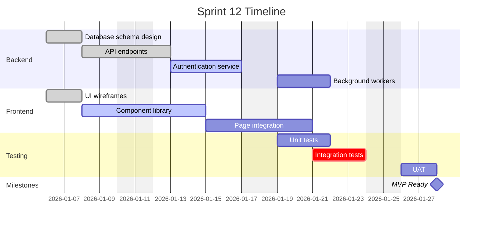
```mermaid
gantt
    title Sprint 12 Timeline
    dateFormat YYYY-MM-DD
    excludes weekends

    section Backend
    Database schema design    :done,    db,     2026-01-06, 2d
    API endpoints             :done,    api,    after db, 3d
    Authentication service    :active,  auth,   after api, 4d
    Background workers        :         workers, after auth, 3d

    section Frontend
    UI wireframes             :done,    wire,   2026-01-06, 2d
    Component library         :active,  comp,   after wire, 5d
    Page integration          :         pages,  after comp, 4d

    section Testing
    Unit tests                :         unit,   after auth, 3d
    Integration tests         :crit,    integ,  after pages, 3d
    UAT                       :         uat,    after integ, 2d

    section Milestones
    MVP Ready                 :milestone, mvp, after uat, 0d
```

### Common Pitfalls
- `dateFormat` must appear before any tasks.
- `excludes weekends` skips Saturdays and Sundays in duration calculations.
- Task IDs must not contain spaces or special characters.
- `after` references must point to previously defined task IDs.
- `milestone` tasks must have `0d` duration.

---

## 13. Quadrant Chart

**Keyword:** `quadrantChart`

### Syntax

```
quadrantChart
    title Chart Title
    x-axis "Low Label" --> "High Label"
    y-axis "Low Label" --> "High Label"
    quadrant-1 "Top Right Label"
    quadrant-2 "Top Left Label"
    quadrant-3 "Bottom Left Label"
    quadrant-4 "Bottom Right Label"
    Item Name: [x, y]
```

Coordinates: `x` and `y` are floats from 0 to 1.

### Point Styling

```
Point A: [0.9, 0.8] radius: 12, color: #ff3300
Point B:::customClass: [0.1, 0.5]
```

### Complete Example

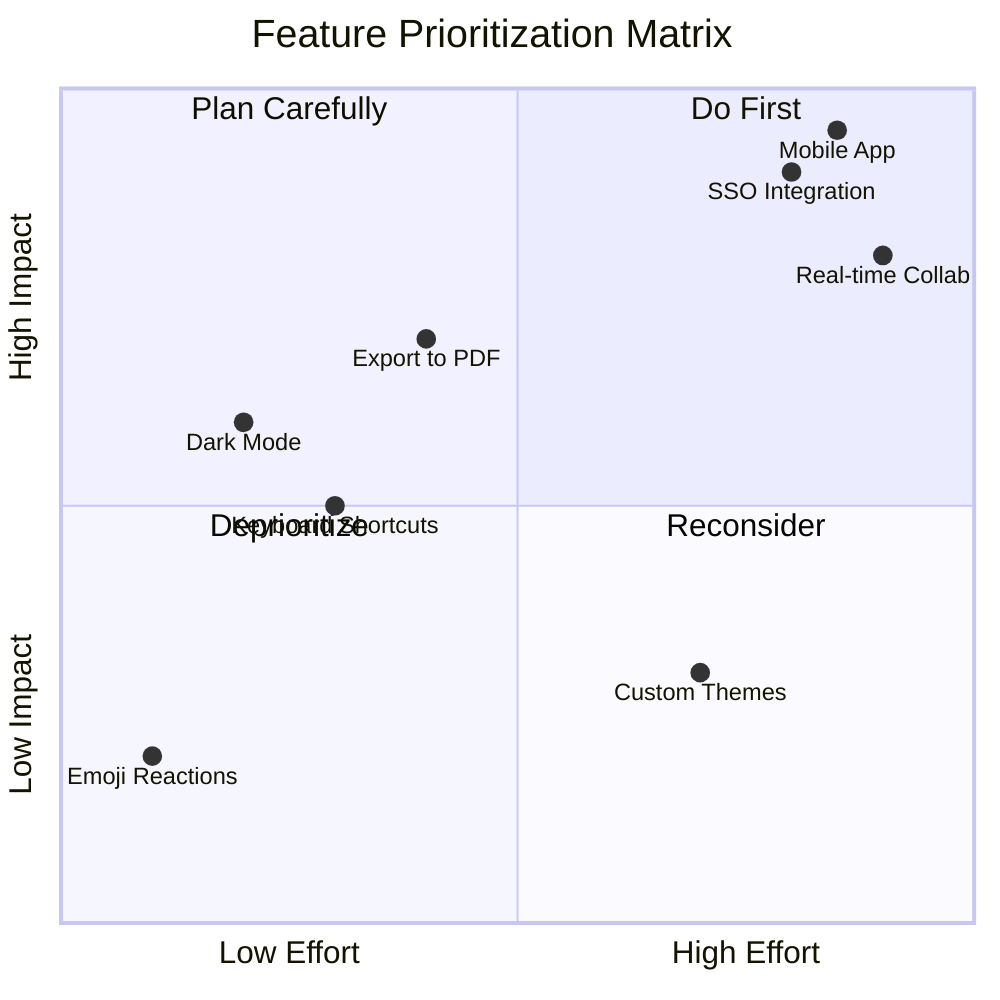
```mermaid
quadrantChart
    title Feature Prioritization Matrix
    x-axis "Low Effort" --> "High Effort"
    y-axis "Low Impact" --> "High Impact"
    quadrant-1 "Do First"
    quadrant-2 "Plan Carefully"
    quadrant-3 "Deprioritize"
    quadrant-4 "Reconsider"
    SSO Integration: [0.8, 0.9]
    Dark Mode: [0.2, 0.6]
    Export to PDF: [0.4, 0.7]
    Custom Themes: [0.7, 0.3]
    Emoji Reactions: [0.1, 0.2]
    Real-time Collab: [0.9, 0.8]
    Keyboard Shortcuts: [0.3, 0.5]
    Mobile App: [0.85, 0.95]
```

### Common Pitfalls
- Quadrant numbering starts top-right (1) and goes counter-clockwise.
- Coordinate values must be between 0 and 1 inclusive.
- Point names cannot contain colons -- they conflict with the coordinate separator.

---

## 14. Mindmap

**Keyword:** `mindmap`

### Hierarchy

Indentation defines parent-child relationships:

```
mindmap
    Root
        Child 1
            Grandchild A
            Grandchild B
        Child 2
```

### Node Shapes

```
id[Square]
id(Rounded)
id((Circle))
id))Bang((
id)Cloud(
id{{Hexagon}}
```

Default (no delimiters) uses the base shape.

### Icons

```
mindmap
    Root
        Node::icon(fa fa-book)
```

Icons require a configured icon font (e.g., Font Awesome).

### Complete Example

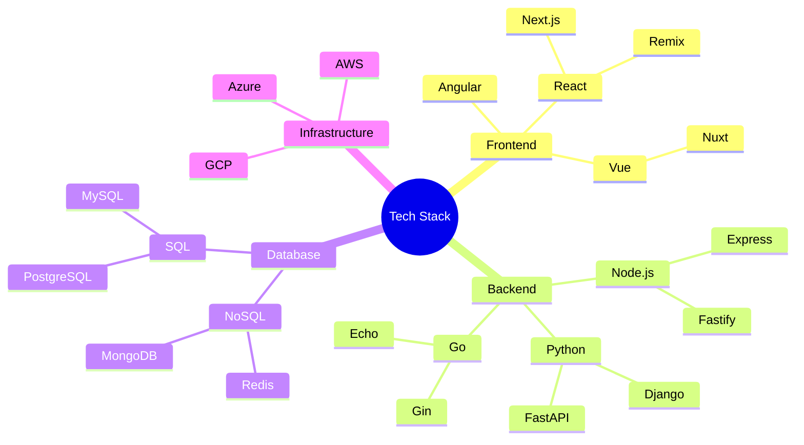
```mermaid
mindmap
    root((Tech Stack))
        Frontend
            React
                Next.js
                Remix
            Vue
                Nuxt
            Angular
        Backend
            Node.js
                Express
                Fastify
            Python
                FastAPI
                Django
            Go
                Gin
                Echo
        Database
            SQL
                PostgreSQL
                MySQL
            NoSQL
                MongoDB
                Redis
        Infrastructure
            AWS
            GCP
            Azure
```

### Common Pitfalls
- Indentation is relative to the previous line, not absolute.
- All nodes are text-only -- Markdown formatting inside nodes is limited.
- Very deep hierarchies (5+ levels) become hard to read.

---

## 15. Timeline

**Keyword:** `timeline`

### Syntax

```
timeline
    title Timeline Title
    section Section Name
        Time Period : Event 1 : Event 2
```

Multiple events per period use `:` separators or stacked format.

### Complete Example

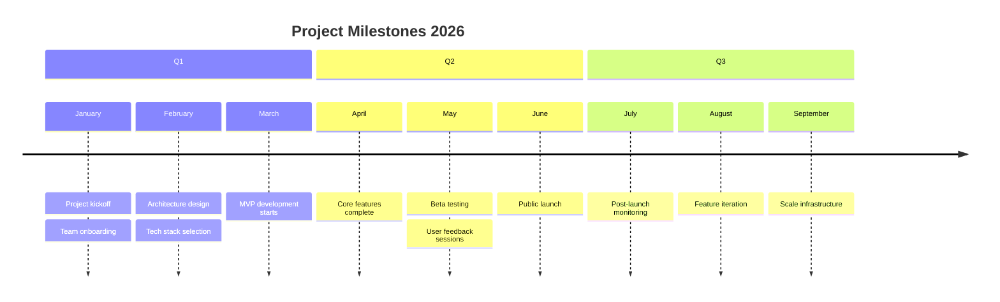
```mermaid
timeline
    title Project Milestones 2026
    section Q1
        January : Project kickoff
                : Team onboarding
        February : Architecture design
                 : Tech stack selection
        March : MVP development starts
    section Q2
        April : Core features complete
        May : Beta testing
            : User feedback sessions
        June : Public launch
    section Q3
        July : Post-launch monitoring
        August : Feature iteration
        September : Scale infrastructure
```

### Common Pitfalls
- The `section` keyword is optional but helps group periods visually.
- Events auto-wrap long text -- use `<br>` for explicit line breaks.
- Time periods are labels, not parsed dates.

---

## 16. Git Graph

**Keyword:** `gitGraph`

### Commands

```
commit                              %% Basic commit on current branch
commit id: "abc123"                 %% Commit with custom ID
commit id: "v1.0" tag: "v1.0"      %% Commit with tag
commit id: "fix" type: REVERSE     %% Reverse commit
commit type: HIGHLIGHT              %% Highlighted commit
branch feature-x                    %% Create and switch to branch
checkout main                       %% Switch to existing branch
merge feature-x                     %% Merge branch into current
merge feature-x id: "merge-123"    %% Merge with custom ID
merge feature-x tag: "v2.0"        %% Merge with tag
cherry-pick id: "abc123"           %% Cherry-pick a commit
```

### Commit Types

- `NORMAL` (default)
- `HIGHLIGHT` -- visually emphasized
- `REVERSE` -- shown as a revert

### Complete Example

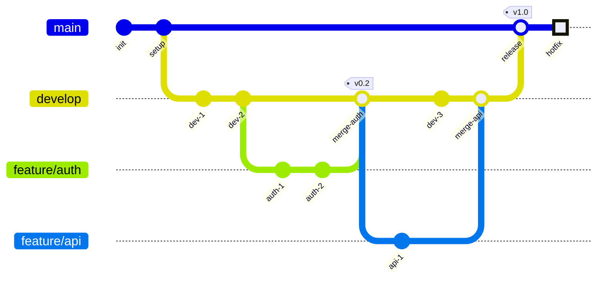
```mermaid
gitGraph
    commit id: "init"
    commit id: "setup"
    branch develop
    commit id: "dev-1"
    commit id: "dev-2"
    branch feature/auth
    commit id: "auth-1"
    commit id: "auth-2"
    checkout develop
    merge feature/auth id: "merge-auth" tag: "v0.2"
    branch feature/api
    commit id: "api-1"
    checkout develop
    commit id: "dev-3"
    merge feature/api id: "merge-api"
    checkout main
    merge develop id: "release" tag: "v1.0"
    commit id: "hotfix" type: HIGHLIGHT
```

### Common Pitfalls
- Branch names cannot contain spaces.
- `cherry-pick` requires the exact `id` string from a previous commit.
- You must `checkout` a branch before committing to it.
- The diagram always starts on `main` (or `master`).

---

## 17. Pie Chart

**Keyword:** `pie`

### Syntax

```
pie
    title Chart Title
    "Label 1" : value
    "Label 2" : value
```

Values are automatically converted to percentages.

### Complete Example

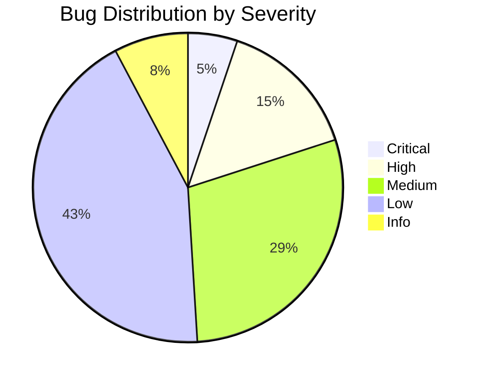
```mermaid
pie
    title Bug Distribution by Severity
    "Critical" : 8
    "High" : 23
    "Medium" : 45
    "Low" : 67
    "Info" : 12
```

### Options

```
pie showData
    title With Raw Values Shown
    "Slice A" : 30
    "Slice B" : 70
```

`showData` displays the raw numeric values alongside percentages.

### Common Pitfalls
- Labels must be double-quoted.
- Values must be positive numbers.
- Too many slices (10+) become unreadable -- group small slices into "Other".

---

## 18. Block Diagram

**Keyword:** `block-beta`

### Columns

```
block-beta
    columns 3
    a b c
    d e f
```

### Block Shapes

All flowchart node shapes are supported:
```
a["Rectangle"]
b("Rounded")
c(["Stadium"])
d[("Cylinder")]
e(("Circle"))
f{"Diamond"}
```

### Block Width (Spanning)

```
block-beta
    columns 4
    a:2 b:1 c:1      %% 'a' spans 2 columns
```

### Arrows/Connections

```
a --> b
a -- "label" --> b
```

### Space Blocks

```
space           %% Empty space (1 column)
space:2         %% Empty space spanning 2 columns
```

### Composite/Nested Blocks

```
block-beta
    columns 3
    a:3
    block:group1:2
        columns 2
        b c
    end
    d
```

### Complete Example

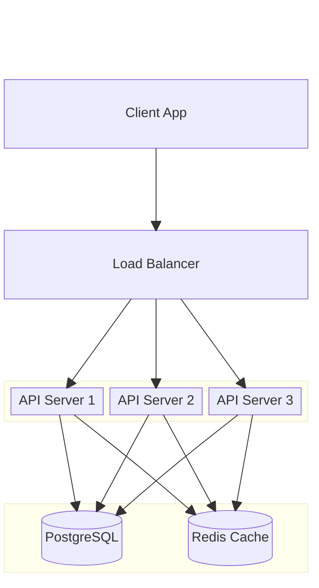
```mermaid
block-beta
    columns 5
    space:5
    A["Client App"]:5

    space:5

    B["Load Balancer"]:5

    space:5
    block:backend:5
        columns 3
        C["API Server 1"] D["API Server 2"] E["API Server 3"]
    end

    space:5
    block:data:5
        columns 2
        F[("PostgreSQL")] G[("Redis Cache")]
    end

    A --> B
    B --> C
    B --> D
    B --> E
    C --> F
    D --> F
    E --> F
    C --> G
    D --> G
    E --> G
```

### Common Pitfalls
- Use `block-beta` not `block` -- the feature is in beta.
- Column count must be set before placing blocks.
- Block spanning widths must sum to the column count per row.
- Nested blocks use `block:id:width ... end` syntax.

---

## 19. Architecture Diagram

**Keyword:** `architecture-beta`

### Groups

```
group groupId(icon)[Label]
group childGroup(icon)[Label] in parentGroup
```

### Services

```
service serviceId(icon)[Label]
service serviceId(icon)[Label] in groupId
```

### Default Icons

`cloud`, `database`, `disk`, `internet`, `server`

Additional icons via iconify: `(icon-set:icon-name)`.

### Edges

```
serviceA:R --> L:serviceB
serviceA:B --> T:serviceB
```

Direction markers: `T` (top), `B` (bottom), `L` (left), `R` (right).
Arrow types: `-->` (right arrow), `<--` (left arrow), `<-->` (bidirectional).

### Junctions

```
junction junctionId
junction junctionId in groupId
```

Junctions act as 4-way connection points for routing edges.

### Complete Example

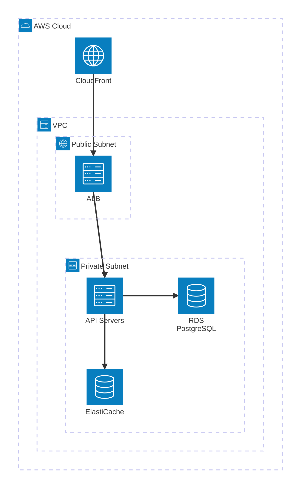
```mermaid
architecture-beta
    group cloud(cloud)[AWS Cloud]
    group vpc(server)[VPC] in cloud
    group public(internet)[Public Subnet] in vpc
    group private(server)[Private Subnet] in vpc

    service cdn(internet)[CloudFront] in cloud
    service lb(server)[ALB] in public
    service api(server)[API Servers] in private
    service db(database)[RDS PostgreSQL] in private
    service cache(database)[ElastiCache] in private

    cdn:B --> T:lb
    lb:B --> T:api
    api:R --> L:db
    api:B --> T:cache
```

### Common Pitfalls
- Use `architecture-beta` -- the feature is in beta.
- Edge direction markers (T/B/L/R) affect layout positioning.
- Groups can be nested but icon set must be available.
- Service IDs must be unique across the entire diagram.

---

## 20. Kanban Diagram

**Keyword:** `kanban`

### Columns

```
columnId[Column Title]
```

### Tasks

Tasks are indented under columns:
```
    taskId[Task Description]
```

### Task Metadata

```
    taskId[Description]
        @{ ticket: "PROJ-123", assigned: "Alice", priority: "High" }
```

Supported metadata keys: `ticket`, `assigned`, `priority` ("Very High", "High", "Low", "Very Low").

### Configuration

```yaml
---
config:
  kanban:
    ticketBaseUrl: 'https://your-jira.atlassian.net/browse/#TICKET#'
---
```

`#TICKET#` is replaced with the `ticket` metadata value.

### Complete Example

```mermaid
kanban
    todo[To Do]
        task1[Design login page]
            @{ ticket: "UI-101", assigned: "Alice", priority: "High" }
        task2[Set up CI pipeline]
            @{ ticket: "OPS-42", assigned: "Bob", priority: "High" }

    inProgress[In Progress]
        task3[Implement auth API]
            @{ ticket: "BE-55", assigned: "Charlie", priority: "Very High" }

    review[In Review]
        task4[Database migration script]
            @{ ticket: "BE-48", assigned: "Diana", priority: "Low" }

    done[Done]
        task5[Project scaffolding]
            @{ ticket: "OPS-40", assigned: "Bob" }
```

### Common Pitfalls
- Tasks must be indented under their column.
- Metadata must be indented under the task.
- Column and task IDs must be unique.
- The `priority` value affects visual styling of the task card.

---

## 21. Packet Diagram

**Keyword:** `packet-beta`

### Bit Range Syntax

```
packet-beta
    0-15: "Header"
    16-23: "Type"
    24-31: "Length"
```

### Bit Count Syntax (v11.7.0+)

```
packet-beta
    +16: "Header"
    +8: "Type"
    +8: "Length"
```

### Configuration

```yaml
---
config:
  packet:
    bitsPerRow: 32
    bitWidth: 20
    rowHeight: 40
    showBits: true
---
```

### Complete Example

```mermaid
packet-beta
    0-3: "Version"
    4-7: "IHL"
    8-15: "Type of Service"
    16-18: "Flags"
    19-31: "Fragment Offset"
    32-39: "TTL"
    40-47: "Protocol"
    48-63: "Header Checksum"
    64-95: "Source Address"
    96-127: "Destination Address"
```

### Common Pitfalls
- Use `packet-beta` for the latest syntax.
- Bit ranges must not overlap.
- `bitsPerRow` configuration controls row wrapping.
- Field labels must be quoted.

---

## Styling and Theming

### Inline Styles

Apply styles to individual nodes (flowcharts, block diagrams):

```
style nodeId fill:#f9f,stroke:#333,stroke-width:2px,color:#000
```

### CSS Classes

Define and apply classes:

```
classDef highlight fill:#ff0,stroke:#f00,stroke-width:3px
class nodeA,nodeB highlight
```

Or inline: `A:::highlight --> B`

### Theme Configuration

Set the theme via frontmatter:

```yaml
---
config:
  theme: default
---
```

Available themes: `default`, `dark`, `forest`, `neutral`, `base`.

### Theme Variables

Override specific colors:

```yaml
---
config:
  theme: base
  themeVariables:
    primaryColor: "#4a90d9"
    primaryTextColor: "#fff"
    primaryBorderColor: "#2d6da3"
    lineColor: "#666"
    secondaryColor: "#f4f4f4"
    tertiaryColor: "#e8e8e8"
---
```

### Look Configuration

Set the rendering style:

```yaml
---
config:
  look: handDrawn
---
```

Available looks: `classic` (default), `handDrawn`.

### Layout Configuration

```yaml
---
config:
  layout: elk
---
```

Available layouts: `dagre` (default), `elk` (advanced, better for large diagrams).

---

## Troubleshooting

### Diagram Not Rendering

1. **Check the keyword** -- Ensure the first line matches a valid diagram type keyword (e.g., `flowchart`, `sequenceDiagram`, `erDiagram`).
2. **Check for reserved words** -- `end`, `graph`, `subgraph` used as node labels must be wrapped in quotes or brackets.
3. **Check special characters** -- Angle brackets `<>`, ampersands `&`, and quotes inside labels can break parsing. Use HTML entities or wrap in quotes.
4. **Check indentation** -- Mindmap and Kanban diagrams are indentation-sensitive.

### Layout Issues

1. **Too many nodes** -- Split into multiple diagrams if a single diagram exceeds 20 nodes.
2. **Overlapping labels** -- Shorten label text or use `\n` for line breaks.
3. **Unexpected direction** -- Verify `direction` or diagram orientation (TD, LR, etc.).
4. **Try ELK layout** -- For complex diagrams, add `%%{ init: { 'flowchart': { 'useMaxWidth': false } } }%%` or switch to `elk` layout.

### Rendering Differences

Different renderers may produce different results:
- **GitHub** -- Supports most diagram types but may lag behind latest Mermaid releases.
- **VS Code** (Markdown Preview Mermaid Support extension) -- Generally up to date.
- **Mermaid Live Editor** (mermaid.live) -- Always uses the latest version.
- **GitLab** -- Supports Mermaid but may have version differences.

### Performance

- Keep diagrams under 50 nodes for responsive rendering.
- Use subgraphs/groups to organize large diagrams.
- Consider splitting into multiple diagrams with cross-references rather than one massive diagram.
