# Diagram Selection Guide

This guide helps auto-select the right Mermaid diagram types based on project context. Use it when generating PRD.md and PLAN.md to pick diagrams that add real value.

## Quick Selection Matrix

| Context | Primary Diagrams | Secondary Diagrams | Why |
|---------|-----------------|-------------------|-----|
| New project (greenfield) | C4 Context, ER, Gantt | Component, User Journey, Flowchart | Need full system overview, data model, and timeline |
| New feature (brownfield) | Sequence, Flowchart, Gantt | State, Dependency Graph | Focus on behavior within existing system |
| New component (library/module) | Class, Component, Flowchart | Sequence, Dependency Graph | Internal structure and API surface |
| Refactor | Flowchart (before/after), Dependency Graph | Class, Component | Show change impact and dependencies |
| API design | Sequence, ER, Flowchart | State, C4 Component | Request/response flows and data shapes |
| Database change | ER, State, Timeline | Flowchart, Dependency Graph | Data model evolution and migration steps |
| UI feature | User Journey, Flowchart, Component | Sequence, State | User experience and component hierarchy |
| Infrastructure / DevOps | Block, Flowchart, Gantt | Sequence, Timeline | System topology and deployment flow |
| Integration | Sequence, C4 Context, Flowchart | ER, State | Cross-system communication patterns |
| Performance optimization | Flowchart, Sequence, Quadrant | Gantt, Pie | Bottleneck identification and prioritization |

## Minimum Diagram Set

Every plan should include at least three diagrams:

1. **One structural diagram** -- shows what the system IS (C4, Class, ER, Component, or Block)
2. **One behavioral diagram** -- shows what the system DOES (Sequence, State, Flowchart, or User Journey)
3. **One planning diagram** -- shows WHEN things happen (Gantt, Timeline, or Dependency Graph)

## Diagram Type Reference

### 1. Flowchart

**Best for:** Decision logic, process flows, algorithms, control flow, before/after comparisons.

**When to pick it:**
- Mapping user actions through a system
- Showing conditional branching ("if this, then that")
- Documenting a build/deploy pipeline
- Comparing before/after architectures

**When NOT to pick it:**
- Showing time-ordered interactions between systems (use Sequence)
- Modeling data relationships (use ER)

**Planning use cases:** Decision flowcharts for architecture choices, signup/onboarding flows, error handling paths.

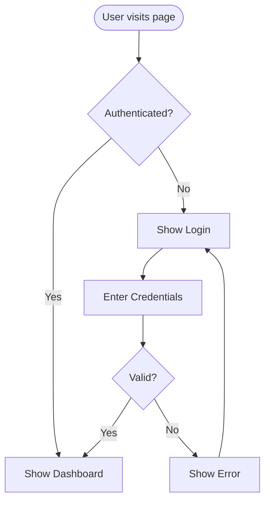

### 2. Sequence Diagram

**Best for:** API calls, multi-system interactions, time-ordered message flows, authentication handshakes.

**When to pick it:**
- Documenting how services communicate
- Showing request/response cycles with timing
- Illustrating auth flows (OAuth, JWT refresh)
- Modeling webhook or event-driven flows

**When NOT to pick it:**
- Showing system structure without interactions (use C4 or Component)
- Modeling state transitions (use State)

**Planning use cases:** API endpoint design, integration planning, auth flow design.

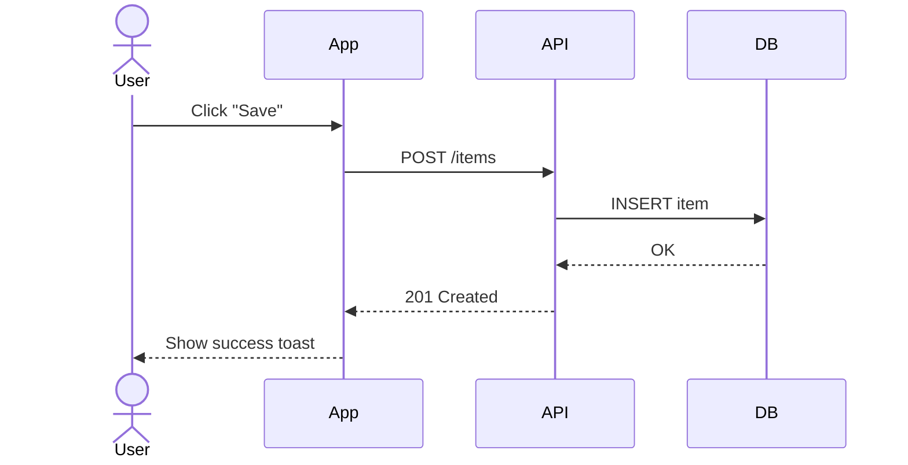

### 3. Class Diagram

**Best for:** Code structure, module APIs, type hierarchies, component interfaces.

**When to pick it:**
- Designing a library or SDK
- Showing inheritance and composition
- Documenting a module's public API
- Planning a component's internal structure

**When NOT to pick it:**
- Showing runtime behavior (use Sequence or State)
- Modeling infrastructure (use Block or C4)

**Planning use cases:** Component interface design, data model classes, service layer architecture.

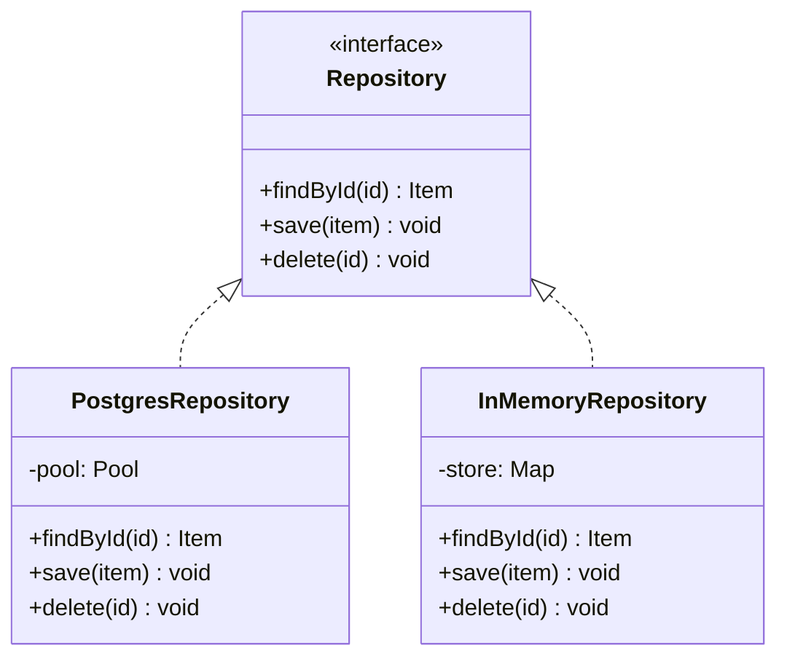

### 4. State Diagram

**Best for:** Entity lifecycle, workflow status, UI component states, order/payment status machines.

**When to pick it:**
- Modeling the lifecycle of an entity (order, ticket, user account)
- Documenting valid state transitions and guards
- Designing UI component states (loading, error, empty, populated)

**When NOT to pick it:**
- Showing data relationships (use ER)
- Showing multi-party interactions (use Sequence)

**Planning use cases:** Order status flow, approval workflows, feature flag states.

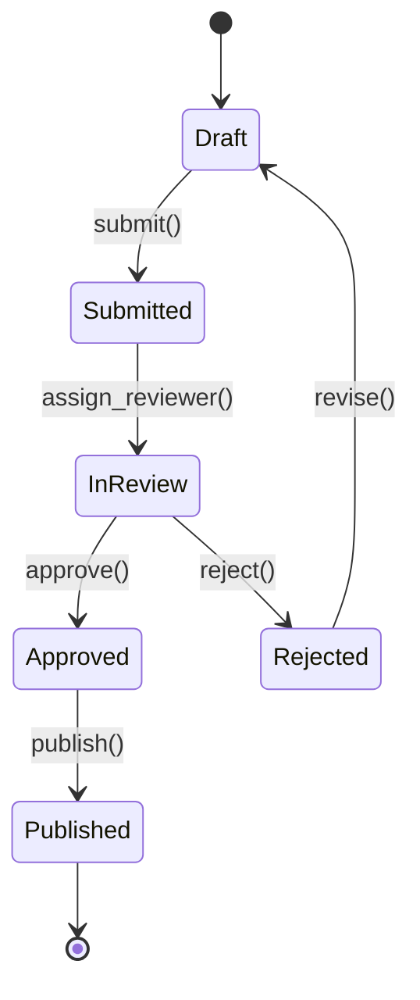

### 5. ER Diagram

**Best for:** Database schema, data model relationships, entity attributes and cardinality.

**When to pick it:**
- Planning a new database schema
- Documenting relationships between entities
- Designing a data migration
- Showing how tables relate to each other

**When NOT to pick it:**
- Showing code structure (use Class)
- Showing behavior (use Sequence or State)

**Planning use cases:** Database design, data model for PRDs, migration planning.

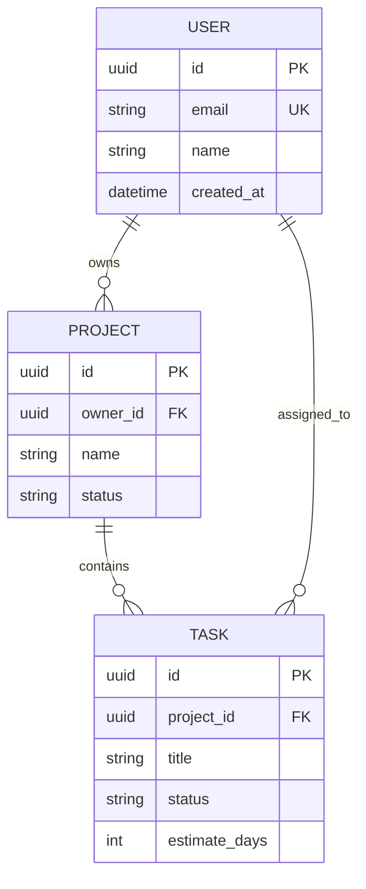

### 6. C4 Context Diagram

**Best for:** System boundaries, external actors, system-to-system relationships at the highest level.

**When to pick it:**
- Starting a new project and showing where it fits in the ecosystem
- Documenting external dependencies (third-party APIs, databases, users)
- Stakeholder-facing architecture overview

**When NOT to pick it:**
- Internal component details (use C4 Component or Class)
- Runtime behavior (use Sequence)

**Planning use cases:** PRD architecture overview, system boundary definition.

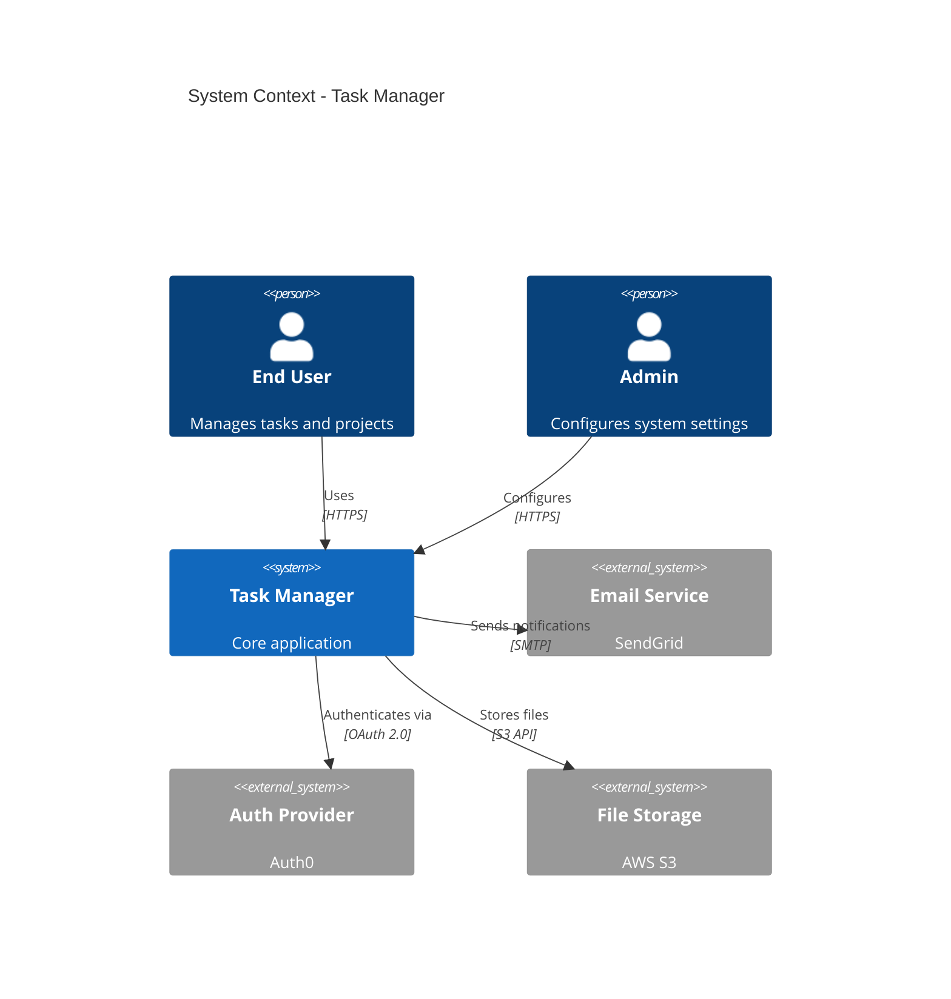

### 7. C4 Container Diagram

**Best for:** Showing the major deployable units within a system: web apps, APIs, databases, message queues.

**When to pick it:**
- Detailing the internal structure of a system identified in a C4 Context diagram
- Showing how a frontend, backend, and database relate
- Documenting microservice boundaries

**Planning use cases:** System decomposition, infrastructure planning.

### 8. C4 Component Diagram

**Best for:** Showing components within a single container: controllers, services, repositories, adapters.

**When to pick it:**
- Detailing the internal structure of a single service or application
- Planning module boundaries within a monolith
- Documenting the adapter/port pattern

**Planning use cases:** Module decomposition, service internals design.

### 9. User Journey

**Best for:** End-to-end user experience, satisfaction scoring, identifying pain points.

**When to pick it:**
- Mapping a user's experience across multiple touchpoints
- Identifying where users might drop off or get frustrated
- Communicating the intended UX to stakeholders

**When NOT to pick it:**
- Technical system interactions (use Sequence)
- Code structure (use Class or Component)

**Planning use cases:** PRD user flows, UX validation, feature prioritization.

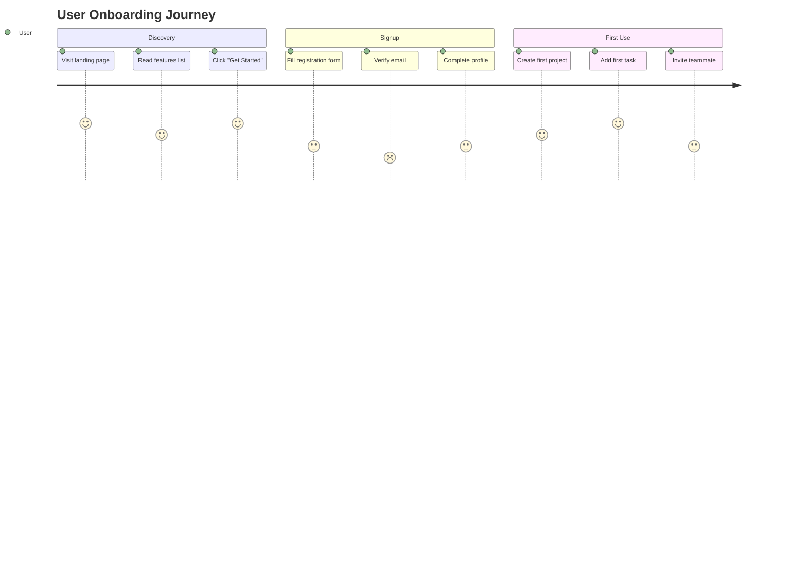

### 10. Gantt Chart

**Best for:** Project timelines, task scheduling, dependency visualization, milestone tracking.

**When to pick it:**
- Planning implementation phases with dates
- Showing task dependencies and critical path
- Tracking actual vs planned progress
- Communicating timeline to stakeholders

**When NOT to pick it:**
- Showing system architecture (use C4 or Flowchart)
- Showing user flows (use Sequence or User Journey)

**Planning use cases:** PLAN.md timeline, PROGRESS.md actual vs planned.

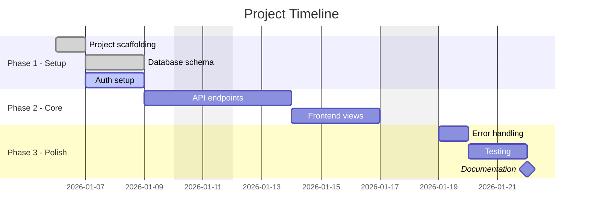

### 11. Quadrant Chart

**Best for:** Feature prioritization, effort vs impact analysis, technology comparisons.

**When to pick it:**
- Prioritizing features by effort and value
- Comparing technology options on two axes
- Risk assessment visualization (likelihood vs impact)

**Planning use cases:** Feature prioritization in PRDs, risk visualization.

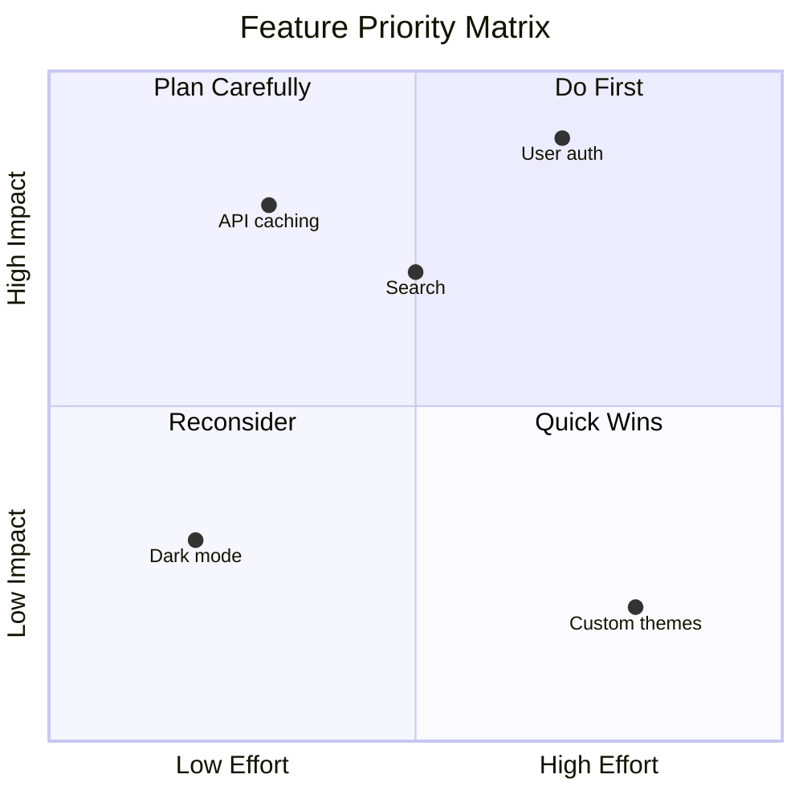

### 12. Mindmap

**Best for:** Brainstorming output, feature decomposition, concept exploration, scope mapping.

**When to pick it:**
- Capturing brainstorming results
- Breaking a broad feature into sub-features
- Exploring a problem space
- Showing a taxonomy or categorization

**Planning use cases:** Initial brainstorming, feature breakdown, scope exploration.

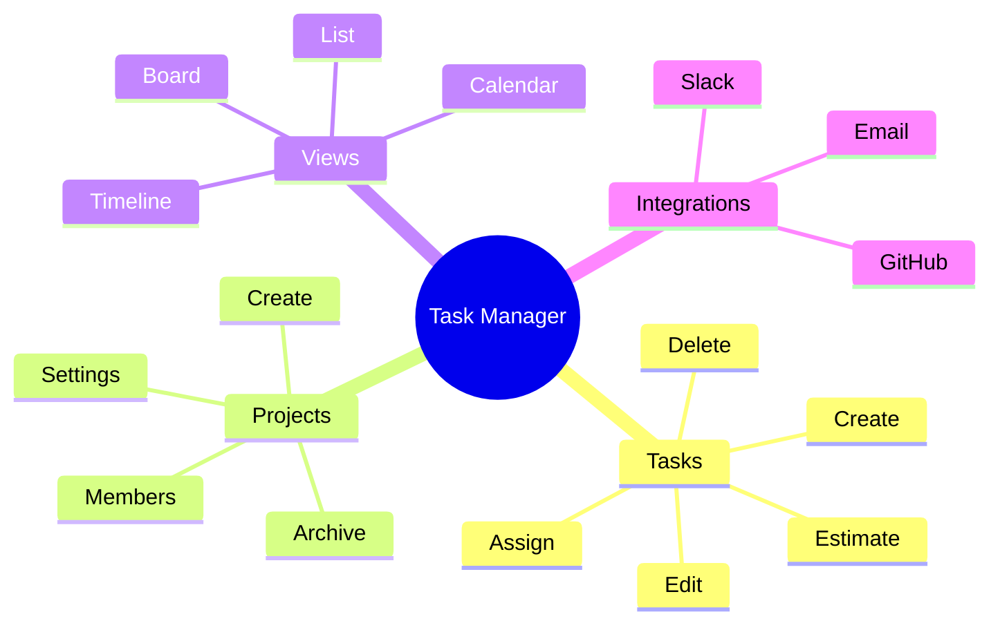

### 13. Timeline

**Best for:** Chronological events, project milestones, release history, migration phases.

**When to pick it:**
- Showing major milestones on a timeline
- Documenting release history
- Planning migration phases
- Showing product evolution

**Planning use cases:** Milestone planning, release roadmap.

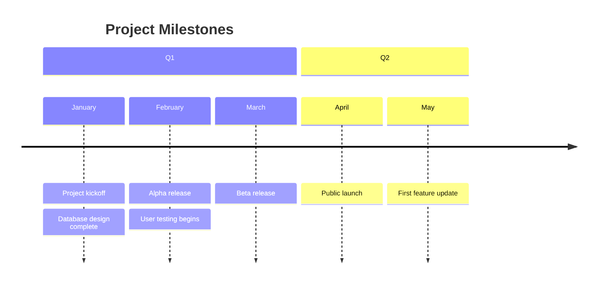

### 14. Git Graph

**Best for:** Branching strategies, release workflows, merge patterns.

**When to pick it:**
- Documenting the team's Git branching strategy
- Showing a release workflow
- Planning a migration branch strategy

**Planning use cases:** Branching strategy documentation, release process planning.

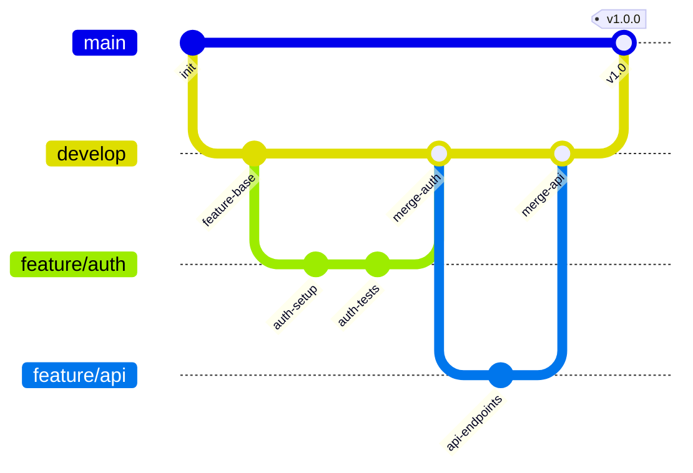

### 15. Pie Chart

**Best for:** Distribution visualization, effort allocation, error categorization, survey results.

**When to pick it:**
- Showing how effort is distributed across phases
- Visualizing error types or categories
- Summarizing survey or feedback data

**When NOT to pick it:**
- Comparing more than 6 categories (too many slices become unreadable)
- Showing change over time (use Gantt or Timeline)

**Planning use cases:** Effort allocation overview, risk distribution.

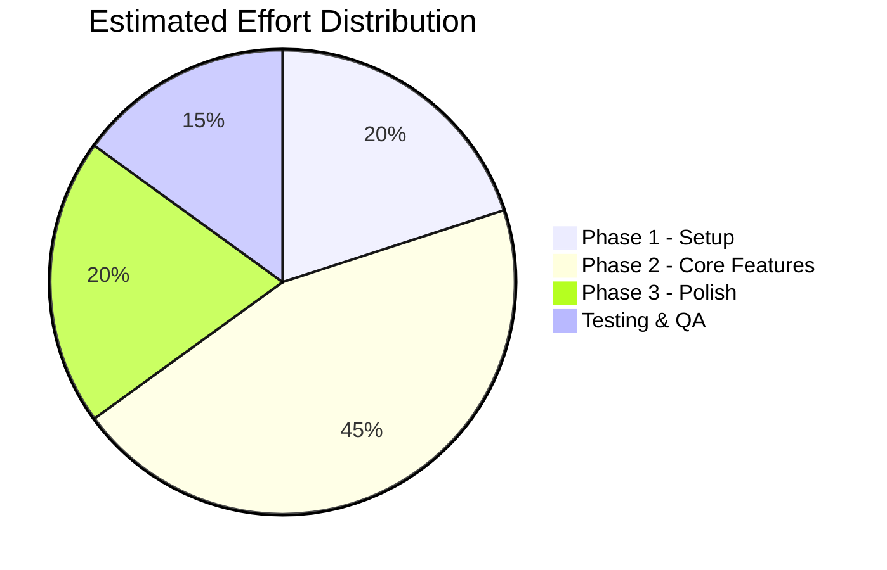

## Anti-Patterns

Avoid these common diagram selection mistakes:

| Mistake | Why It Is Wrong | Better Choice |
|---------|----------------|---------------|
| Flowchart for API interactions | Flowcharts do not show participants or timing | Sequence diagram |
| Class diagram for infrastructure | Classes are code-level, not infra-level | C4 Context or Block diagram |
| ER diagram for code relationships | ER is for data persistence, not code structure | Class diagram |
| Gantt for architecture | Gantt shows time, not structure | C4 or Flowchart |
| Pie chart with 10+ slices | Unreadable with many categories | Table or bar-style representation |
| Sequence diagram for static structure | Sequence shows runtime, not design-time | Component or Class diagram |
| Mindmap for implementation plan | Mindmap lacks ordering and dependencies | Gantt or dependency graph |
