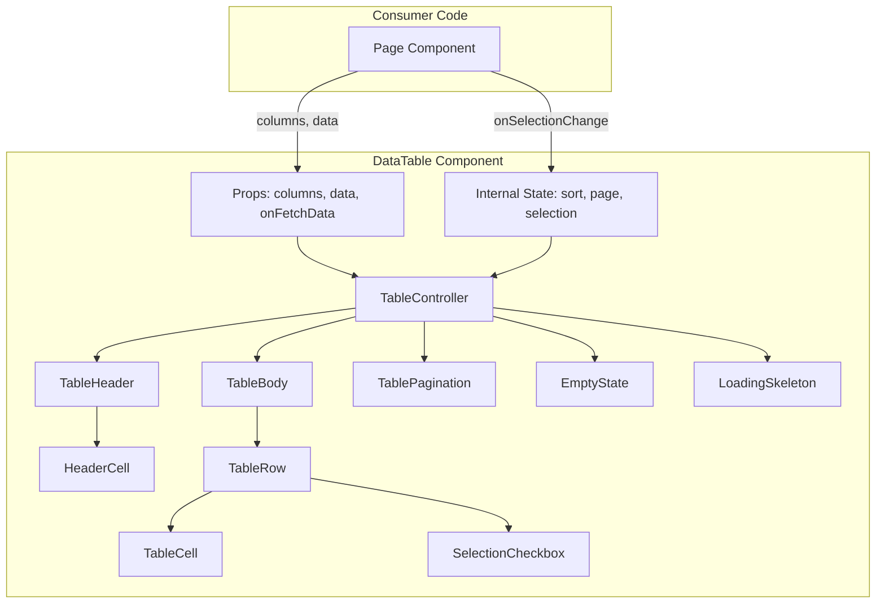
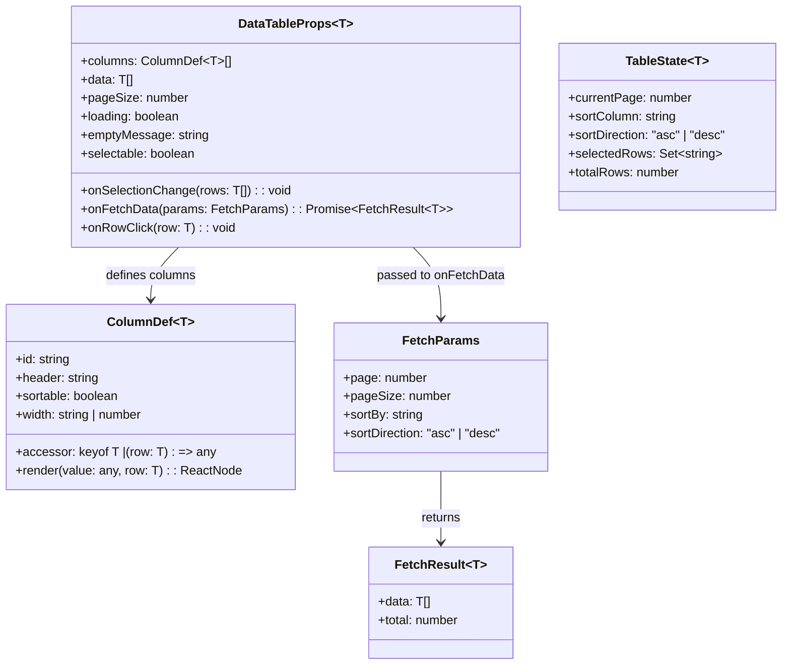
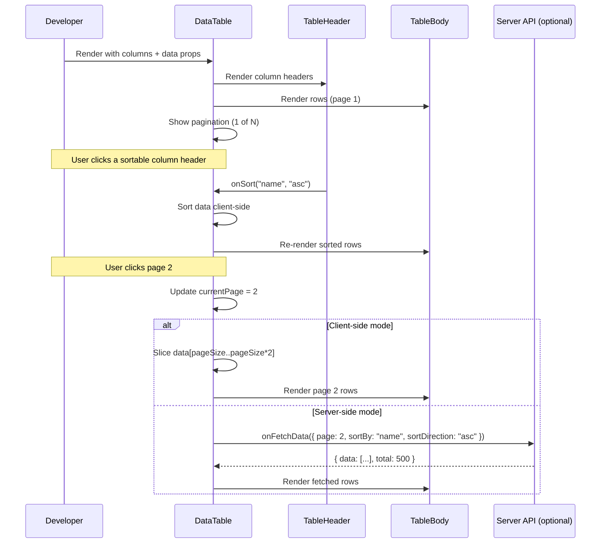
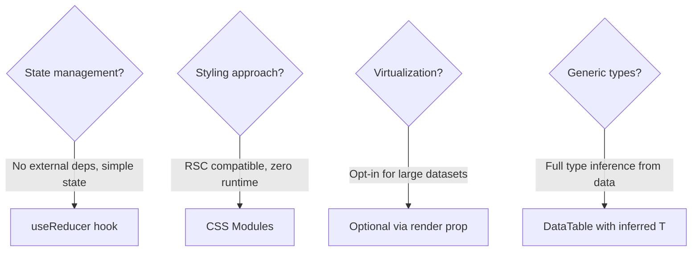
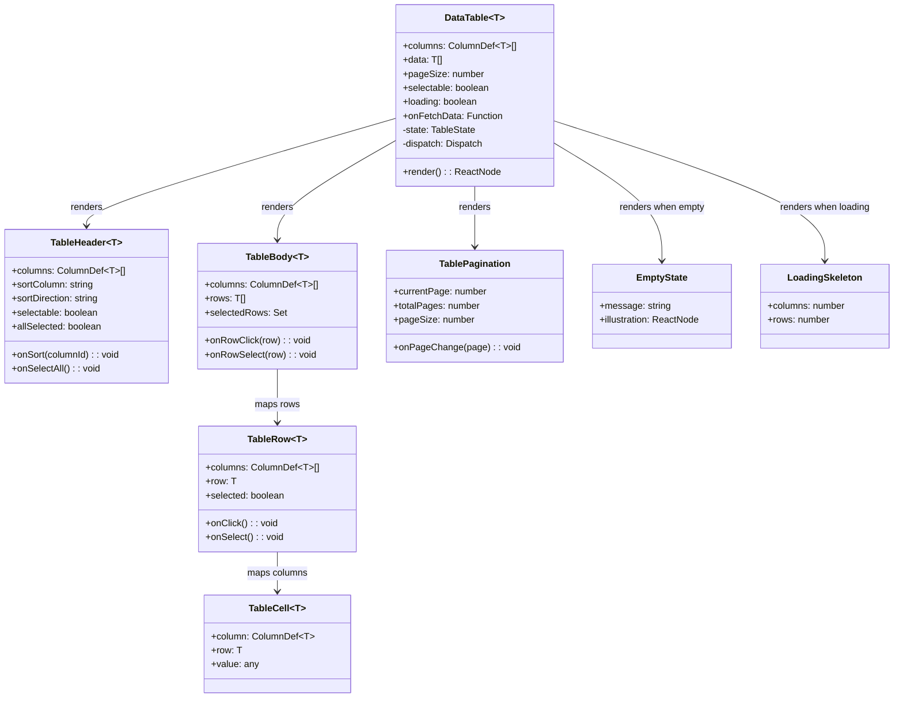
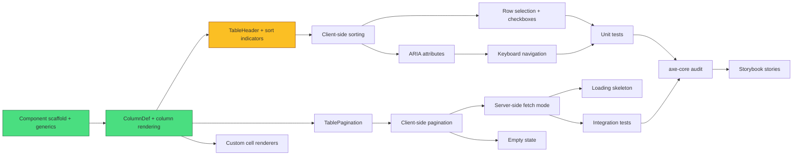
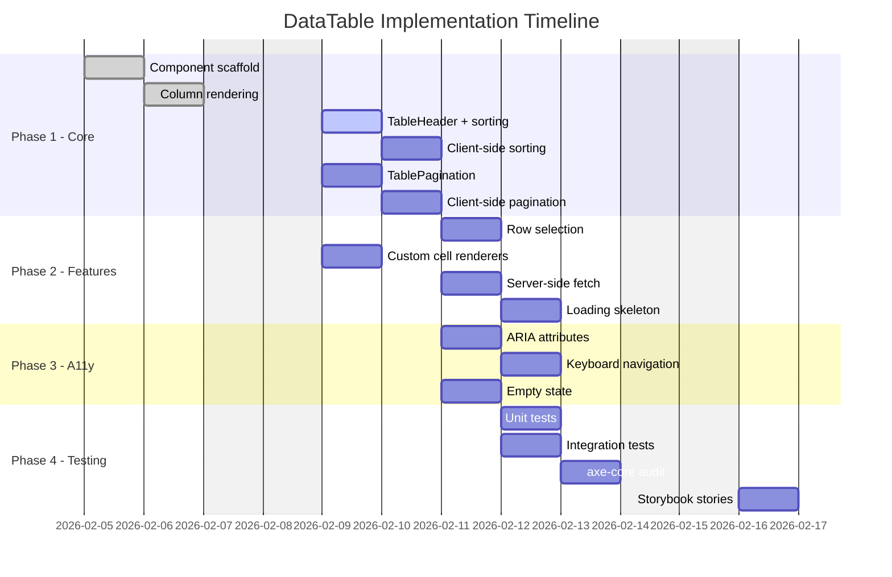

# Example: New Component -- Reusable Data Table

This example shows focused planning output for building a reusable, configurable data table component for a React design system. The focus is on component API design, class structure, and internal architecture.

---

## PRD.md

# PRD: DataTable Component

**Author:** Sam
**Date:** 2026-02-05
**Status:** Approved

## Problem Statement

Our React application has seven different pages that display tabular data (users list, audit log, invoices, products, orders, API keys, team members). Each page has its own ad-hoc table implementation with inconsistent sorting, pagination, and styling. Adding a new table page takes 2-3 days of duplicated work, and fixing a table bug requires changes in multiple files. We need a single reusable DataTable component that handles common table patterns.

## Goals & Success Criteria

- [ ] Replace all 7 existing table implementations with one component -- migration count (7/7 pages migrated)
- [ ] New table pages take under 2 hours to build -- developer time (< 2h for a standard table page)
- [ ] Zero accessibility violations (WCAG 2.1 AA) -- axe-core audit (0 violations)
- [ ] Component renders 10,000 rows without lag -- render time (< 100ms for initial paint with virtualization)

## User Stories

- **P0:** As a developer, I want to render a table by passing columns and data so that I do not have to build table markup from scratch.
- **P0:** As a developer, I want built-in sorting by clicking column headers so that I do not have to implement sort logic per page.
- **P0:** As a developer, I want built-in pagination controls so that I can handle large datasets without custom code.
- **P1:** As a developer, I want to customize cell rendering with a render function so that I can display badges, links, and other rich content in cells.
- **P1:** As a developer, I want row selection with checkboxes so that I can build bulk action features.
- **P1:** As a developer, I want to provide a server-side data fetching function so that I can use the table with paginated APIs.
- **P2:** As a developer, I want column resizing so that users can adjust the table to their screen.
- **P2:** As a developer, I want an empty state and loading state built into the component so that I do not need to wrap it in conditionals.

## Scope

### In Scope

- Column definition API (header, accessor, sortable, render function, width)
- Client-side sorting (single column, asc/desc toggle)
- Client-side pagination with configurable page size
- Server-side data mode (onFetchData callback with page/sort params)
- Row selection (single and multi-select with checkbox column)
- Custom cell renderers
- Loading state (skeleton rows)
- Empty state (configurable message and illustration)
- Keyboard navigation (arrow keys between cells, Enter to activate)
- ARIA attributes for screen readers (role="grid", aria-sort, aria-selected)

### Out of Scope

- Column filtering/search (separate FilterBar component, different PRD)
- Column reordering via drag-and-drop
- Row grouping/tree tables
- CSV/Excel export
- Infinite scroll (pagination only for v1)
- Sticky columns (horizontal scroll only)

## Architecture Overview

## Data Model

The component does not persist data, but it defines TypeScript interfaces for its API.

## User Flow

## Technical Constraints

- Must work with React 18+ (use hooks, no class components)
- TypeScript strict mode with full generic support
- Zero runtime dependencies beyond React
- Must pass axe-core accessibility audit with zero violations
- Bundle size < 15KB gzipped
- Must support React Server Components (no useContext, no CSS-in-JS)

## Dependencies

| Dependency | Type | Status | Notes |
|-----------|------|--------|-------|
| React 18+ | Peer dependency | Confirmed | Already in use across the app |
| TypeScript 5+ | Dev dependency | Confirmed | Already configured |
| @testing-library/react | Test dependency | Confirmed | Used for all component tests |
| axe-core | Test dependency | Confirmed | Used in CI for a11y checks |

## Open Questions

- [ ] Should we virtualize by default or make it opt-in? -- Owner: Sam, Target: 2026-02-07
- [ ] Should column widths be CSS Grid or fixed table layout? -- Owner: Sam, Target: 2026-02-07

---

## PLAN.md

# Implementation Plan: DataTable Component

**PRD:** [PRD.md](./PRD.md)
**Date:** 2026-02-05
**Status:** Active

## Phases

### Phase 1: Core Table Rendering (~3d)

Build the basic table that renders columns and rows with sorting and pagination. At the end of this phase, a developer can render a fully functional read-only table.

- [ ] Create DataTable component scaffold with TypeScript generics ~0.5d @sam
- [ ] Implement ColumnDef type and column rendering logic ~0.5d @sam
- [ ] Build TableHeader with sortable column indicators ~0.5d @sam
- [ ] Implement client-side sorting (single column, asc/desc) ~0.5d @sam
- [ ] Build TablePagination with page navigation ~0.5d @sam
- [ ] Implement client-side pagination (slice data by page) ~0.5d @sam

### Phase 2: Advanced Features (~3d)

Add selection, custom rendering, server-side mode, and states. At the end of this phase, the component supports all P0 and P1 features.

- [ ] Add row selection with checkbox column ~1d @sam
- [ ] Implement custom cell renderer support ~0.5d @sam
- [ ] Build server-side data fetching mode (onFetchData) ~1d @sam
- [ ] Add loading state with skeleton rows ~0.5d @sam

### Phase 3: Accessibility & Polish (~2d)

Ensure accessibility, add keyboard navigation, and handle edge cases.

- [ ] Add ARIA attributes (role="grid", aria-sort, aria-selected) ~0.5d @sam
- [ ] Implement keyboard navigation (arrow keys, Enter) ~1d @sam
- [ ] Add empty state component ~0.5d @sam

### Phase 4: Testing & Documentation (~2d)

- [ ] Write unit tests for sorting, pagination, selection logic ~0.5d @sam
- [ ] Write integration tests for server-side mode ~0.5d @sam
- [ ] Run axe-core audit and fix violations ~0.5d @sam
- [ ] Write Storybook stories for all variants ~0.5d @sam

## Architecture Decisions

## Component Breakdown

## Dependency Graph

## Timeline

## Risk Assessment

| Risk | Likelihood | Impact | Mitigation |
|------|-----------|--------|------------|
| Generic TypeScript types become too complex for consumers | Medium | High | Provide helper type `ColumnDef<T>` with good defaults; add 5+ Storybook examples showing common patterns |
| Bundle size exceeds 15KB with all features | Low | Medium | Use tree-shakeable exports; measure size in CI with size-limit; defer virtualization to separate package |
| Keyboard navigation conflicts with page shortcuts | Medium | Medium | Only capture keyboard events when table has focus; use stopPropagation carefully; test with screen readers |
| Migration of 7 existing tables breaks functionality | Medium | High | Migrate one table at a time; keep old implementation behind feature flag until validated; write comparison tests |
| CSS Modules class name collisions | Low | Low | Use BEM-style naming with `dt-` prefix; test in isolation and integrated |
