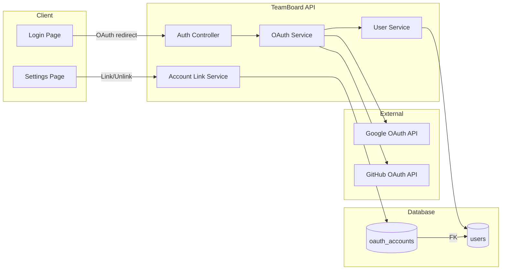
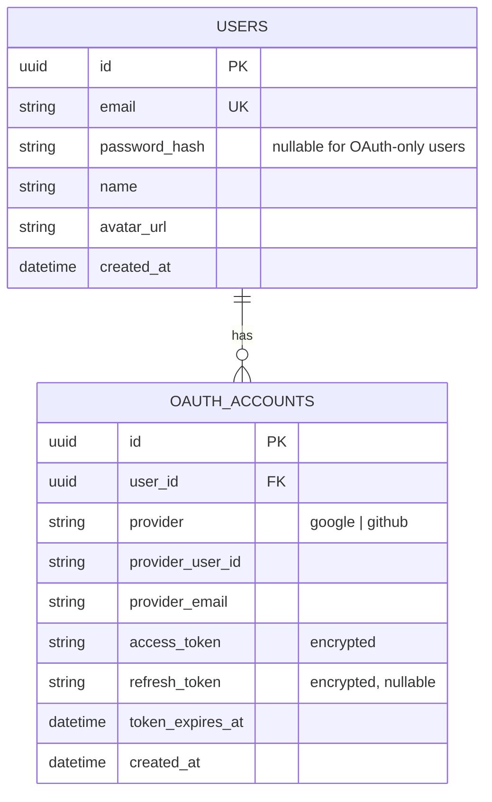
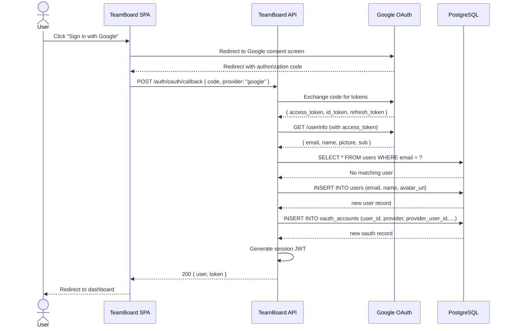
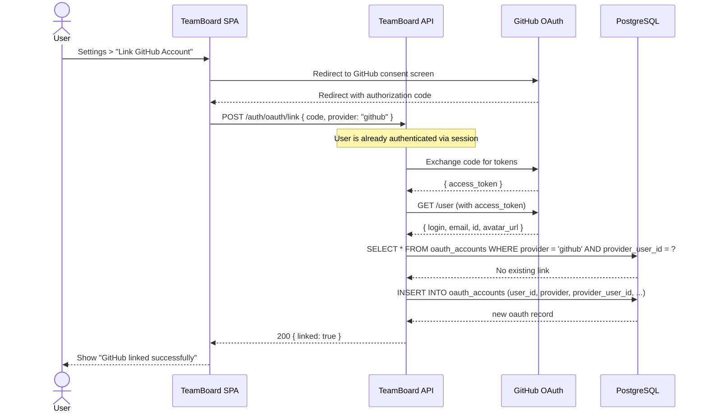
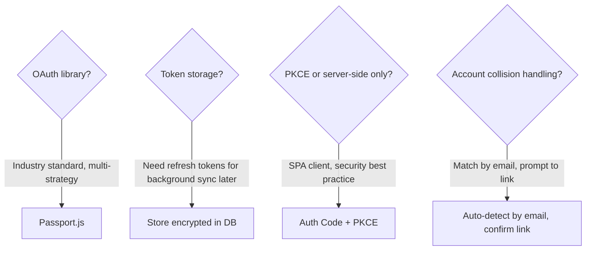
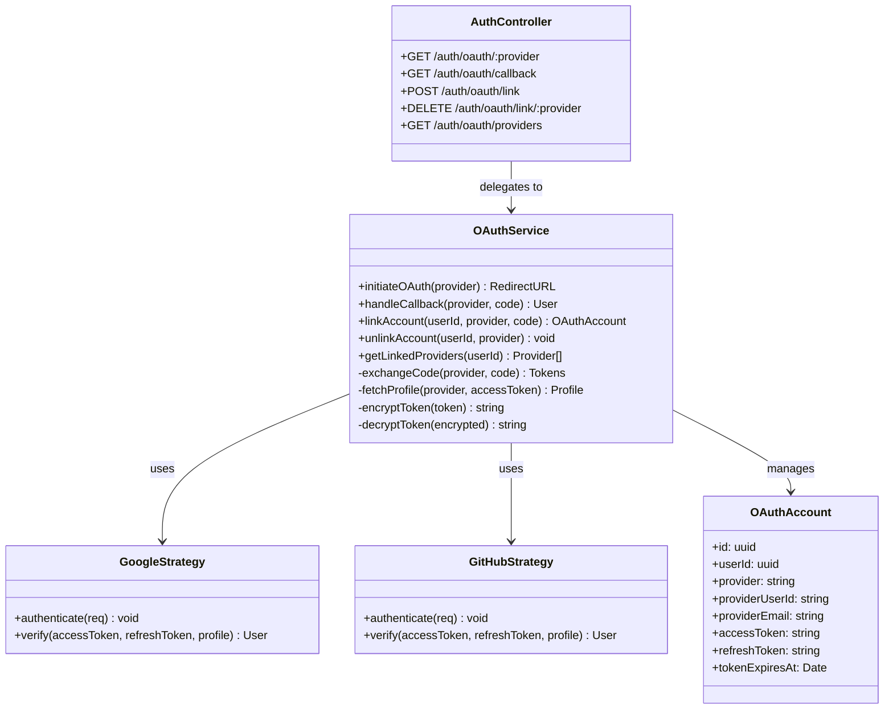
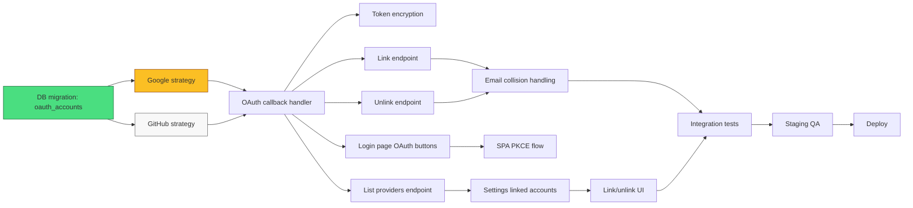
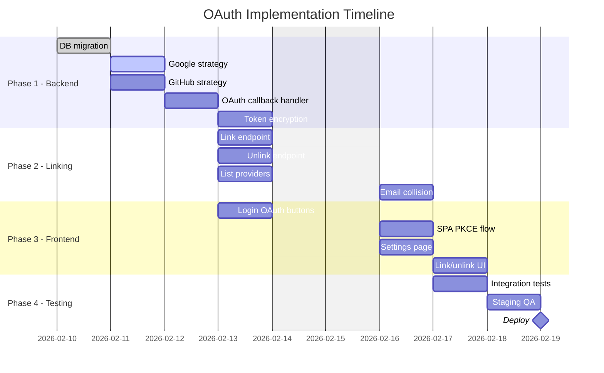

# Example: New Feature -- Adding OAuth to an Existing App

This example shows focused planning output for adding OAuth (Google + GitHub) to an existing Express + React application that currently uses email/password authentication. Only PRD and PLAN are shown since this is a feature addition, not a greenfield project.

---

## PRD.md

# PRD: OAuth Sign-In (Google & GitHub)

**Author:** Jordan
**Date:** 2026-02-08
**Status:** Approved

## Problem Statement

Users of our internal project management app (TeamBoard) must create an account with email and password, which causes friction during onboarding. Our analytics show that 35% of visitors who click "Sign Up" abandon the registration form. Competitors offer social login, and our user feedback survey (Jan 2026) ranked "sign in with Google" as the #1 requested feature. Adding OAuth will reduce sign-up friction and improve conversion.

## Goals & Success Criteria

- [ ] Reduce signup abandonment rate -- funnel conversion (from 65% to 85%)
- [ ] Support Google and GitHub as OAuth providers -- provider count (2 providers live)
- [ ] Existing users can link OAuth to their account -- account linking success rate (> 95%)
- [ ] No disruption to existing email/password auth -- regression test pass rate (100%)

## User Stories

- **P0:** As a new user, I want to sign up with my Google account so that I can start using the app without creating a password.
- **P0:** As a new user, I want to sign up with my GitHub account so that I can use my developer identity.
- **P0:** As an existing user, I want to link my Google or GitHub account to my existing email/password account so that I can log in either way.
- **P1:** As a user, I want to see which OAuth providers are linked to my account so that I can manage my login methods.
- **P1:** As a user, I want to unlink an OAuth provider from my account so that I can revoke access if needed (as long as I have at least one login method remaining).
- **P2:** As an admin, I want to see which login method each user used so that I can help with support requests.

## Scope

### In Scope

- Google OAuth 2.0 sign-in (using Authorization Code flow with PKCE)
- GitHub OAuth sign-in
- Account linking: connect OAuth to existing email/password account
- Account unlinking: disconnect OAuth (minimum 1 auth method must remain)
- Settings page section showing linked providers
- Login page UI update: "Sign in with Google" and "Sign in with GitHub" buttons
- Migration: add `oauth_accounts` table, no changes to existing `users` table schema

### Out of Scope

- Apple Sign-In (deferred to v2)
- Microsoft/Azure AD (enterprise feature, separate PRD)
- OAuth for API access (this is user-facing auth only)
- Removing email/password auth
- Two-factor authentication (separate initiative)

## Architecture Overview

## Data Model

## User Flow

### New User: OAuth Sign-Up

### Existing User: Account Linking

## Technical Constraints

- Must use Authorization Code flow with PKCE (no implicit flow)
- OAuth tokens must be encrypted at rest (AES-256)
- Callback URLs must use HTTPS in production
- Session tokens remain JWT-based (no change to existing auth middleware)
- Google Cloud project already exists; GitHub OAuth app needs to be created

## Dependencies

| Dependency | Type | Status | Notes |
|-----------|------|--------|-------|
| Google Cloud Console OAuth credentials | Config | Confirmed | Existing project, need to add OAuth consent screen |
| GitHub OAuth App | Config | Pending | Jordan to create in GitHub org settings |
| `passport-google-oauth20` | npm package | Confirmed | v2.x compatible with our Express version |
| `passport-github2` | npm package | Confirmed | v0.1.x |
| Database migration slot | Process | Confirmed | Scheduled for next deploy window |

## Open Questions

- [ ] Should OAuth-only users be able to set a password later? -- Owner: Jordan, Target: 2026-02-10
- [ ] Should we store refresh tokens or re-authenticate each session? -- Owner: Jordan, Target: 2026-02-09

---

## PLAN.md

# Implementation Plan: OAuth Sign-In

**PRD:** [PRD.md](./PRD.md)
**Date:** 2026-02-08
**Status:** Active

## Phases

### Phase 1: Backend OAuth Infrastructure (~3.5d)

Set up the OAuth flow on the server side. At the end of this phase, the API can authenticate a user via Google or GitHub and return a session token.

- [ ] Create database migration: add `oauth_accounts` table ~0.5d @jordan
- [ ] Install and configure Passport.js with Google strategy ~1d @jordan
- [ ] Install and configure Passport.js with GitHub strategy ~0.5d @jordan
- [ ] Implement OAuth callback handler: create-or-link user logic ~1d @jordan
- [ ] Add token encryption for stored OAuth tokens (AES-256) ~0.5d @jordan

### Phase 2: Account Linking & Management (~2.5d)

Add the ability for existing users to link/unlink OAuth providers. At the end of this phase, account linking works end-to-end.

- [ ] Build POST /auth/oauth/link endpoint ~0.5d @jordan
- [ ] Build DELETE /auth/oauth/link/:provider endpoint (with min-1-method guard) ~0.5d @jordan
- [ ] Build GET /auth/oauth/providers endpoint (list linked providers) ~0.5d @jordan
- [ ] Handle email collision: same email, different provider ~1d @jordan

### Phase 3: Frontend UI (~2.5d)

Update the login and settings pages. At the end of this phase, users can sign in with OAuth and manage their linked accounts.

- [ ] Add "Sign in with Google" and "Sign in with GitHub" buttons to login page ~0.5d @jordan
- [ ] Implement OAuth redirect flow in the SPA (PKCE code verifier) ~1d @jordan
- [ ] Add "Linked Accounts" section to settings page ~0.5d @jordan
- [ ] Add link/unlink UI with confirmation dialogs ~0.5d @jordan

### Phase 4: Testing & Rollout (~1.5d)

- [ ] Write integration tests for OAuth flows (happy path + edge cases) ~0.5d @jordan
- [ ] Test account linking with existing email/password users ~0.5d @jordan
- [ ] Deploy to staging and run manual QA ~0.5d @jordan

## Architecture Decisions

## Component Breakdown

## Dependency Graph

## Timeline

## Risk Assessment

| Risk | Likelihood | Impact | Mitigation |
|------|-----------|--------|------------|
| Google OAuth consent screen review delays | Medium | High | Submit for verification immediately; use "testing" mode (100-user limit) until approved |
| Email collision: user signed up with email, tries Google with same email | High | Medium | Auto-detect by email match; show "This email already has an account -- link it?" prompt |
| Token encryption key rotation | Low | High | Use envelope encryption pattern; store key version alongside encrypted data |
| Passport.js session conflicts with existing JWT auth | Medium | Medium | Use Passport in stateless mode (no serialize/deserialize); extract profile only |
| GitHub OAuth app rate limits during testing | Low | Low | Use separate OAuth app for dev environment; cache user profile responses |
