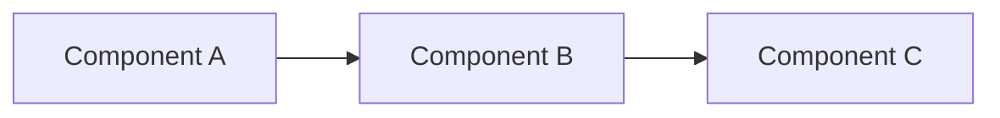
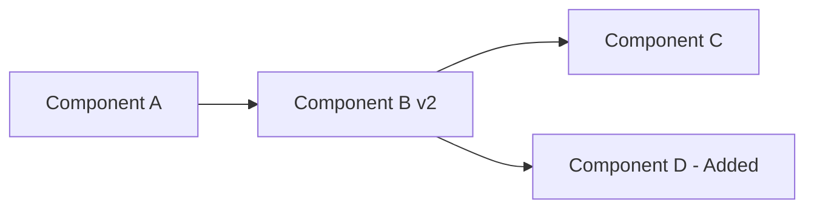

# Pivots Template

Use this template when generating PIVOTS.md files. Initialize it with empty tables when the plan is first created. Auto-update it whenever the plan changes.

**Auto-update instructions for Claude:**
- Whenever PLAN.md is modified (tasks added, removed, reordered, or re-estimated), append a row to the Change Log.
- If the architecture changes, update the Original vs Current diagram with before/after views.
- After each pivot, consider whether a lesson learned should be appended.
- Capture the WHY behind every change -- the reasoning matters more than the diff.

---

# Pivots & Changes: [Project or Feature Name]

**PLAN:** [Link to PLAN.md]
**Started:** [YYYY-MM-DD]
**Last Updated:** [YYYY-MM-DD]

## Change Log

| Date | What Changed | Why | Impact |
|------|-------------|-----|--------|

> Append a row every time the plan is modified. Be specific about what changed:
> - "Added task: implement rate limiting" not "updated plan"
> - "Increased estimate for auth from ~2d to ~5d" not "changed estimates"
>
> Impact values: None, Low, Medium, High, Critical
> - None: cosmetic or documentation change
> - Low: minor task adjustment, no timeline impact
> - Medium: timeline shifts by 1-2 days
> - High: phase reordering or scope change
> - Critical: fundamental architecture change or major scope cut

## Scope Changes

> Track features or tasks that were added or removed after the initial plan was approved.

### Added After Initial Plan

| Date | Item | Reason | Estimated Impact |
|------|------|--------|-----------------|

### Removed / Deferred

| Date | Item | Reason | Original Estimate |
|------|------|--------|------------------|

## Original Plan vs Current

> When the architecture or phase structure changes significantly, show a side-by-side comparison using diagrams. Update these diagrams after major pivots.

### Original Architecture

> Replace with the actual architecture diagram from the initial PLAN.md.

### Current Architecture

> Update this diagram to reflect the current state after pivots.

## Estimate Accuracy

> Track how actual effort compared to estimates. This data improves future estimation.

| Task | Original Estimate | Actual | Variance | Notes |
|------|------------------|--------|----------|-------|

> Fill this in as tasks complete. Variance = (Actual - Estimate) / Estimate as a percentage.
> Example: Estimated ~2d, took 3d -> variance = +50%

## Lessons Learned

> Append insights here whenever a pivot reveals something useful for future planning. Focus on actionable takeaways, not blame.

- [YYYY-MM-DD] [Lesson learned from pivot or change]

> Good examples:
> - "2026-01-15: API integration estimates should include time for auth token refresh edge cases -- added 30% buffer to future API tasks."
> - "2026-01-20: Breaking the auth feature into separate tasks for frontend and backend reduced blockers -- use this pattern for future cross-stack features."
