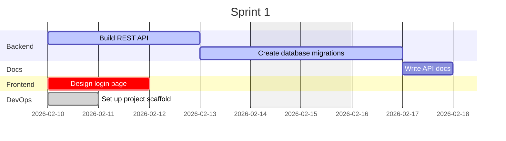
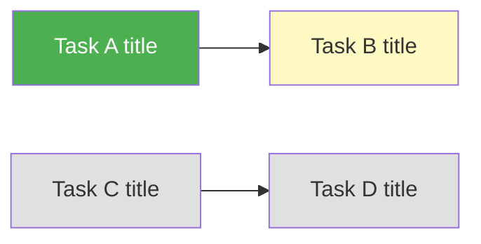
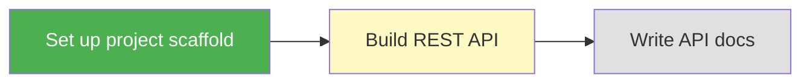

# PROJECT.md Update Guide

This document contains the exact rules Claude must follow when modifying PROJECT.md. Each operation is described with a step-by-step algorithm and concrete before/after examples.

## Table of Contents

1. [Adding a Task](#1-adding-a-task)
2. [Moving a Task Between Columns](#2-moving-a-task-between-columns)
3. [Completing a Task](#3-completing-a-task)
4. [Removing a Task](#4-removing-a-task)
5. [Regenerating the Gantt Chart](#5-regenerating-the-gantt-chart)
6. [Regenerating the Dependency Graph](#6-regenerating-the-dependency-graph)
7. [Appending to the Log](#7-appending-to-the-log)
8. [Starting a New Sprint](#8-starting-a-new-sprint)
9. [Ending a Sprint](#9-ending-a-sprint)
10. [Calculating Velocity](#10-calculating-velocity)
11. [Seeding from PLAN.md](#11-seeding-from-planmd)
12. [Updating PROGRESS.md](#12-updating-progressmd)
13. [Handling Subtasks](#13-handling-subtasks)
14. [Parsing Task Metadata](#14-parsing-task-metadata)

---

## 1. Adding a Task

### Algorithm

1. Parse the task text to extract metadata (see [Parsing Task Metadata](#14-parsing-task-metadata)).
2. Format as a markdown checkbox item: `- [ ] <title> ~<duration> #<tag> @<assignee>`.
3. Append the line under the `### Backlog` heading, before the next heading.
4. Regenerate the Gantt chart (see [Regenerating the Gantt Chart](#5-regenerating-the-gantt-chart)).
5. Regenerate the dependency graph (see [Regenerating the Dependency Graph](#6-regenerating-the-dependency-graph)).
6. Append a log entry (see [Appending to the Log](#7-appending-to-the-log)).

### Example

**User command:** `/amp:track add Build user profile page ~2d #frontend @bob`

**Before -- Backlog section:**
```markdown
### Backlog

- [ ] Define project requirements ~1d #planning @alice
```

**After -- Backlog section:**
```markdown
### Backlog

- [ ] Define project requirements ~1d #planning @alice
- [ ] Build user profile page ~2d #frontend @bob
```

**Log entry added:**
```
| 2026-02-15 | Added task | "Build user profile page" added to Backlog |
```

---

## 2. Moving a Task Between Columns

### Algorithm

1. Locate the task line (and any subtask lines indented beneath it) in the source column.
2. Remove the task line(s) from the source column.
3. Insert the task line(s) at the end of the destination column (before the next `###` heading).
4. Update checkbox state:
   - If destination is `Done`: change `- [ ]` to `- [x]` on the task and all its subtasks.
   - If source was `Done` and destination is not: change `- [x]` to `- [ ]` on the task and all its subtasks.
   - For moves between Backlog, In Progress, and In Review: keep `- [ ]` unchanged.
5. Regenerate the Gantt chart.
6. Regenerate the dependency graph.
7. Append a log entry.

### Example: Moving from Backlog to In Progress

**Before:**
```markdown
### Backlog

- [ ] Define project requirements ~1d #planning @alice
- [ ] Build user profile page ~2d #frontend @bob

### In Progress

- [ ] Initialize project repository ~0.5d #devops @carol
```

**After:**
```markdown
### Backlog

- [ ] Define project requirements ~1d #planning @alice

### In Progress

- [ ] Initialize project repository ~0.5d #devops @carol
- [ ] Build user profile page ~2d #frontend @bob
```

**Log entry:**
```
| 2026-02-15 | Moved task | "Build user profile page" moved to In Progress |
```

### Example: Moving from In Progress to Done

**Before:**
```markdown
### In Progress

- [ ] Initialize project repository ~0.5d #devops @carol
  - [x] Create repo
  - [x] Configure linting

### Done

- [x] Create project plan ~1d #planning @alice
```

**After:**
```markdown
### In Progress

### Done

- [x] Create project plan ~1d #planning @alice
- [x] Initialize project repository ~0.5d #devops @carol
  - [x] Create repo
  - [x] Configure linting
```

Note: the parent checkbox changed from `[ ]` to `[x]`, and all subtask checkboxes remain `[x]`.

---

## 3. Completing a Task

Completing a task is the same as moving it to Done (see section 2). Additionally:

1. If a `PROGRESS.md` exists, update it (see [Updating PROGRESS.md](#12-updating-progressmd)).
2. If all tasks in the current sprint are now Done, suggest ending the sprint.

---

## 4. Removing a Task

### Algorithm

1. Locate the task line (and any subtask lines) in its current column.
2. Remove the line(s).
3. Regenerate the Gantt chart.
4. Regenerate the dependency graph.
5. Remove any `depends:` references to this task from other tasks.
6. Append a log entry.

### Example

**Before:**
```markdown
### Backlog

- [ ] Define project requirements ~1d #planning @alice
- [ ] Build analytics dashboard ~5d #frontend @bob
```

**After:**
```markdown
### Backlog

- [ ] Define project requirements ~1d #planning @alice
```

**Log entry:**
```
| 2026-02-15 | Removed task | "Build analytics dashboard" removed from Backlog |
```

---

## 5. Regenerating the Gantt Chart

### Full Algorithm

This is the most complex operation. Follow these steps exactly.

#### Step 1: Collect all tasks

Walk the Board section and collect every task from all four columns. For each task, record:
- `title`: the task description text (metadata stripped)
- `id`: a sanitized version of the title (lowercase, spaces replaced with hyphens, special characters removed, max 30 chars)
- `duration`: parsed from `~Nd` (default: `1d` if missing)
- `column`: which column the task is in
- `tags`: list of `#tag` values
- `depends_on`: list of task titles from `depends:` metadata
- `order`: the position of the task in the file (for default sequencing)

#### Step 2: Map columns to Gantt status tags

| Column       | Gantt Status Tag |
|-------------|------------------|
| Backlog     | *(none)*         |
| In Progress | `active`         |
| In Review   | `crit`           |
| Done        | `done`           |

#### Step 3: Group tasks into sections

Group tasks by their first `#tag`. Tasks with no tags go into a section called "General". The section name is the tag with the first letter capitalized (e.g., `#backend` becomes `Backend`).

#### Step 4: Determine task scheduling

For each task:
- If it has `depends_on` entries, generate an `after <dep-id>` clause using the dependency's sanitized ID.
- If it has no dependencies and is not the first task, it starts after the previous task in the same section, OR on the sprint start date if it is the first task in its section.
- The first task in the entire chart with no dependencies starts on the sprint start date.

#### Step 5: Generate the Mermaid Gantt block

```
gantt
    title Sprint <N>
    dateFormat YYYY-MM-DD
    excludes weekends

    section <SectionName>
    <Task title>    :<status>,  <id>,  <start-or-after>,  <duration>
```

#### Step 6: Replace the existing Gantt

Find the `## Timeline` section. Replace everything between the opening ` ```mermaid ` fence and the closing ` ``` ` fence with the newly generated Gantt block.

### Complete Before/After Example

**Board state:**
```markdown
### Backlog
- [ ] Write API docs ~1d #docs

### In Progress
- [ ] Build REST API ~3d #backend @alice
- [ ] Create database migrations ~2d #backend @bob depends:Build REST API

### In Review
- [ ] Design login page ~2d #frontend @carol

### Done
- [x] Set up project scaffold ~1d #devops @alice
```

**Generated Gantt (Sprint starts 2026-02-10):**


### ID Sanitization Rules

To create a Gantt task ID from a task title:
1. Convert to lowercase
2. Replace spaces with hyphens
3. Remove characters that are not alphanumeric or hyphens
4. Truncate to 30 characters
5. Remove trailing hyphens

Examples:
- "Build REST API" -> `build-rest-api`
- "Set up CI/CD pipeline" -> `set-up-cicd-pipeline`
- "Design the user authentication flow system" -> `design-the-user-authenticati`

---

## 6. Regenerating the Dependency Graph

### Full Algorithm

#### Step 1: Collect tasks and dependencies

Use the same collected task data from the Gantt regeneration. Identify all tasks that either have dependencies or are depended upon.

If no tasks have `depends:` relationships, generate a simple graph with all tasks as disconnected nodes (still colored by column).

#### Step 2: Create node labels

For each task, create a node with:
- A short ID (single uppercase letter A, B, C... or use the sanitized ID)
- A label that includes the task title
- For Done tasks: prepend a checkmark to the label

Use sequential letters (A, B, C...) for node IDs to keep the graph readable.

#### Step 3: Apply node styles by column

| Column       | Fill Color | Text Color | Meaning         |
|-------------|-----------|------------|-----------------|
| Done        | `#4caf50` | `#fff`     | Green = complete |
| In Progress | `#fff9c4` | `#333`     | Yellow = active  |
| In Review   | `#ffe0b2` | `#333`     | Orange = review  |
| Backlog     | `#e0e0e0` | `#333`     | Grey = waiting   |

#### Step 4: Draw edges

For each `depends:` relationship, draw an arrow from the dependency to the dependent task:
```
A --> B
```

Where A is the task that B depends on.

#### Step 5: Generate the Mermaid graph block



#### Step 6: Replace the existing graph

Find the `## Dependencies` section. Replace everything between the opening ` ```mermaid ` fence and the closing ` ``` ` fence with the newly generated graph block.

### Complete Before/After Example

**Board state:**
```markdown
### Backlog
- [ ] Write API docs ~1d #docs depends:Build REST API

### In Progress
- [ ] Build REST API ~3d #backend @alice depends:Set up project scaffold

### Done
- [x] Set up project scaffold ~1d #devops @alice
```

**Generated Dependency Graph:**


---

## 7. Appending to the Log

### Algorithm

1. Find the `## Log` section.
2. Find the last row of the markdown table (the line before the next `##` heading or end of file).
3. Append a new row with:
   - **Date**: today's date in `YYYY-MM-DD` format
   - **Action**: a short action verb phrase (see table below)
   - **Details**: context about the action

### Standard Action Phrases

| Event | Action | Details Template |
|-------|--------|-----------------|
| Init | Initialized project | Created PROJECT.md with N tasks |
| Init from PLAN.md | Initialized project | Seeded from PLAN.md with N tasks |
| Add task | Added task | "Task title" added to Backlog |
| Move task | Moved task | "Task title" moved to <Column> |
| Remove task | Removed task | "Task title" removed from <Column> |
| Start sprint | Started sprint N | Goal: "<sprint goal>" |
| End sprint | Ended sprint N | Completed X/Y tasks, Z carried over |
| Add dependency | Added dependency | "Task A" now depends on "Task B" |
| Remove dependency | Removed dependency | "Task A" no longer depends on "Task B" |

### Example

**Before:**
```markdown
## Log

| Date | Action | Details |
|------|--------|---------|
| 2026-02-13 | Initialized project | Created PROJECT.md with 6 tasks |
```

**After (adding a task):**
```markdown
## Log

| Date | Action | Details |
|------|--------|---------|
| 2026-02-13 | Initialized project | Created PROJECT.md with 6 tasks |
| 2026-02-15 | Added task | "Build user profile page" added to Backlog |
```

---

## 8. Starting a New Sprint

### Algorithm

1. Update the sprint header:
   ```markdown
   ## Sprint: <N+1> (<today> to <today + 14 days>)
   ```
2. Ask the user for the sprint goal and update the **Goal** line.
3. Move carry-over tasks:
   - Any tasks in `In Progress` or `In Review` are moved back to the top of `Backlog`.
   - Their checkbox state remains `- [ ]`.
   - Their metadata is fully preserved.
4. Clear the `Done` column (remove all `- [x]` lines). Before clearing, log each completed task if not already logged.
5. Regenerate the Gantt chart with the new sprint start date.
6. Regenerate the dependency graph.
7. Append a log entry: `Started sprint N | Goal: "<goal>"`.

### Example

**Before (end of Sprint 1):**
```markdown
## Sprint: 1 (2026-02-10 to 2026-02-24)

**Goal:** Set up project foundation

## Board

### Backlog

### In Progress
- [ ] Build REST API ~3d #backend @alice

### In Review
- [ ] Design login page ~2d #frontend @carol

### Done
- [x] Set up project scaffold ~1d #devops @alice
- [x] Create database migrations ~2d #backend @bob
```

**After (Sprint 2 started):**
```markdown
## Sprint: 2 (2026-02-24 to 2026-03-10)

**Goal:** [User-provided goal]

## Board

### Backlog
- [ ] Build REST API ~3d #backend @alice
- [ ] Design login page ~2d #frontend @carol

### In Progress

### In Review

### Done
```

**Log entries added:**
```
| 2026-02-24 | Ended sprint 1 | Completed 2/4 tasks, 2 carried over |
| 2026-02-24 | Started sprint 2 | Goal: "[User-provided goal]" |
```

**Velocity table updated:**
```
| 1 | 4 | 2 | 2 | 2 |
```

---

## 9. Ending a Sprint

### Algorithm

1. Count tasks:
   - **Planned**: total tasks that were in the sprint (across all columns)
   - **Completed**: tasks in the Done column
   - **Carry-over**: tasks NOT in the Done column (Backlog + In Progress + In Review)
2. Append a row to the Velocity table (see [Calculating Velocity](#10-calculating-velocity)).
3. Append a log entry: `Ended sprint N | Completed X/Y tasks, Z carried over`.
4. Proceed to [Starting a New Sprint](#8-starting-a-new-sprint) if the user wants to continue.

### Counting Rules

- Only count top-level tasks (not subtasks) for velocity
- A task counts as "Completed" only if it is in the Done column with `[x]`
- Tasks added mid-sprint still count toward "Planned"

---

## 10. Calculating Velocity

### Algorithm

1. At sprint end, gather the counts from [Ending a Sprint](#9-ending-a-sprint).
2. Append a row to the Velocity table:

```markdown
| <sprint-number> | <planned> | <completed> | <carry-over> | <velocity> |
```

Where:
- `velocity` = `completed` (number of tasks finished in the sprint)

3. If the table has 3+ rows, compute the trend:
   - Get the last 3 velocity values
   - If max - min <= 20% of the average: trend is **Stable**
   - If each value is greater than or equal to the previous: trend is **Improving**
   - If each value is less than or equal to the previous: trend is **Declining**
   - Otherwise: trend is **Volatile**

### Example

**After 3 sprints:**
```markdown
| Sprint | Planned | Completed | Carry-over | Velocity |
|--------|---------|-----------|------------|----------|
| 1      | 8       | 6         | 2          | 6        |
| 2      | 10      | 7         | 3          | 7        |
| 3      | 9       | 8         | 1          | 8        |
```

Trend analysis: velocities [6, 7, 8] are each >= previous, so trend is **Improving**.

---

## 11. Seeding from PLAN.md

### Algorithm

When `init` finds a `PLAN.md` file (from the amp:plan skill):

1. Open PLAN.md and find the `## Phases` section.
2. For each phase heading (e.g., `### Phase 1: Setup`):
   a. Extract all task lines matching the pattern `- [ ] <text>`.
   b. Preserve all metadata (~duration, #tag, @assignee).
   c. For tasks in Phase 1, add them to `### Backlog` in PROJECT.md.
   d. For tasks in Phase 2+, add them to `### Backlog` with an additional `#phase-N` tag.
3. If PLAN.md has a `## Dependency Graph` section with a Mermaid diagram:
   a. Parse the node labels and edges.
   b. Add corresponding `depends:` metadata to tasks in PROJECT.md.
4. If PLAN.md has a `## Timeline` section with a Gantt chart:
   a. Use the date range to set the Sprint 1 dates.
5. Set the project name from PLAN.md's H1 heading.
6. Generate the Gantt chart and dependency graph for PROJECT.md.
7. Log: `Initialized project | Seeded from PLAN.md with N tasks`.

### Example

**PLAN.md content:**
```markdown
# Implementation Plan: Todo App

## Phases

### Phase 1: Foundation
- [ ] Set up project scaffold ~1d #devops @alice
- [ ] Create database schema ~1d #backend @bob
- [ ] Set up CI/CD ~2d #devops @alice

### Phase 2: Core Features
- [ ] Build task CRUD API ~3d #backend @bob
- [ ] Create task list UI ~2d #frontend @carol
- [ ] Add task filtering ~1d #frontend @carol
```

**Generated PROJECT.md Backlog:**
```markdown
### Backlog

- [ ] Set up project scaffold ~1d #devops @alice
- [ ] Create database schema ~1d #backend @bob
- [ ] Set up CI/CD ~2d #devops @alice
- [ ] Build task CRUD API ~3d #backend @bob #phase-2
- [ ] Create task list UI ~2d #frontend @carol #phase-2
- [ ] Add task filtering ~1d #frontend @carol #phase-2
```

---

## 12. Updating PROGRESS.md

### Algorithm

When a task is moved to Done and a `PROGRESS.md` file exists (from the amp:plan skill):

1. Open PROGRESS.md.
2. Find the `## Completed` table.
3. Append a new row:
   ```
   | <today YYYY-MM-DD> | <task title> | Completed in Sprint <N> |
   ```
4. Find the `## In Progress` table.
5. Remove the row for this task if it exists there.
6. Update the `## Metrics` section:
   - Increment the completed count
   - Recalculate the percentage
7. If all tasks in a phase are now done:
   - Update the `## Current Status` header to reflect the next phase
   - Log the phase completion

### Example

**PROGRESS.md before:**
```markdown
## Completed

| Date | Task | Notes |
|------|------|-------|
| 2026-02-13 | Set up project scaffold | Completed in Sprint 1 |

## In Progress

| Task | Started | Assignee | Blockers |
|------|---------|----------|----------|
| Build REST API | 2026-02-14 | @alice | None |

## Metrics
- Tasks completed: 1/8 (12%)
- Current phase: 1 of 3
```

**PROGRESS.md after (Build REST API moved to Done):**
```markdown
## Completed

| Date | Task | Notes |
|------|------|-------|
| 2026-02-13 | Set up project scaffold | Completed in Sprint 1 |
| 2026-02-17 | Build REST API | Completed in Sprint 1 |

## In Progress

| Task | Started | Assignee | Blockers |
|------|---------|----------|----------|

## Metrics
- Tasks completed: 2/8 (25%)
- Current phase: 1 of 3
```

---

## 13. Handling Subtasks

### Rules

1. Subtasks are indented lines (2 spaces) under a parent task, using the same checkbox syntax.
2. Subtask checkboxes are managed independently -- completing a subtask does not automatically complete the parent.
3. The parent task should only be moved to Done when ALL subtasks are `[x]`.
4. When moving a parent task between columns, ALL subtask lines move with it.
5. Subtasks do not appear in the Gantt chart or dependency graph -- only top-level tasks do.
6. Subtasks do not count toward velocity -- only top-level tasks count.

### Example: Completing subtasks incrementally

**Before:**
```markdown
### In Progress

- [ ] Build REST API ~3d #backend @alice
  - [x] Define route structure
  - [ ] Implement CRUD endpoints
  - [ ] Add input validation
```

**After (one more subtask completed):**
```markdown
### In Progress

- [ ] Build REST API ~3d #backend @alice
  - [x] Define route structure
  - [x] Implement CRUD endpoints
  - [ ] Add input validation
```

Note: parent stays `[ ]` because not all subtasks are complete.

**After (all subtasks completed, parent moved to Done):**
```markdown
### Done

- [x] Build REST API ~3d #backend @alice
  - [x] Define route structure
  - [x] Implement CRUD endpoints
  - [x] Add input validation
```

---

## 14. Parsing Task Metadata

### Algorithm

Given a raw task string (the text after `- [ ] ` or `- [x] `):

1. **Priority**: Check if the string starts with `!` (followed by a space). If so, flag as high priority and remove the `!` prefix.
2. **Duration**: Find the pattern `~(\d+\.?\d*)d` using regex. Extract the numeric value as the duration in days. Remove the match from the string.
3. **Tags**: Find all `#(\w[\w-]*)` patterns. Collect as a list of tags. Remove all matches from the string.
4. **Assignee**: Find the pattern `@(\w[\w-]*)`. Extract as the assignee. Remove the match from the string.
5. **Dependencies**: Find the pattern `depends:(.+?)(?=\s+[~#@!]|$)`. Extract the dependency task title. Remove the match from the string.
6. **Title**: Trim any remaining whitespace. The remaining text is the task title.

### Parsing Examples

**Input:** `! Implement auth flow ~3d #backend #security @alice depends:Setup database`

| Field | Value |
|-------|-------|
| Priority | high |
| Duration | 3d |
| Tags | [backend, security] |
| Assignee | alice |
| Dependencies | [Setup database] |
| Title | Implement auth flow |

**Input:** `Build landing page ~2d #frontend`

| Field | Value |
|-------|-------|
| Priority | normal |
| Duration | 2d |
| Tags | [frontend] |
| Assignee | (none) |
| Dependencies | (none) |
| Title | Build landing page |

**Input:** `Fix login bug @bob`

| Field | Value |
|-------|-------|
| Priority | normal |
| Duration | 1d (default) |
| Tags | (none) |
| Assignee | bob |
| Dependencies | (none) |
| Title | Fix login bug |

---

## Summary: Operation Checklist

Every time you modify PROJECT.md, follow this checklist:

1. **Perform the primary operation** (add, move, remove, sprint change)
2. **Update checkbox states** if the task crossed into or out of Done
3. **Regenerate the Gantt chart** (section 5)
4. **Regenerate the dependency graph** (section 6)
5. **Append to the Log table** (section 7)
6. **Update PROGRESS.md** if it exists and a task was completed (section 12)
7. **Update the Velocity table** if a sprint boundary was crossed (section 10)
8. **Validate** -- confirm all Mermaid blocks have valid syntax, checkbox states match columns, and metadata is preserved
