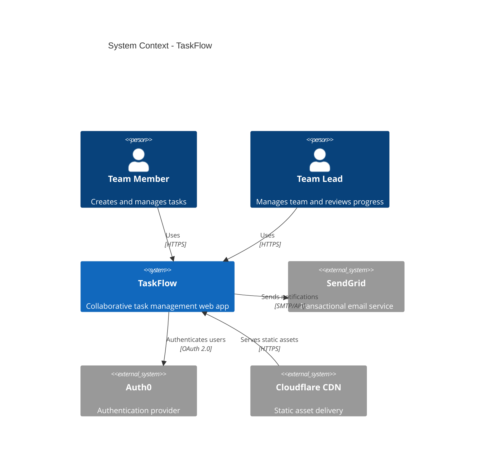
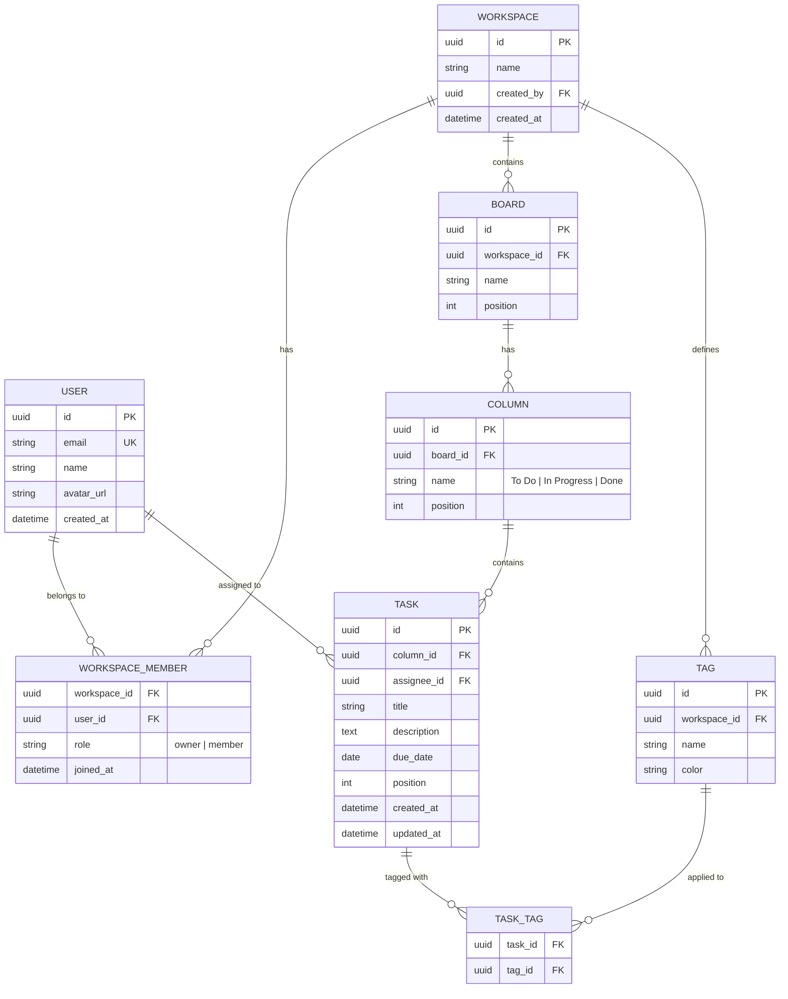
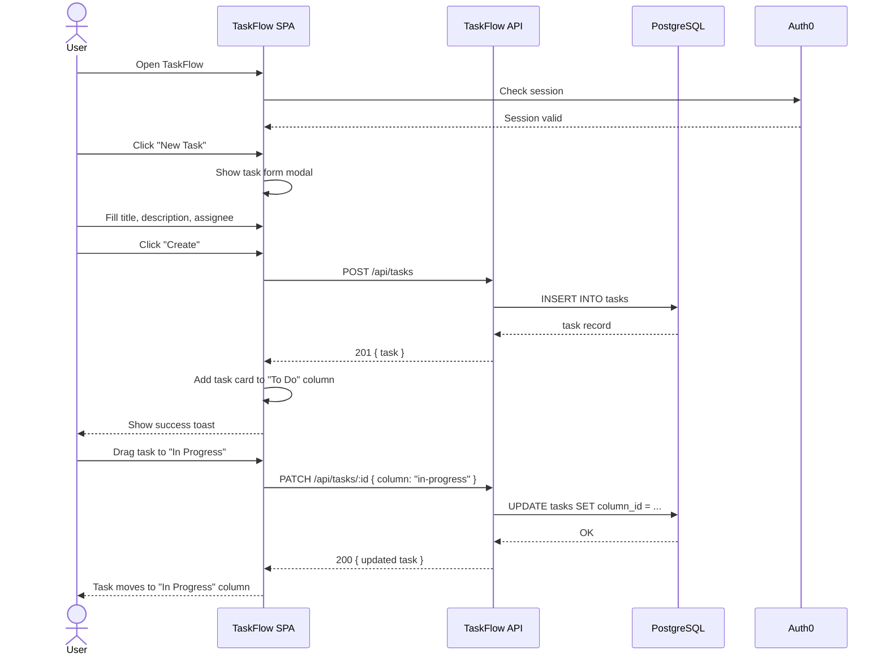
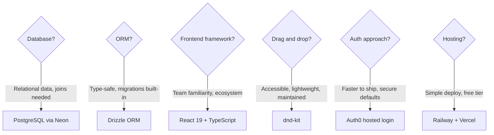
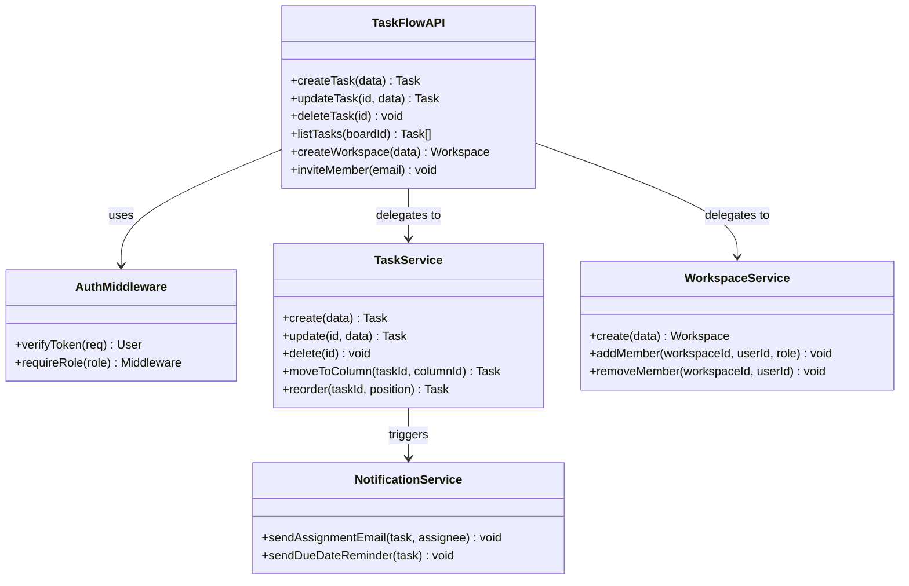
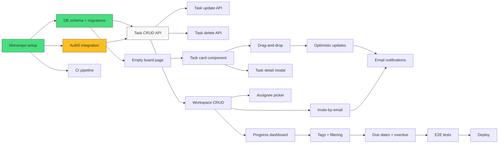
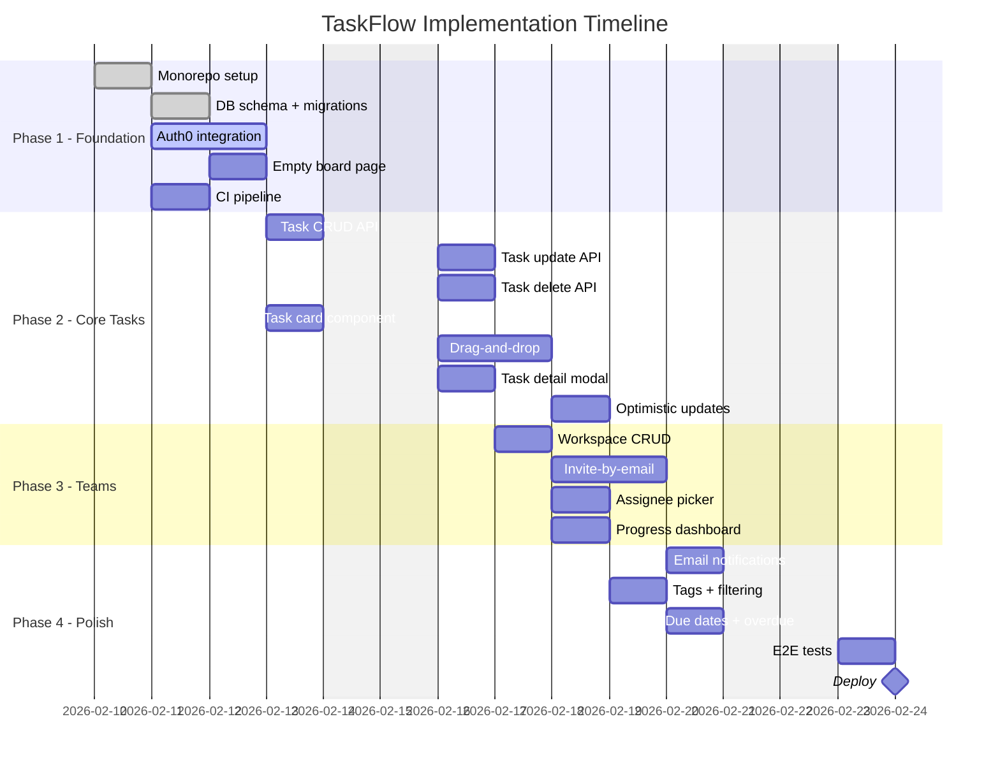
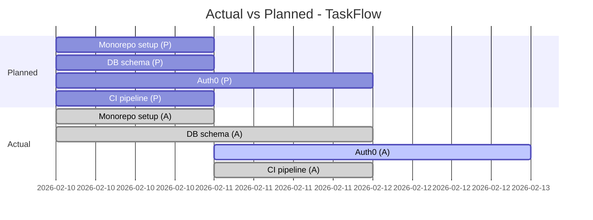
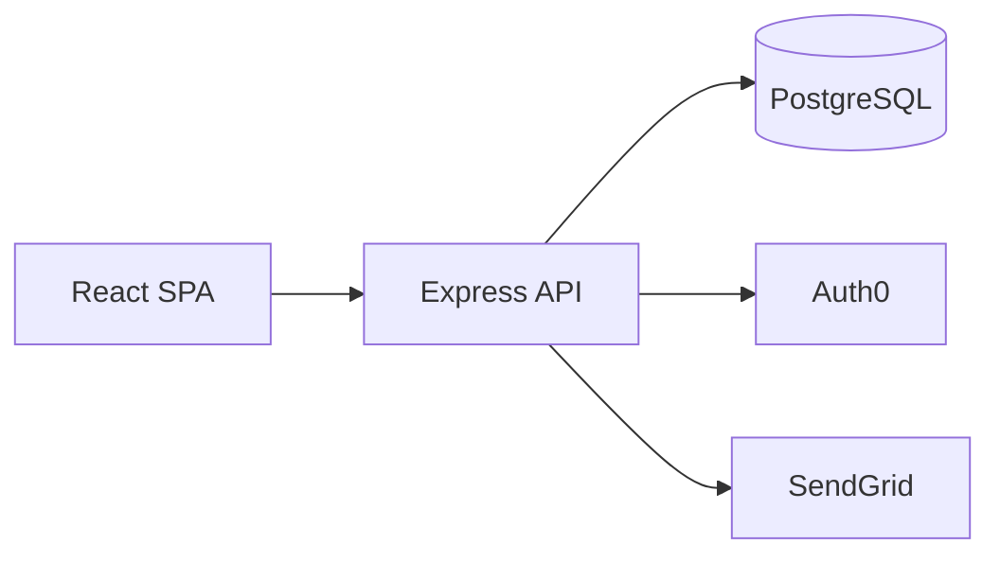

# Example: New Project -- Todo App

This example shows the complete planning output for a greenfield todo application. All four files (PRD, PLAN, PROGRESS, PIVOTS) are shown with real Mermaid diagrams.

---

## PRD.md

# PRD: TaskFlow -- Collaborative Todo App

**Author:** Alex
**Date:** 2026-02-10
**Status:** Approved

## Problem Statement

Small teams (2-5 people) working on side projects lack a lightweight task management tool that fits their workflow. Existing tools like Jira are too heavy, sticky notes get lost, and shared Google Docs lack structure. Teams need a simple tool that lets them create, assign, and track tasks without onboarding overhead.

## Goals & Success Criteria

- [ ] Users can create and manage tasks in under 10 seconds -- time-to-create metric (< 10s)
- [ ] Teams of 2-5 can collaborate on shared boards -- concurrent user support (5 simultaneous users)
- [ ] Task completion rate improves over baseline -- completion rate (> 70% of created tasks marked done within 7 days)
- [ ] App loads in under 2 seconds on 3G connections -- LCP metric (< 2s)

## User Stories

- **P0:** As a team member, I want to create a task with a title and description so that I can capture work items quickly.
- **P0:** As a team member, I want to drag tasks between "To Do", "In Progress", and "Done" columns so that I can track work status visually.
- **P0:** As a team lead, I want to assign tasks to team members so that everyone knows what they own.
- **P1:** As a team member, I want to add due dates to tasks so that I can prioritize by deadline.
- **P1:** As a team lead, I want to see a progress overview so that I know how the team is doing.
- **P2:** As a user, I want to filter tasks by assignee or tag so that I can focus on relevant work.
- **P2:** As a user, I want to receive email notifications when I am assigned a task so that I do not miss new assignments.

## Scope

### In Scope

- User registration and login (email/password)
- Create, edit, delete tasks with title, description, assignee, due date, tags
- Kanban board with drag-and-drop between columns (To Do, In Progress, Done)
- Team workspaces with invite-by-email
- Basic progress dashboard (task counts per column, overdue count)
- Mobile-responsive web app

### Out of Scope

- Native mobile apps (iOS/Android) -- web only for v1
- Real-time collaboration (polling every 30s is acceptable for v1)
- File attachments on tasks
- Time tracking or estimation
- Recurring tasks
- Integrations with external tools (Slack, GitHub)

## Architecture Overview

## Data Model

## User Flow

## Technical Constraints

- Must run on Node.js >= 18 (deployment target: Railway or Fly.io)
- PostgreSQL for data persistence (managed instance)
- Frontend: React 19 with TypeScript
- API response time < 200ms at p95
- Must support latest 2 versions of Chrome, Firefox, Safari, Edge

## Dependencies

| Dependency | Type | Status | Notes |
|-----------|------|--------|-------|
| Auth0 | Auth provider | Confirmed | Free tier for < 7,500 MAU |
| SendGrid | Email API | Confirmed | Free tier for < 100 emails/day |
| PostgreSQL (Neon) | Database | Confirmed | Free tier with 0.5 GB |
| React 19 | Framework | Confirmed | Stable release available |
| Railway | Hosting | Pending | Evaluating vs Fly.io |

## Open Questions

- [ ] Should we use Auth0 or roll our own auth with Passport.js? -- Owner: Alex, Target: 2026-02-12
- [ ] Real-time updates: polling vs SSE for v1? -- Owner: Alex, Target: 2026-02-14

---

## PLAN.md

# Implementation Plan: TaskFlow

**PRD:** [PRD.md](./PRD.md)
**Date:** 2026-02-10
**Status:** Active

## Phases

### Phase 1: Foundation (~4.5d)

Set up the project, database, and authentication. At the end of this phase, a user can sign up, log in, and see an empty board.

- [ ] Initialize monorepo with React frontend and Express backend ~0.5d @alex
- [ ] Set up PostgreSQL schema with migrations (Drizzle ORM) ~1d @alex
- [ ] Integrate Auth0 for signup/login ~1.5d @alex
- [ ] Create empty board page with three columns ~1d @alex
- [ ] Set up CI pipeline (GitHub Actions: lint, test, build) ~0.5d @alex

### Phase 2: Core Task Management (~6d)

Build the primary task CRUD and board interactions. At the end of this phase, a user can create tasks and move them between columns.

- [ ] Build task creation API endpoint (POST /api/tasks) ~1d @alex
- [ ] Build task update API endpoint (PATCH /api/tasks/:id) ~0.5d @alex
- [ ] Build task deletion API endpoint (DELETE /api/tasks/:id) ~0.5d @alex
- [ ] Create task card component with title, assignee, due date ~1d @alex
- [ ] Implement drag-and-drop between columns (dnd-kit) ~1.5d @alex
- [ ] Add task detail modal with edit form ~1d @alex
- [ ] Implement optimistic updates for drag-and-drop ~0.5d @alex

### Phase 3: Teams & Collaboration (~4d)

Add workspace and team features. At the end of this phase, multiple users can share a board.

- [ ] Build workspace CRUD API ~1d @alex
- [ ] Implement invite-by-email flow ~1.5d @alex
- [ ] Add assignee picker (workspace members dropdown) ~0.5d @alex
- [ ] Build progress dashboard (task counts, overdue count) ~1d @alex

### Phase 4: Polish & Launch (~3.5d)

Finalize UX, add notifications, test, and deploy.

- [ ] Add email notifications for task assignment (SendGrid) ~1d @alex
- [ ] Implement tag creation and task filtering ~1d @alex
- [ ] Add due date picker and overdue highlighting ~0.5d @alex
- [ ] Write E2E tests for critical paths (Playwright) ~0.5d @alex
- [ ] Deploy to Railway (backend) and Vercel (frontend) ~0.5d @alex

## Architecture Decisions

## Component Breakdown

## Dependency Graph

## Timeline

## Risk Assessment

| Risk | Likelihood | Impact | Mitigation |
|------|-----------|--------|------------|
| Auth0 free tier limits exceeded during testing | Low | Medium | Use test tenants with separate Auth0 app; monitor MAU count weekly |
| Drag-and-drop performance with 100+ tasks | Medium | High | Virtualize the task list with react-window; lazy load task details |
| Scope creep: users request real-time sync | High | Medium | Document polling as v1 approach; defer WebSocket/SSE to v2 backlog |
| Database migration breaking changes | Low | High | Write reversible migrations; test with production data snapshot before deploying |
| Railway free tier cold starts | Medium | Low | Add health check endpoint; consider upgrading to paid tier at launch |

---

## PROGRESS.md

# Progress: TaskFlow

**PLAN:** [PLAN.md](./PLAN.md)
**Started:** 2026-02-10
**Last Updated:** 2026-02-12

## Current Status: Phase 1 -- Foundation In Progress

## Completed

| Date | Task | Phase | Notes |
|------|------|-------|-------|
| 2026-02-10 | Monorepo setup | Phase 1 | Used Turborepo for monorepo structure |
| 2026-02-11 | DB schema + migrations | Phase 1 | All 8 tables created with Drizzle; seed script added |
| 2026-02-11 | CI pipeline | Phase 1 | GitHub Actions: lint + type-check + test on push |

## In Progress

| Task | Started | Assignee | Blockers |
|------|---------|----------|----------|
| Auth0 integration | 2026-02-11 | @alex | Waiting for Auth0 tenant approval (expected today) |
| Empty board page | 2026-02-12 | @alex | None |

## Upcoming

| Task | Phase | Estimate | Dependencies |
|------|-------|----------|-------------|
| Task CRUD API | Phase 2 | ~1d | Auth0 integration |
| Task card component | Phase 2 | ~1d | Empty board page |
| Task update API | Phase 2 | ~0.5d | Task CRUD API |

## Metrics

- **Tasks completed:** 3 / 21 (14%)
- **Current phase:** 1 of 4
- **Days elapsed:** 2
- **Days remaining (estimated):** 16

## Timeline: Actual vs Planned

## Blockers

| Blocker | Affects | Raised | Status | Resolution |
|---------|---------|--------|--------|------------|
| Auth0 tenant approval delay | Auth0 integration | 2026-02-11 | Active | Submitted support ticket; expected same-day resolution |

---

## PIVOTS.md

# Pivots & Changes: TaskFlow

**PLAN:** [PLAN.md](./PLAN.md)
**Started:** 2026-02-10
**Last Updated:** 2026-02-12

## Change Log

| Date | What Changed | Why | Impact |
|------|-------------|-----|--------|
| 2026-02-11 | Increased DB schema estimate from ~1d to ~1.5d | Seed script needed for development; added TASK_TAG junction table that was missing from initial design | Low |
| 2026-02-12 | Added "optimistic updates" task to Phase 2 | Drag-and-drop feels sluggish without optimistic UI; discovered during board page prototyping | Low |

## Scope Changes

### Added After Initial Plan

| Date | Item | Reason | Estimated Impact |
|------|------|--------|-----------------|
| 2026-02-12 | Optimistic updates for drag-and-drop | UX requirement discovered during prototyping | +0.5d to Phase 2 |

### Removed / Deferred

| Date | Item | Reason | Original Estimate |
|------|------|--------|------------------|

## Original Plan vs Current

### Original Architecture

### Current Architecture

No architecture changes yet -- the system design remains as originally planned.

## Estimate Accuracy

| Task | Original Estimate | Actual | Variance | Notes |
|------|------------------|--------|----------|-------|
| Monorepo setup | ~0.5d | 0.5d | 0% | Used Turborepo template, went smoothly |
| DB schema + migrations | ~1d | 1.5d | +50% | Seed script and junction table added complexity |
| CI pipeline | ~0.5d | 0.5d | 0% | Standard GitHub Actions setup |

## Lessons Learned

- 2026-02-11: Always include seed scripts in database setup estimates. Development without test data is slow and error-prone. Added 0.5d buffer to future DB tasks.
- 2026-02-12: Prototype the UX early (even roughly) before finalizing the task list. The need for optimistic updates only became clear when seeing the board in action.
