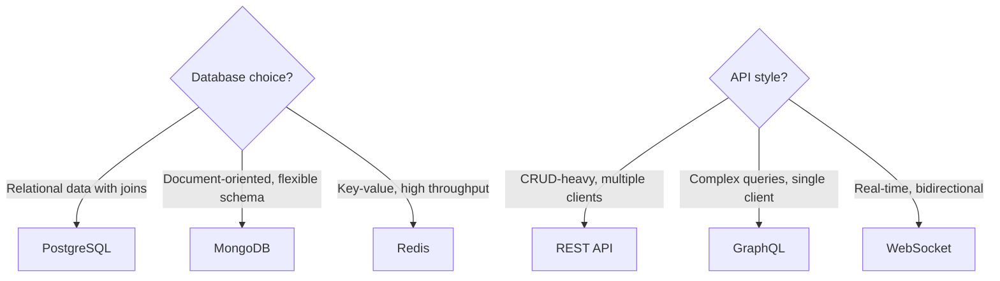
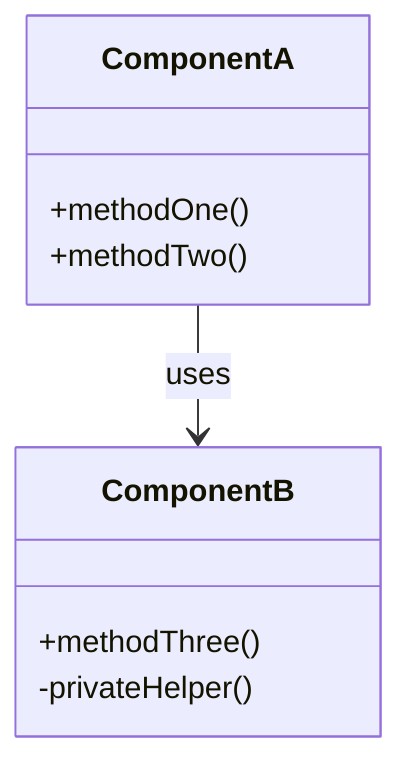
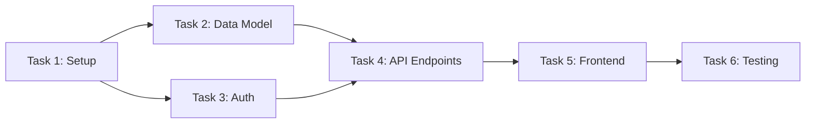

# Plan Template

Use this template when generating PLAN.md files. Replace all `[bracketed]` text with actual content. Remove guidance comments (lines starting with `>`) from the final output.

---

# Implementation Plan: [Project or Feature Name]

**PRD:** [Link to PRD.md]
**Date:** [YYYY-MM-DD]
**Status:** Draft | Active | Complete

## Phases

> Break the work into 2-5 phases. Each phase should produce a shippable increment -- something that can be demoed, tested, or used. Order phases so that earlier phases de-risk the project (tackle unknowns first).
>
> Task format: `- [ ] Task description ~estimate @assignee`
> Estimates use the ~Nd format: ~0.5d (half day), ~1d (one day), ~2d (two days), etc.
> Use ~?d for tasks with high uncertainty -- these need a spike or research phase first.

### Phase 1: [Foundation / Setup / Core]

> The first phase should establish the foundation: project setup, core data model, basic infrastructure. Keep it small and shippable.

- [ ] [Task 1] ~[estimate] @[assignee]
- [ ] [Task 2] ~[estimate] @[assignee]
- [ ] [Task 3] ~[estimate] @[assignee]

### Phase 2: [Core Features / Primary Flow]

> Build the primary user-facing flow. This is the main value delivery.

- [ ] [Task 1] ~[estimate] @[assignee]
- [ ] [Task 2] ~[estimate] @[assignee]
- [ ] [Task 3] ~[estimate] @[assignee]

### Phase 3: [Polish / Edge Cases / Secondary Features]

> Handle error cases, add secondary features, polish the UX. This phase should be safe to cut if time runs short.

- [ ] [Task 1] ~[estimate] @[assignee]
- [ ] [Task 2] ~[estimate] @[assignee]

## Architecture Decisions

> Document key technical decisions as a flowchart showing the decision process and chosen path. Focus on decisions that affect the overall structure, not implementation details.



## Component Breakdown

> Show how the system is organized into components or modules. Use a class diagram for code-level components or a C4 component diagram for service-level breakdown.



## Dependency Graph

> Map task dependencies to show what blocks what. This helps identify the critical path and parallelizable work. Nodes are tasks, edges are "blocks" relationships.



## Timeline

> Generate a Gantt chart from the phases and tasks above. Tasks should reflect actual estimates and dependencies. Use `excludes weekends` for realistic timelines.

```mermaid
gantt
    title Implementation Timeline
    dateFormat YYYY-MM-DD
    excludes weekends

    section Phase 1
        Task 1           :t1, [start-date], [duration]
        Task 2           :t2, after t1, [duration]
        Task 3           :t3, after t1, [duration]

    section Phase 2
        Task 4           :t4, after t2, [duration]
        Task 5           :t5, after t4, [duration]

    section Phase 3
        Task 6           :t6, after t5, [duration]
```

## Risk Assessment

> Identify 3-5 risks. Rate likelihood and impact as Low/Medium/High. Every risk must have a concrete, actionable mitigation -- not just "monitor" or "be careful."

| Risk | Likelihood | Impact | Mitigation |
|------|-----------|--------|------------|
| [Risk 1: e.g., "Third-party API rate limits"] | [Medium] | [High] | [Implement caching layer with 5-min TTL; add circuit breaker] |
| [Risk 2: e.g., "Data migration complexity"] | [Low] | [High] | [Write migration script in Phase 1; test with production data copy] |
| [Risk 3: e.g., "Scope creep from stakeholders"] | [High] | [Medium] | [Lock PRD scope before Phase 2; defer new requests to backlog] |
