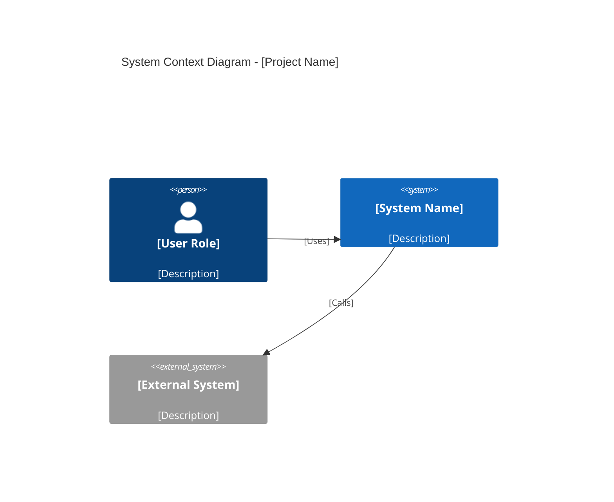
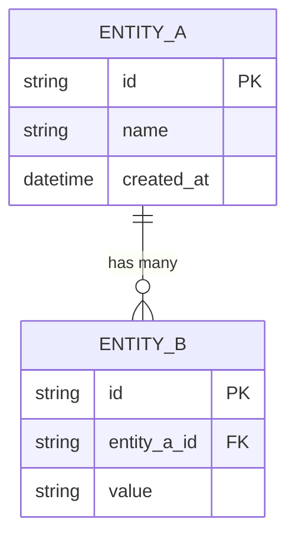
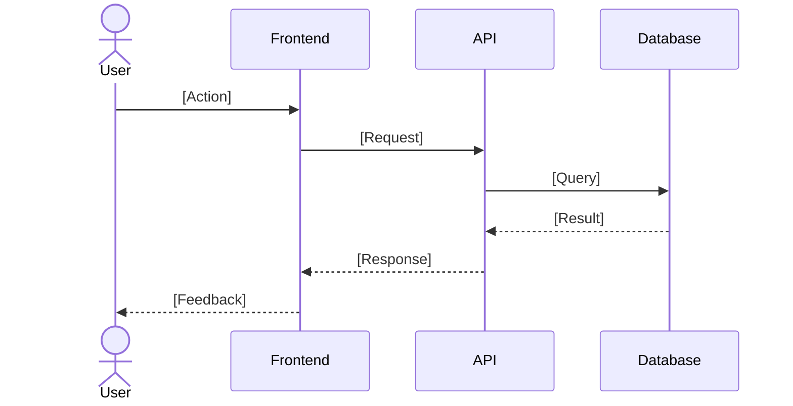

# PRD Template

Use this template when generating PRD.md files. Replace all `[bracketed]` text with actual content. Remove guidance comments (lines starting with `>`) from the final output.

---

# PRD: [Project or Feature Name]

**Author:** [name]
**Date:** [YYYY-MM-DD]
**Status:** Draft | In Review | Approved

## Problem Statement

> Describe the problem from the user's perspective. Answer: Who has this problem? What is the pain point? What happens if we do nothing?

[Write 2-4 sentences describing the core problem. Focus on the impact, not the solution.]

## Goals & Success Criteria

> Each goal must be measurable. Tie goals to observable outcomes, not implementation details. Include a target metric so you know when you have succeeded.

- [ ] [Goal 1] -- [metric] ([target value])
- [ ] [Goal 2] -- [metric] ([target value])
- [ ] [Goal 3] -- [metric] ([target value])

## User Stories

> Write user stories for the primary flow, secondary flows, and at least one edge case. Use the standard format. Aim for 3-8 stories. Prioritize them with P0 (must-have), P1 (should-have), P2 (nice-to-have).

- **P0:** As a [role], I want [capability] so that [benefit].
- **P0:** As a [role], I want [capability] so that [benefit].
- **P1:** As a [role], I want [capability] so that [benefit].
- **P2:** As a [role], I want [capability] so that [benefit].

## Scope

> Be explicit about boundaries. Listing what is out of scope is just as important as listing what is in scope. This prevents scope creep during implementation.

### In Scope

- [Feature or capability that will be built]
- [Feature or capability that will be built]

### Out of Scope

- [Feature or capability that will NOT be built in this iteration]
- [Feature or capability that will NOT be built in this iteration]

## Architecture Overview

> Select the appropriate diagram type from diagram-selection.md. For new projects, use a C4 context diagram. For features, use a flowchart or component diagram. Show real system components and their relationships.

## Data Model

> Include this section whenever the feature involves persistent data. Show entities, their attributes, and relationships. Use Mermaid ER diagram syntax.

## User Flow

> Show the primary happy path. Use a sequence diagram for multi-system interactions or a flowchart for single-system decision flows. Include error paths for critical failures.

## Technical Constraints

> List hard technical requirements: platform support, performance targets, compliance needs, technology choices that are fixed.

- [Constraint 1: e.g., "Must support Node.js >= 18"]
- [Constraint 2: e.g., "API response time < 200ms at p95"]
- [Constraint 3: e.g., "Must comply with GDPR data residency requirements"]

## Dependencies

> List external dependencies: third-party services, internal teams, libraries, APIs. Note whether each dependency is confirmed or pending.

| Dependency | Type | Status | Notes |
|-----------|------|--------|-------|
| [Dependency 1] | [Library / API / Team] | [Confirmed / Pending] | [Notes] |
| [Dependency 2] | [Library / API / Team] | [Confirmed / Pending] | [Notes] |

## Open Questions

> Track unresolved decisions. Each question should have an owner and a target resolution date. Remove questions as they are answered and update the relevant sections.

- [ ] [Question 1] -- Owner: [name], Target: [date]
- [ ] [Question 2] -- Owner: [name], Target: [date]
