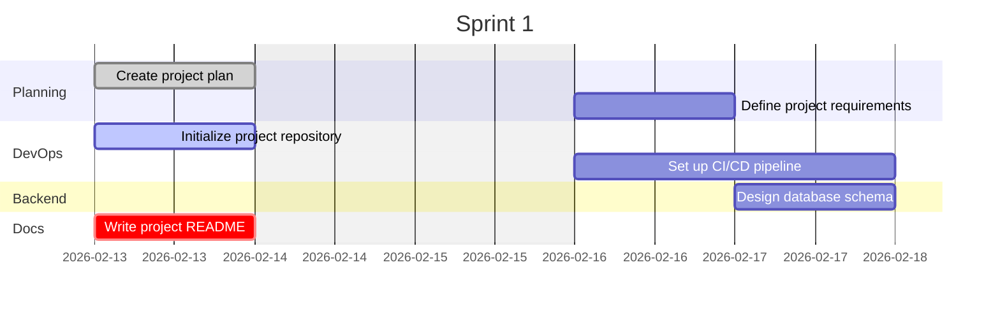
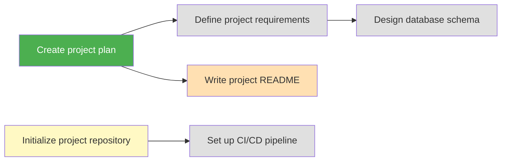

# Project: [Project Name]

## Sprint: 1 ([start-date] to [end-date])

**Goal:** [Define the sprint goal here]

## Board

### Backlog

- [ ] Define project requirements ~1d #planning @[assignee]
- [ ] Set up CI/CD pipeline ~2d #devops
- [ ] Design database schema ~1d #backend @[assignee]

### In Progress

- [ ] Initialize project repository ~0.5d #devops @[assignee]
  - [x] Create repo
  - [ ] Configure linting
  - [ ] Add pre-commit hooks

### In Review

- [ ] Write project README ~0.5d #docs @[assignee]

### Done

- [x] Create project plan ~1d #planning @[assignee]

## Timeline

## Dependencies

## Velocity

| Sprint | Planned | Completed | Carry-over | Velocity |
|--------|---------|-----------|------------|----------|

## Log

| Date | Action | Details |
|------|--------|---------|
| [start-date] | Initialized project | Created PROJECT.md with [N] tasks |
